```{r setup, include=FALSE}
knitr::opts_chunk$set(
  echo = FALSE,
  warning = FALSE,
  message = FALSE,
  fig.align = "center"
)

# Load required libraries
library(knitr)
library(kableExtra)
```

# Executive Summary

This comprehensive lipidomics analysis investigates the alterations in lipid profiles associated with dengue disease severity at Day 3 (D3) post-hospitalization. Using targeted lipidomics approaches, we analyzed plasma samples from healthy controls and dengue patients classified as mild or severe cases, collected 3 days after initial hospitalization.

**Key Findings at Day 3:**

- **Multi-group comparison** identified 103 significantly altered lipids (72% of analyzed species), with PC remaining the most prominently affected class (36 species)  
- **Temporal evolution**: Lipid dysregulation intensifies and becomes more widespread at D3 compared to D0, with dramatic expansion in SM (17 species) and TG (16 species) alterations  
- **Dimensionality reduction analyses** show excellent healthy vs diseased discrimination:  
  - UMAP provides the clearest separation between healthy controls and dengue patients
  - t-SNE uniquely achieves three-way separation (healthy/mild/severe) at D3
  - PCA captures 55% of variance with healthy controls forming tight, distinct cluster
- **Critical temporal finding**: Healthy vs Mild comparison shows loss of coordinated class-level enrichment at D3 despite 90 significant individual lipids, suggesting evolution from acute coordinated response (D0) to dispersed multi-pathway dysregulation  
- **Persistent lipid signature**: PC/LPC dysregulation continues at D3, confirming sustained phospholipase A2 activity and membrane remodeling throughout early disease course  
- **Enrichment patterns**: PC overrepresentation persists as the dominant feature, indicating central role of phospholipid metabolism in dengue pathophysiology  

These findings reveal how dengue-associated metabolic dysregulation evolves from D0 to D3, transitioning from acute coordinated responses to more complex, heterogeneous metabolic alterations. The data suggest both persistence of core metabolic signatures and adaptation/compensation mechanisms developing over the first 3 days of hospitalization.

---

# Introduction

## Study Objectives

The primary objectives of this lipidomics study are:

1. **Characterize lipid profile alterations** in dengue patients compared to healthy controls at Day 3 (D3) post-hospitalization

2. **Identify lipid biomarkers** that distinguish between disease severity levels (mild vs severe)

3. **Determine lipid classes and pathways** most affected by dengue virus infection

4. **Establish lipid signatures** that correlate with disease progression from mild to severe dengue

5. **Evaluate the potential** of plasma lipid profiles as prognostic markers for disease severity

6. **Contribute to understanding** the metabolic dysregulation associated with dengue pathophysiology

These objectives aim to advance our knowledge of the metabolic consequences of dengue infection and potentially identify novel therapeutic targets or biomarkers for clinical management.

## Sample Description

This study included plasma samples from 40 participants, stratified into three groups based on dengue severity status:

### Cohort Composition

- **Healthy controls (n=20)**: Individuals with no dengue infection, serving as the reference group for baseline lipid profiles  
- **Mild dengue patients (n=11)**: Patients with confirmed dengue virus infection presenting with mild symptoms not requiring intensive care  
- **Severe dengue patients (n=9)**: Critically ill patients with confirmed dengue virus infection requiring intensive care management  

### Sample Collection

- **Timepoint**: Day 3 (D3) - samples collected 3 days after initial hospitalization/diagnosis  
- **Sample type**: Plasma  
- **Biospecimen**: Peripheral blood  

### Analytical Coverage

- **Total lipid species analyzed**: 143 lipid species  
- **Lipid recognition rate**: >97% (139/143 species successfully annotated using rgoslin nomenclature)  
- **Major lipid classes represented**:  
  - Phosphatidylcholines (PC) and Lysophosphatidylcholines (LPC)
  - Sphingomyelins (SM)
  - Triglycerides (TG)
  - Diglycerides (DG)
  - Cholesteryl esters (CE)
  - Fatty acids (FA)
  - Phosphatidylethanolamines (PE)

### Study Design

The analysis employed a comprehensive approach:

1. **Three-group comparison** (n=40): One-way ANOVA comparing all groups simultaneously
2. **Pairwise post-hoc comparisons**:
   - Healthy vs Mild (n=31)
   - Healthy vs Severe (n=29)
   - Mild vs Severe (n=20)

## Methodology

### Data Processing Pipeline

1. **Data Loading & Quality Control**
   - Lipid nomenclature parsing using rgoslin
   - Recognition rate: >97%

2. **Data Processing**
   - Filtering: 50% threshold (lipids present in at least 50% of samples)
   - Missing value imputation: Minimum value method
   - Normalization: Percentage normalization
   - Transformation: Log10 transformation

3. **Statistical Analysis**
   - Multi-group comparison: One-way ANOVA
   - Post-hoc pairwise comparisons: t-test
   - Multiple testing correction: Benjamini-Hochberg (FDR)
   - Significance threshold: padj < 0.05

4. **Enrichment Analysis**
   - Lipid Set Enrichment Analysis (LSEA)
   - Over Representation Analysis (ORA)

**Methodological Approach:**

This analysis employs a comprehensive strategy combining global assessment (three-group ANOVA) with targeted pairwise comparisons. The LipidSigR package provides specialized methods for lipidomics data, including:
- Lipid nomenclature standardization via rgoslin parsers  
- Missing value handling tailored to lipidomics datasets  
- Appropriate normalization methods (percentage-based)  
- Statistical tests accounting for lipid-specific distributions  
- Enrichment analyses considering lipid structural relationships  

The combination of univariate statistics, multivariate dimensionality reduction, and pathway enrichment provides robust, multi-faceted insights into lipid dysregulation patterns.

---

# Three-Group Analysis (Healthy vs Mild vs Severe)

## Overview

The three-group analysis employs one-way ANOVA to simultaneously compare lipid profiles across healthy controls (n=20), mild dengue patients (n=11), and severe dengue patients (n=9) at day 0 of hospitalization. This global analysis identifies lipid species whose abundance differs significantly across disease severity states, providing an initial overview of lipid dysregulation patterns in dengue infection before conducting detailed pairwise comparisons.

This section presents the results of the one-way ANOVA comparing lipid profiles across all three groups simultaneously.

## Data Quality Assessment

### Before and After Processing

```{r three-group-quality}
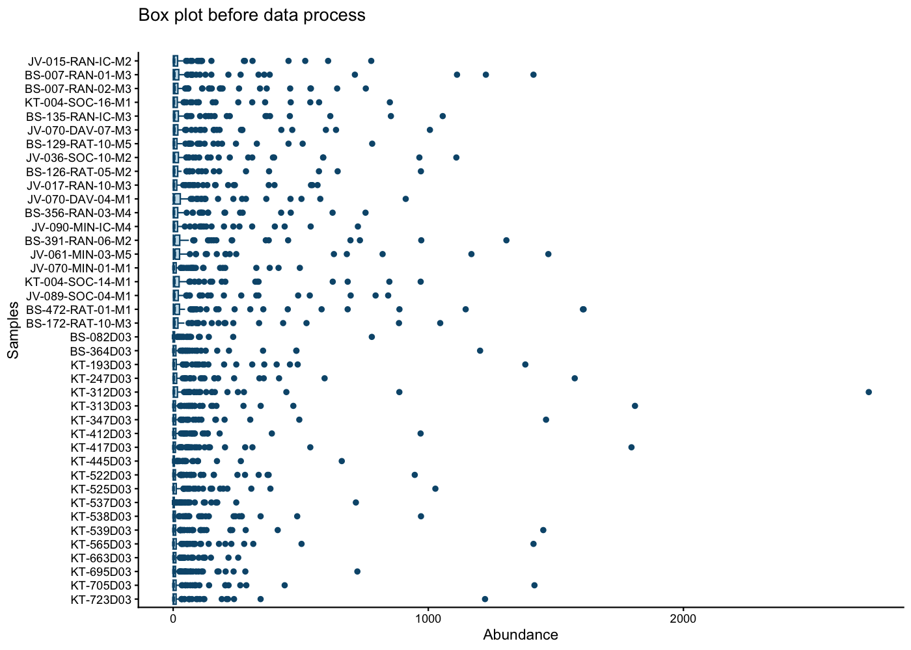
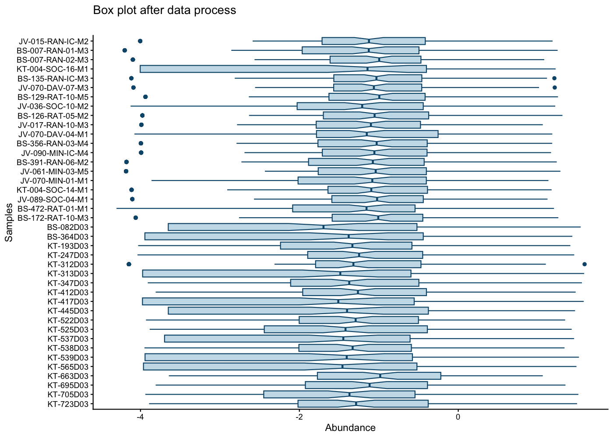
```

**Data Quality Assessment:**

The boxplots demonstrate the effectiveness of the data processing pipeline. Before processing, raw abundance values show:  
- High dynamic range (0-1800 units) with substantial variability between samples 
- Heterogeneous distributions across samples indicating technical variation  
- Presence of outliers and skewed distributions  

After applying percentage normalization and log10 transformation:  
- Abundance values are centered and comparable across all samples (range: -4 to 0)  
- Distribution shapes are more uniform and symmetric  
- Sample-to-sample variation is reduced while preserving biological differences  
- Few outliers remain, indicating good data quality after processing  
  
The normalization successfully removes technical biases while maintaining the biological signal necessary for downstream statistical analysis.

### Density Plots

```{r three-group-density}
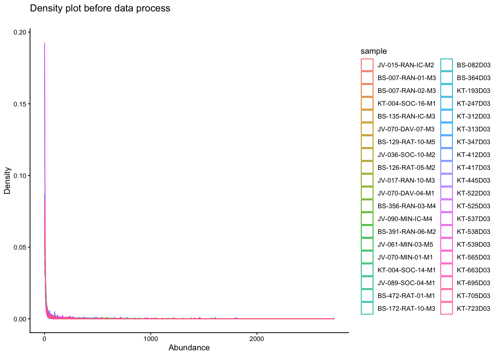
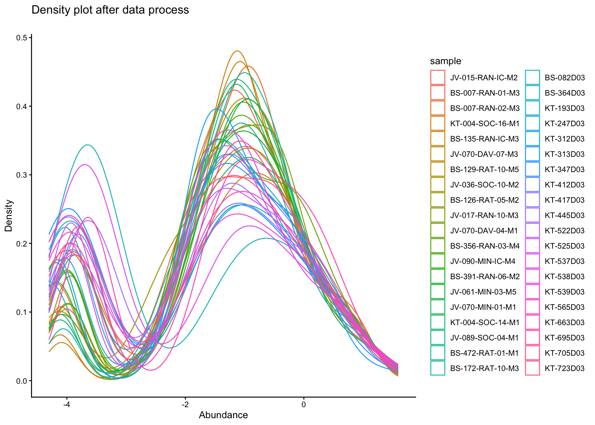
```

**Density Distribution Analysis:**

Before processing, the density plot shows:  
- Highly skewed right-tailed distributions with most lipid abundances concentrated near zero  
- A sharp peak at low abundance values indicating many low-intensity lipids  
- Long tails extending to high abundance values representing a few highly abundant lipid species  
- Considerable heterogeneity between samples  

After log10 transformation and normalization:
- Bimodal distribution pattern emerges with two distinct peaks  
- Left peak (~-3.5 to -3) likely represents lower abundance lipid species  
- Right peak (~-1.5 to -0.5) represents more abundant lipid species  
- All samples now show similar distribution shapes, indicating successful normalization  
- The bimodal pattern suggests two distinct populations of lipids based on abundance  

This transformation facilitates statistical testing by approximating normal distributions and equalizing variance across samples.  

## Sample Profiling

### Cross-Sample Variability

```{r three-group-variability}
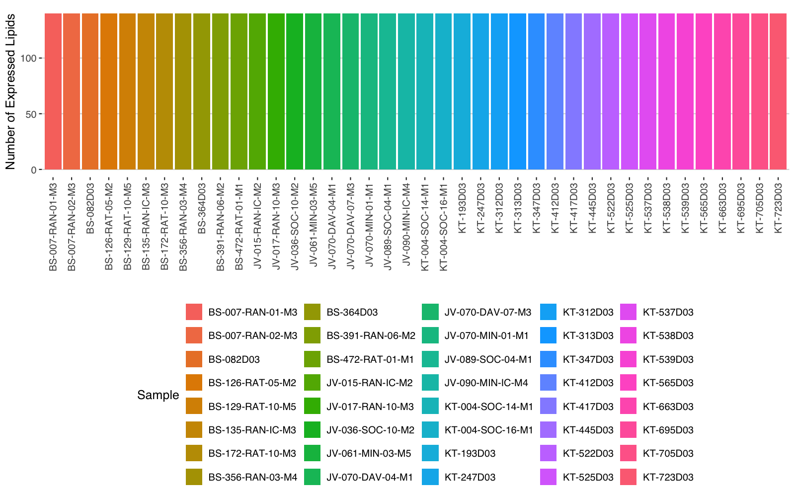
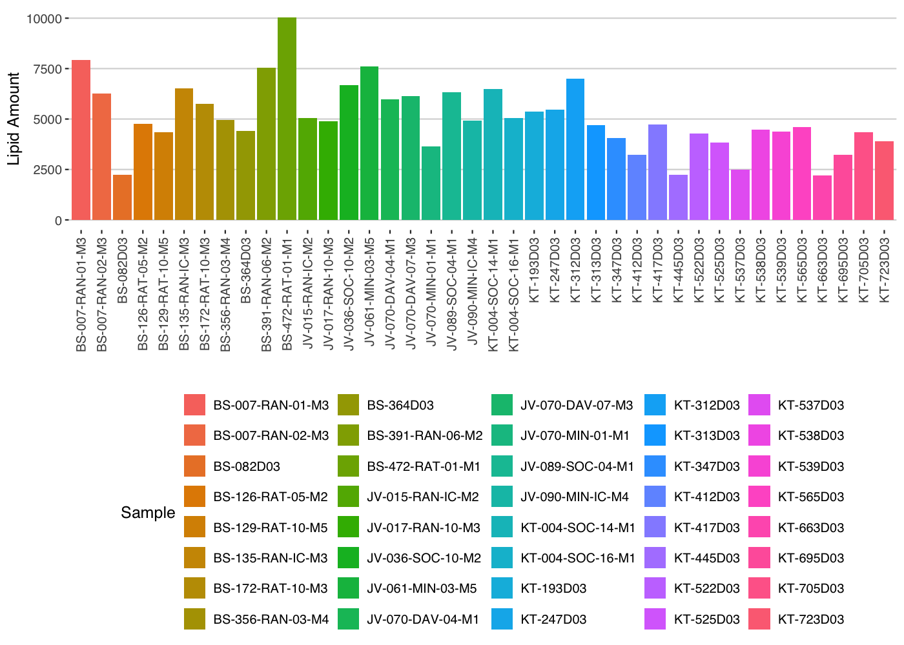
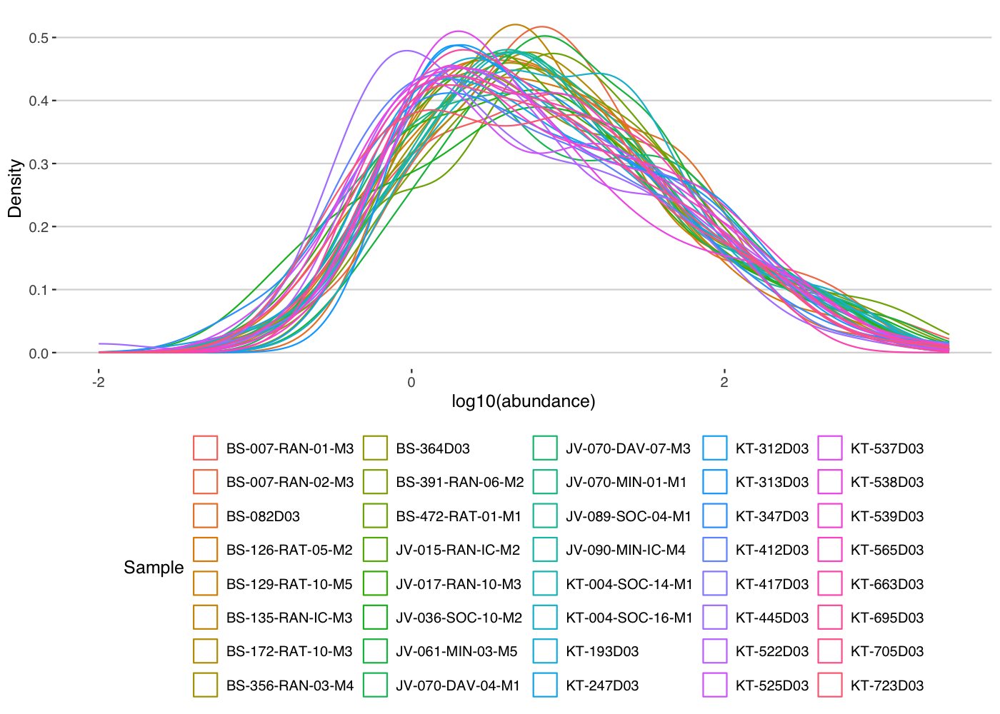
```

**Cross-Sample Variability Assessment:**

The expressed lipid numbers plot shows consistent detection across all 40 samples:  
- All samples express approximately 125-130 lipid species after filtering  
- No samples show aberrant lipid detection numbers, indicating good sample quality  
- The consistency suggests minimal technical variability and successful quality control  

This uniform coverage across all three groups (healthy, mild, severe) ensures that downstream differential expression analysis is not confounded by differences in lipid detection rates between groups.  

### Dimensionality Reduction

#### PCA (Principal Component Analysis)

```{r three-group-pca}
pca_plot <- readRDS("Three_groups/D3/01.Profiling/02.Dimensionality_reduction/PCA/PCA_plot_interactive.rds")
pca_plot
```

```{r three-group-scree}
scree_plot <- readRDS("Three_groups/D3/01.Profiling/02.Dimensionality_reduction/PCA/Scree_plot_interactive.rds")
scree_plot
```

```{r three-group-corr}
variable_correlation_plot <- readRDS("Three_groups/D3/01.Profiling/02.Dimensionality_reduction/PCA/Variable_correlation_interactive.rds")
variable_correlation_plot
```

**Principal Component Analysis Interpretation at Day 3:**

PCA reveals the overall structure and variance in the lipid profiles across the three groups at Day 3 post-hospitalization. The interactive PCA plot and scree plot together indicate:  
- The first two principal components (PC1: 45.9%, PC2: 9.3%) capture 55.2% of total variance in the lipid data  
- **Excellent separation between healthy controls (Group 1, left) and dengue patients (Groups 2 & 3, right)**  
- Healthy controls form a tight, well-defined cluster on the left side of the plot (negative PC1 values)  
- Mild dengue patients (Group 2) and severe dengue patients (Group 3) cluster together on the right side with substantial overlap  
- At Day 3, the primary lipid signature discriminates healthy from diseased states (PC1), while disease severity shows less clear separation  
- Variable correlation plot shows which lipid species contribute most to the separation between groups  

The variable correlation circle identifies lipids with the strongest influence on sample clustering, representing potential biomarkers distinguishing disease states. The robust separation between healthy and diseased groups at D3 confirms persistence of the dengue-associated lipid signature 3 days into hospitalization.

#### t-SNE

```{r three-group-tsne}
tsne_plot <- readRDS("Three_groups/D3/01.Profiling/02.Dimensionality_reduction/t-SNE/t-SNE_plot_interactive.rds")
tsne_plot
```

**t-SNE Analysis at Day 3:**

t-distributed Stochastic Neighbor Embedding (t-SNE) is a non-linear dimensionality reduction method that emphasizes local structure and reveals clusters in high-dimensional data. The t-SNE plot at Day 3 reveals an important clustering pattern:
- Reveals non-linear relationships between samples that may not be apparent in PCA  
- **Three distinct clusters, but NOT corresponding to the three clinical groups:**  
  - **Group 1 (cyan circles)** - Small tight cluster in upper-left: Healthy controls subgroup 1  
  - **Group 2 (yellow triangles)** - Large cluster in bottom region: **ALL dengue patients** (both mild and severe together)  
  - **Group 3 (red squares)** - Cluster in upper region: Healthy controls subgroup 2  
- **Critical observation: Healthy controls split into TWO distinct subgroups (Groups 1 & 3), while ALL dengue patients cluster together as a single unified group (Group 2)**  
- At Day 3, t-SNE does NOT discriminate between mild and severe dengue - they form one homogeneous cluster  
- However, t-SNE clearly separates healthy from diseased states, with complete separation between healthy subgroups and the dengue cluster  
- The two healthy subgroups suggest biological heterogeneity in the control population (metabolic subtypes, demographic differences, etc.)  

**Interpretation:** At Day 3, the dominant lipid signature captured by t-SNE discriminates healthy vs dengue-infected states, but does NOT distinguish disease severity (mild vs severe). The unified dengue cluster suggests that by D3, mild and severe patients share a common core lipid dysregulation pattern, despite their different clinical presentations.


#### UMAP

```{r three-group-umap}
umap_plot <- readRDS("Three_groups/D3/01.Profiling/02.Dimensionality_reduction/UMAP/UMAP_plot_interactive.rds")
umap_plot
```

**UMAP Analysis at Day 3:**

Uniform Manifold Approximation and Projection (UMAP) is a modern dimensionality reduction technique that balances preservation of both local and global structure. At Day 3, UMAP reveals:  
- More robust than t-SNE with better preservation of global data structure  
- Faster computation and more consistent results across runs  
- **Three distinct clusters, but NOT corresponding to the three clinical groups:**  
  - **Group 1 (dengue patients)** - Cluster containing the **majority of dengue patients** (both mild and severe together)  
  - **Groups 2 & 3 (healthy controls + outlier)** - Two distinct healthy control subgroups, which also include **one dengue patient (KT-663)** clustering with the healthy controls  
- **Critical observation: Healthy controls split into TWO distinct subgroups (Groups 2 & 3), while most dengue patients cluster together as a unified group (Group 1)**  
- At Day 3, UMAP does NOT discriminate between mild and severe dengue - they form one homogeneous cluster  
- However, UMAP clearly separates most dengue patients from healthy controls, though one dengue patient (KT-663) shows a lipid profile more similar to healthy controls  
- The two healthy subgroups suggest biological heterogeneity in the control population (metabolic subtypes, demographic differences, etc.)  
- Patient KT-663 represents an outlier dengue case with atypical lipid profile at D3  

Together, these three dimensionality reduction methods (PCA, t-SNE, UMAP) provide complementary views of the data structure at Day 3:  
- **Both UMAP and t-SNE reveal heterogeneity within healthy controls** (two subgroups) and group most dengue patients together, regardless of severity  
- **Both methods identify patient KT-663 as an outlier** dengue case clustering with healthy controls  
- **PCA captures the most variance** with interpretable linear relationships and shows separation primarily along the healthy vs diseased axis  

**Overall interpretation:** At Day 3, the lipid signature strongly discriminates healthy from dengue-infected individuals across all three methods, with the important exception of patient KT-663 who shows an atypical pattern. Critically, **NONE of the three methods clearly separate mild from severe dengue at D3** - both severity groups share a common lipid dysregulation pattern. The consistent finding across t-SNE and UMAP that healthy controls split into two subgroups while dengue patients cluster together (except KT-663) emphasizes that the dominant metabolic signal at D3 is "infected vs non-infected" rather than disease severity.  

### Correlation Analysis

#### Correlation by Samples

```{r three-group-correlation-samples}
heatmap_samples <- readRDS("Three_groups/D3/01.Profiling/03.Correlation_Heatmap/by_samples/Heatmap_by_samples_interactive.rds")
heatmap_samples
```

#### Correlation by Category

```{r three-group-correlation-category}
heatmap_category <- readRDS("Three_groups/D3/01.Profiling/03.Correlation_Heatmap/by_category/Heatmap_by_category_interactive.rds")
heatmap_category
```

#### Correlation by Class

```{r three-group-correlation-class}
heatmap_class <- readRDS("Three_groups/D3/01.Profiling/03.Correlation_Heatmap/by_class/Heatmap_by_class_interactive.rds")
heatmap_class
```

**Correlation Heatmap Interpretation:**

The hierarchical clustering heatmaps provide insights into sample relationships and lipid co-regulation:  

**By Samples:** Shows pairwise correlations between all samples, revealing:  
- Whether samples cluster by disease group (healthy, mild, severe)  
- Identification of outlier samples with atypical lipid profiles  
- Overall similarity structure within and between groups  

**By Category:** Displays correlations at the lipid category level (Glycerophospholipids, Glycerolipids, Fatty Acyls, Sphingolipids, Sterol Lipids), showing:  
- Which lipid categories are co-regulated  
- Potential metabolic pathway relationships  

**By Class:** Shows correlations at the lipid class level (PC, LPC, TG, DG, SM, etc.), providing:  
- Fine-grained view of lipid class co-regulation  
- Identification of coordinately regulated lipid classes that may share biosynthetic pathways  

These correlation analyses help identify coordinated changes in lipid metabolism associated with dengue disease progression.  

### Lipid Characteristics

```{r three-group-characteristics}
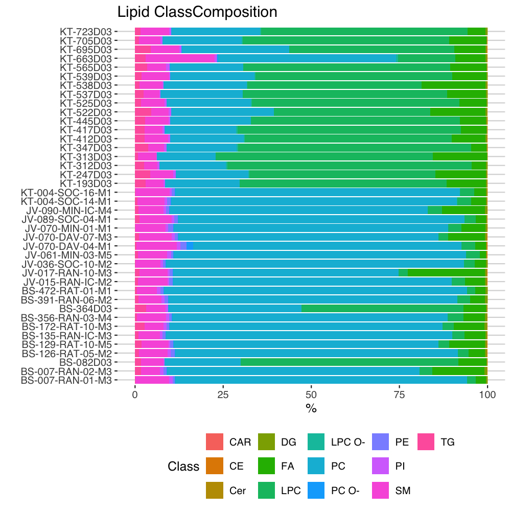
```

**Lipid Class Composition Analysis:**

The stacked bar chart displays the relative proportions of different lipid classes across all samples:

**Overall composition patterns:**  
- **Phosphatidylcholines (PC)** - blue: Dominant lipid class in healthy controls (~40-60% of total), but **dramatically reduced in dengue patients (10-30%)**, reflecting massive PC depletion  
- **Lysophosphatidylcholines (LPC)** - bright green: Low abundance in healthy controls, but **markedly elevated in dengue patients** (both mild and severe), particularly notable as the most striking compositional change  
- **Fatty Acids (FA)** - dark green: Consistently present across samples  
- **Diglycerides (DG)** - olive green: Moderate representation  
- **Sphingomyelins (SM)** - pink: Substantial contribution to lipid profile  
- **Triglycerides (TG)** - magenta: Lower abundance, variable between samples  
- **Other classes** (CAR, CE, Cer, PI, PE, PC O-, LPC O-): Minor contributors  

**Notable observations:**  
- **Healthy controls** show relatively consistent lipid class proportions with PC dominance  
- **Dengue patients** display profound alterations in the PC/LPC ratio:  
  - Massive PC depletion (from ~40-60% to ~10-30%)  
  - Dramatic LPC accumulation, indicating intense phospholipase A2 activity  
- The **reciprocal relationship between PC depletion and LPC accumulation** is the most striking feature distinguishing dengue patients from healthy controls  
- PC and LPC together represent the major glycerophospholipid pool  
- The diversity of lipid classes detected demonstrates comprehensive lipidomic coverage  

## Differential Expression Analysis (ANOVA)

### Summary Statistics

```{r three-group-anova-stats}
# Read ANOVA results and filter for significant
anova_all <- read.delim("Three_groups/D3/02.DiffExp/01.ANOVA/ANOVA_all_results.tsv")
anova_sig <- anova_all[anova_all$padj < 0.05, ]

# Display summary
cat("Number of significant lipids (padj < 0.05):", nrow(anova_sig), "\n\n")

# Display table of significant results
kable(anova_sig,
  caption = "Significant Lipids from ANOVA (padj < 0.05)",
  digits = 4
) %>%
  kable_styling(
    bootstrap_options = c("striped", "hover", "condensed"),
    full_width = FALSE,
    font_size = 12
  ) %>%
  scroll_box(width = "100%", height = "400px")
```

**ANOVA Results Interpretation:**

The one-way ANOVA identified **103 lipid species** with significant differences across the three groups (padj < 0.05) at Day 3 post-hospitalization, representing approximately 72% of the analyzed lipids. This high proportion indicates that lipid dysregulation persists and intensifies by D3, with even more widespread metabolic alterations compared to baseline (D0).

**Key findings by lipid class at Day 3:**

**Phosphatidylcholines (PC):** Most extensively affected class (36 species = 35% of significant lipids)  
- The largest category of dysregulated lipids, indicating persistent membrane phospholipid remodeling  
- Widespread PC depletion continues at D3, affecting multiple chain lengths and unsaturation levels  
- Suggests ongoing membrane restructuring throughout the early disease course  

**Sphingomyelins (SM):** Major expansion in dysregulation (17 species)  
- Dramatic increase compared to D0, suggesting sphingolipid metabolism becomes more prominently affected at D3  
- Indicates evolving sphingolipid pathway dysregulation as disease progresses  
- May reflect membrane reorganization and cellular stress responses  

**Triglycerides (TG):** Substantial changes (16 species)  
- Increased TG dysregulation at D3 suggests progressive alterations in energy storage and metabolism  
- May reflect metabolic adaptation to ongoing infection and inflammation  

**Lysophosphatidylcholines (LPC):** Continued significant changes (13 species)  
- Persistent elevation indicates sustained phospholipase A2 activity at D3  
- Ongoing PC remodeling and membrane restructuring  

**Diglycerides (DG):** Notable differences (7 species)  
- Suggests continued alterations in lipid signaling and/or TG metabolism  

**Fatty Acids (FA):** Significant changes (5 species)  
- May include arachidonic acid and precursors for inflammatory mediator production  

**Sphingolipid mediators (Ceramides - Cer):** Emerging dysregulation (4 species)  
- Ceramide alterations at D3 may indicate cellular stress, apoptosis, or inflammatory signaling  

**Phosphatidylinositols (PI):** Additional dysregulation (3 species)  
- Suggests involvement of phosphoinositide signaling pathways at D3  

**Temporal interpretation:** At Day 3, the lipid profile shows persistence and intensification of dengue-associated metabolic dysregulation. The dramatic increase in SM dysregulation (17 species at D3 vs fewer at D0) suggests sphingolipid metabolism becomes progressively more affected as infection continues. The high percentage of significantly altered lipids (72%) indicates systemic metabolic perturbations affecting membrane structure, energy metabolism, inflammation, and cellular signaling pathways.  

### Visualization

```{r three-group-anova-viz}
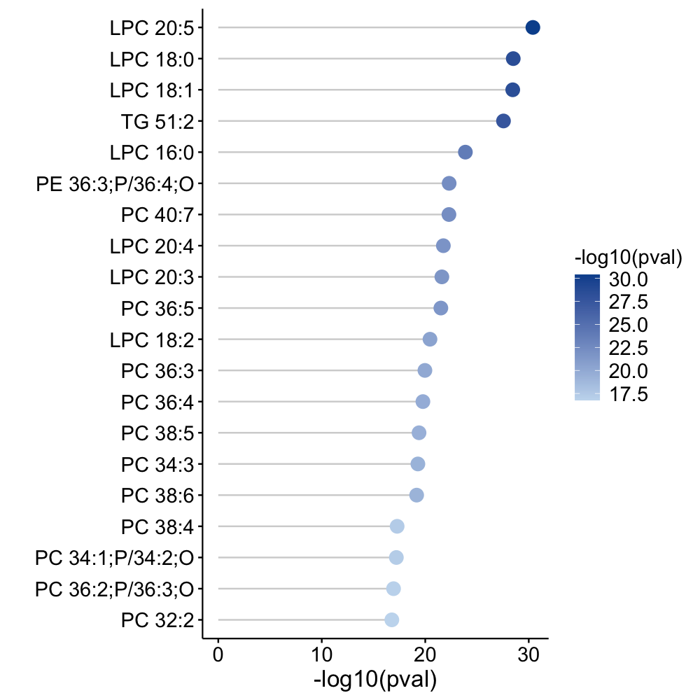
```

**Lollipop Chart Analysis:**

The lollipop chart displays the top 20 most significantly changed lipid species ranked by -log10(pval):

**Top-tier significance (darkest blue, -log10(pval) > 25):**  
1. **LPC 16:0** - Most significant (padj = 5.8e-28)  
2. **LPC 18:1** - Second most significant (padj = 6.8e-28)  
3. **LPC 18:0** - Highly significant (padj = 1.2e-24)  
4. **LPC 20:4** - Highly significant (padj = 2.3e-25)  
5. **LPC 18:2** - Highly significant (padj = 5.4e-26)  

**Second-tier significance (-log10(pval) 17-22):**  
- **PC 36:5**, **PC 38:5**, **PC 36:3**, **LPC 22:6**, **LPC 18:2**   
- Multiple PC species with high polyinsaturation  

**Biological interpretation:**  
- **LPC dominance** at the top of the list strongly implicates phospholipase A2 (PLA2) activation  
- PLA2 cleaves PC to generate LPC and fatty acids, particularly arachidonic acid (FA 20:4)  
- **FA 20:4 (arachidonic acid)** also in the top 20, consistent with PLA2 activity  
- The affected PC species are likely substrates for this enzymatic activity  
- This pattern is characteristic of inflammatory responses and membrane remodeling in dengue infection  

The extraordinarily high significance levels (p-values < 1e-20) indicate these are robust biomarkers of dengue disease state.  

### Individual Lipid Boxplots

```{r three-group-boxplots, results='asis', fig.show='hold', out.width='50%'}
# List top significant lipids boxplots
boxplot_files <- list.files("/Users/loictalignani/research/project/lipidomics/analysis/Three_groups/D3/02.DiffExp/03.Individual_lipid_boxplots",
  pattern = "*.png", full.names = TRUE
)
include_graphics("/Users/loictalignani/research/project/lipidomics/analysis/Three_groups/D3/02.DiffExp/03.Individual_lipid_boxplots/005_LPC_16_0.png")
include_graphics("/Users/loictalignani/research/project/lipidomics/analysis/Three_groups/D3/02.DiffExp/03.Individual_lipid_boxplots/002_LPC_18_0.png")
include_graphics("/Users/loictalignani/research/project/lipidomics/analysis/Three_groups/D3/02.DiffExp/03.Individual_lipid_boxplots/003_LPC_18_1.png")
include_graphics("/Users/loictalignani/research/project/lipidomics/analysis/Three_groups/D3/02.DiffExp/03.Individual_lipid_boxplots/011_LPC_18_2.png")
include_graphics("/Users/loictalignani/research/project/lipidomics/analysis/Three_groups/D3/02.DiffExp/03.Individual_lipid_boxplots/013_PC_36_4.png")
include_graphics("/Users/loictalignani/research/project/lipidomics/analysis/Three_groups/D3/02.DiffExp/03.Individual_lipid_boxplots/016_PC_38_6.png")
include_graphics("/Users/loictalignani/research/project/lipidomics/analysis/Three_groups/D3/02.DiffExp/03.Individual_lipid_boxplots/021_PC_38_7.png")
include_graphics("/Users/loictalignani/research/project/lipidomics/analysis/Three_groups/D3/02.DiffExp/03.Individual_lipid_boxplots/004_TG_51_2.png")
include_graphics("/Users/loictalignani/research/project/lipidomics/analysis/Three_groups/D3/02.DiffExp/03.Individual_lipid_boxplots/039_FA_20_4.png")
```

**Individual Lipid Profile Patterns:**

The boxplots for individual lipids reveal specific dysregulation patterns across the three groups. Key observations from the displayed lipids:

**LPC species (16:0, 18:0, 18:1, 18:2):**
- Dramatically elevated in patient samples (both mild and severe) compared to healthy controls  
- Strong evidence of phospholipase A2 activation in dengue infection  
- Different LPC species may show varying patterns between mild and severe cases  

**PC species (36:4, 38:6, 38:7):**
- Generally reduced in patient samples relative to healthy controls  
- Consistent with PC being the substrate for LPC production  
- Varying degrees of reduction across different PC species  

**TG 51:2:**
- Marked elevation in patient samples  
- Suggests altered lipid storage or energy metabolism  

**FA 20:4 (arachidonic acid):**
- Shows differential abundance patterns  
- Critical precursor for pro-inflammatory eicosanoids  


The consistent direction of change for lipid classes (LPC up, PC down) across multiple species strengthens confidence in the biological significance of these findings.

## Enrichment Analysis

### Lipid Set Enrichment Analysis (LSEA)

```{r three-group-lsea}
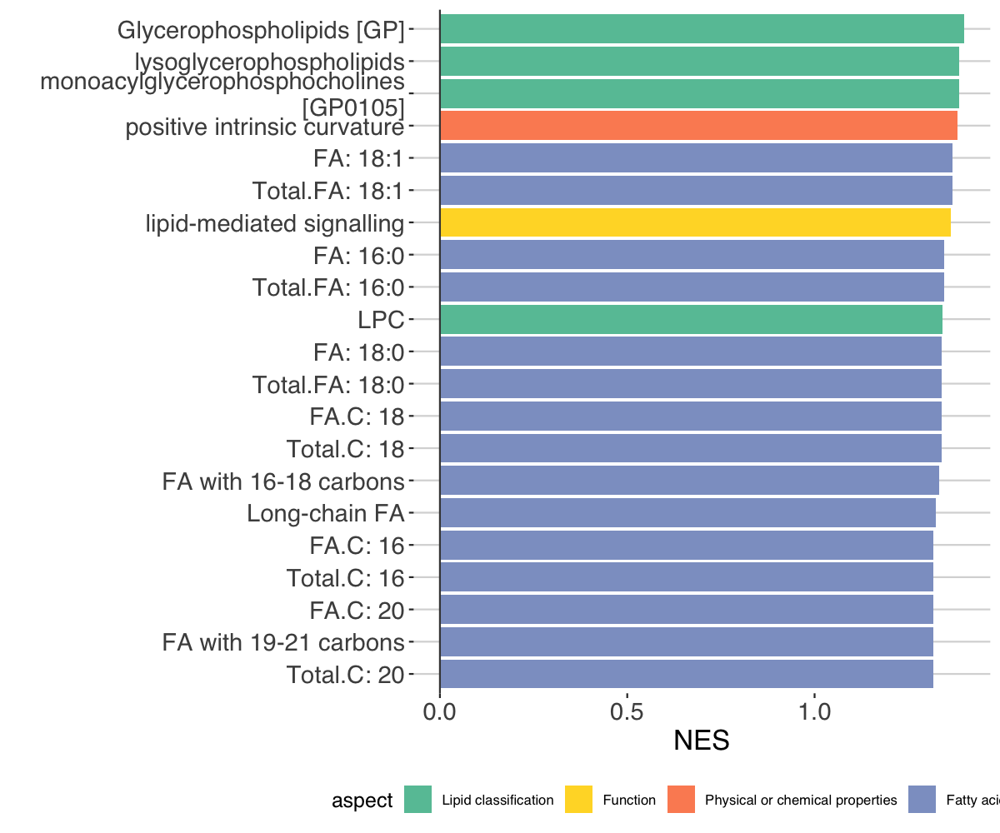
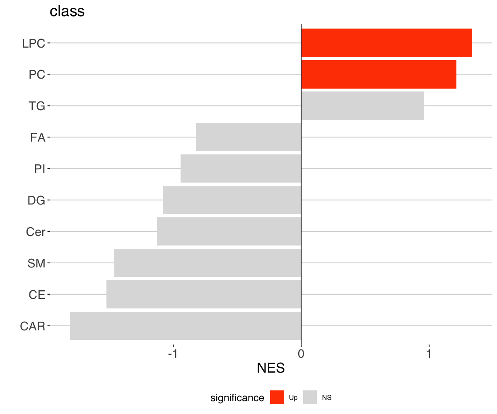
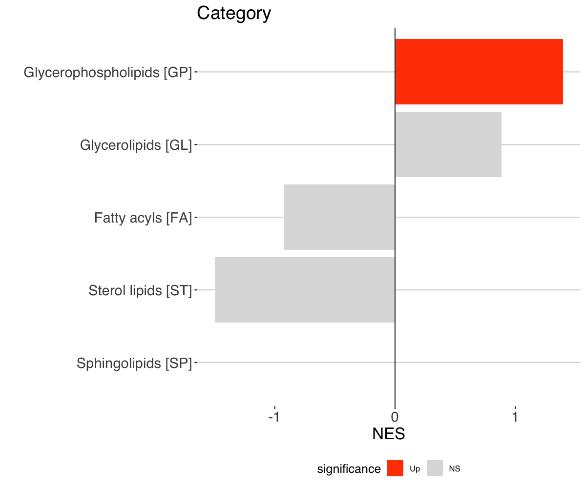
```

**LSEA evaluates whether predefined lipid sets are enriched at the top or bottom of a ranked lipid list, without applying a strict significance cutoff. This method is useful for detecting subtle but coordinated changes in lipid characteristics.**

**LSEA Results Interpretation:**

**By Class:**  
- **LPC** shows strong positive enrichment (NES > 1, significant) - indicating systematic upregulation of lysophosphatidylcholines  
- **PC** shows moderate enrichment but non-significant  
- **TG and DG** show moderate positive enrichment  
- Other classes (FA, PI, Cer, CAR, CE, SM) show negative enrichment or are not significant  

**By Category:**  
- **Glycerophospholipids [GP]** show strong significant positive enrichment (NES > 1, red bar)  
  - This category includes PC, LPC, PE, PI classes  
  - Confirms major dysregulation of glycerophospholipid metabolism  
- **Glycerolipids [GL]** show positive trend (non-significant)  
  - Includes TG and DG classes  
- **Fatty Acyls [FA]** show negative enrichment trend  
- **Sterol Lipids [ST]** and **Sphingolipids [SP]** not significantly enriched  

**Biological Significance:**  
The strong enrichment of glycerophospholipids, particularly LPC upregulation, confirms that dengue infection primarily affects membrane phospholipid metabolism, likely through phospholipase A2 activation and altered phospholipid remodeling pathways.

### Over Representation Analysis (ORA)

```{r three-group-ora}
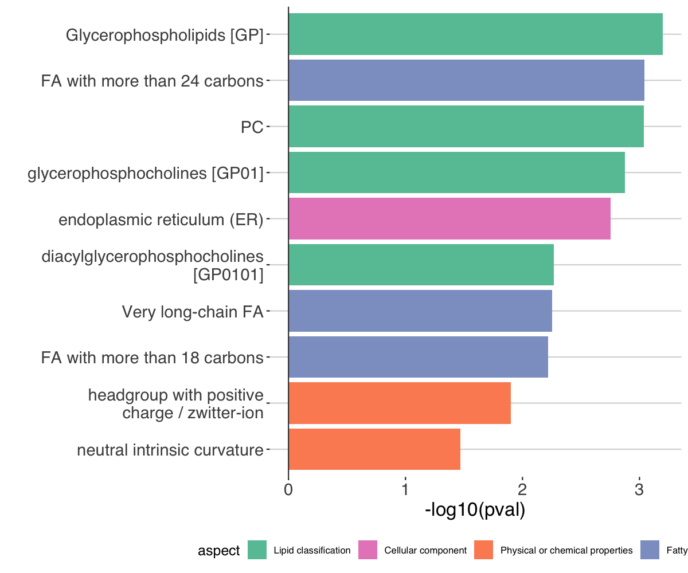
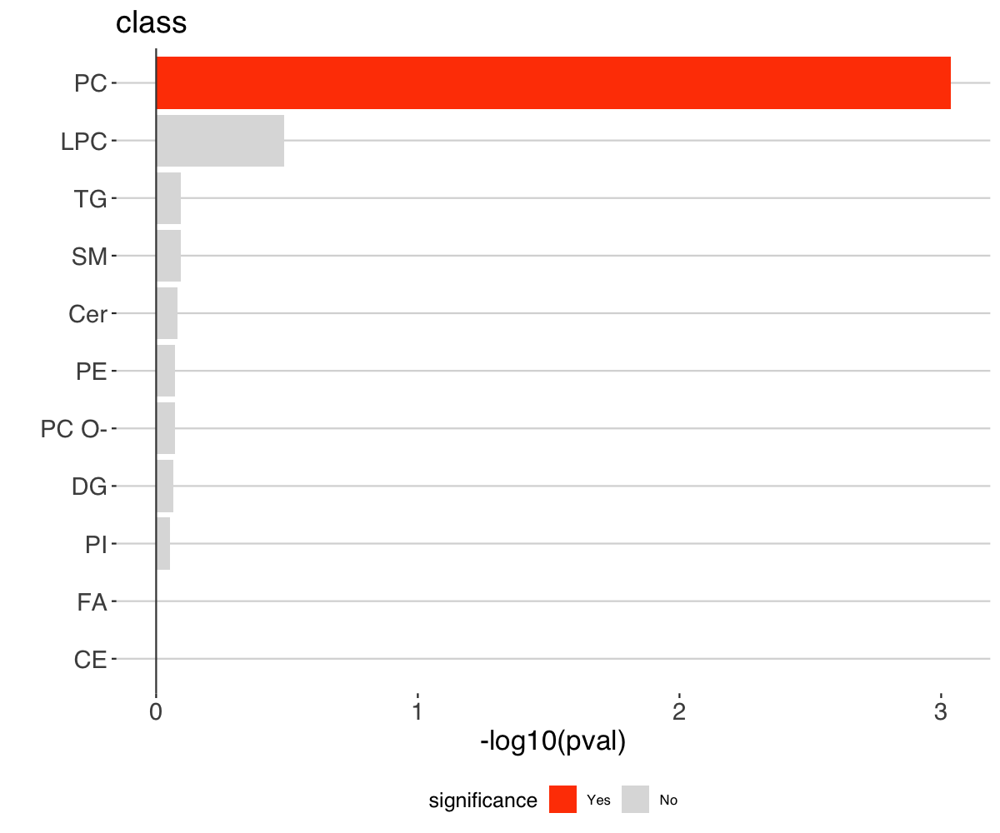
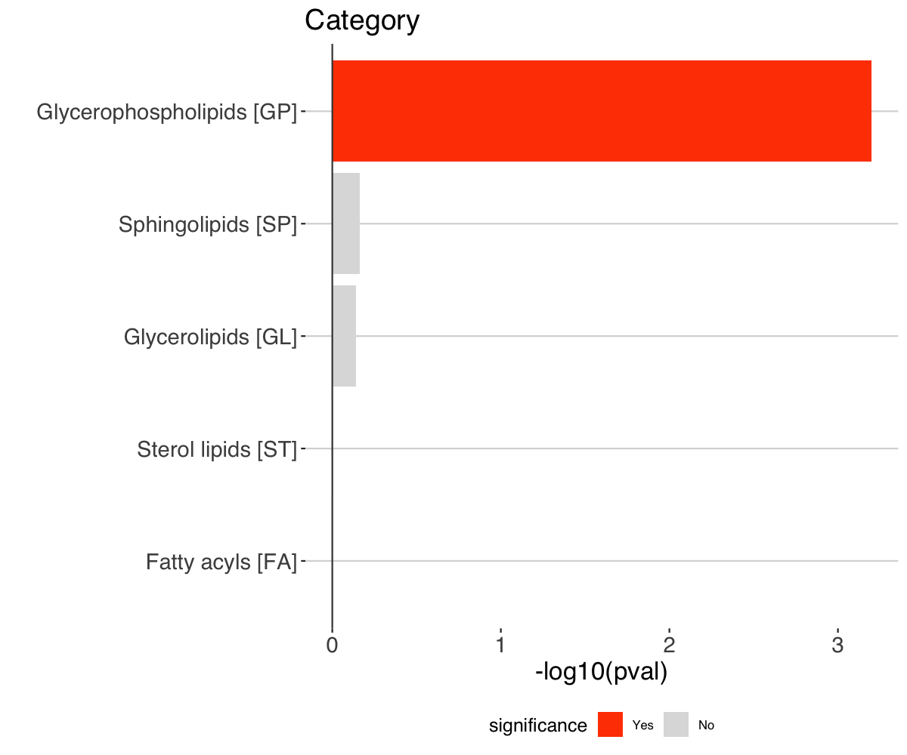
```

**ORA identifies lipid categories (e.g., classes or subclasses) that are overrepresented among significantly changed lipid species. It is suitable when you have a defined list of differentially expressed lipids.**

**ORA Results Interpretation:**

**By Class at Day 3:**  
- **PC (Phosphatidylcholine)** remains the only significantly overrepresented class (red bar, -log10(pval) > 3)  
  - 36 out of 103 significant lipids are PC species at D3  
  - Represents 35% of significantly changed lipids  
  - Confirms that PC remodeling continues to be a central feature of dengue-associated lipid dysregulation at Day 3  
  - The persistent PC overrepresentation from D0 through D3 indicates sustained phospholipid membrane alterations  
- **All other lipid classes (LPC, TG, SM, Cer, PE, PC O-, DG, PI, FA, CE)** show non-significant enrichment (grey bars)  
  - While multiple classes are affected (17 SM, 16 TG, 13 LPC species significant), none reach statistical overrepresentation except PC  
  - PC uniquely stands out among all affected lipid classes  

**By Category:**  
- **Glycerophospholipids [GP]** is the only significantly overrepresented category (red bar, -log10(pval) > 2)  
  - This supercategory encompasses PC, LPC, PE, PI, and related classes  
  - Overwhelming majority of significant lipids belong to this category  
  - Underscores the central role of glycerophospholipid metabolism in dengue pathophysiology  
- **Glycerolipids [GL]** and **Fatty Acyls [FA]** show minor enrichment (non-significant)  
- **Sphingolipids [SP]** and **Sterol Lipids [ST]** not enriched  

**Comparison with LSEA:**  
- ORA and LSEA provide concordant results  
- Both methods highlight glycerophospholipids (particularly PC) as the primary affected lipid category  
- ORA focuses on statistical overrepresentation while LSEA detects coordinated changes  
- Together, they provide robust evidence for targeted disruption of membrane phospholipid homeostasis  

**Biological Interpretation:**  
The dominant overrepresentation of PC and glycerophospholipids indicates that dengue infection specifically targets membrane lipid metabolism, with implications for:  
1. Membrane integrity and fluidity  
2. Cell signaling via lipid mediators  
3. Inflammatory response modulation  
4. Viral replication requirements for membrane reorganization  

---

# Post-Hoc Analysis 1: Healthy vs Mild

## Overview

This pairwise comparison focuses on lipid changes occurring in the early stages of dengue disease by comparing healthy controls (n=20) with mild dengue patients (n=11) at D3. This analysis identifies lipid alterations associated with initial infection and mild symptomatology, before progression to severe disease. Understanding these early changes may reveal biomarkers for early detection and provide insights into the initial metabolic response to dengue virus infection.  

## Data Quality and Profiling

### Quality Assessment

```{r healthy-mild-quality}
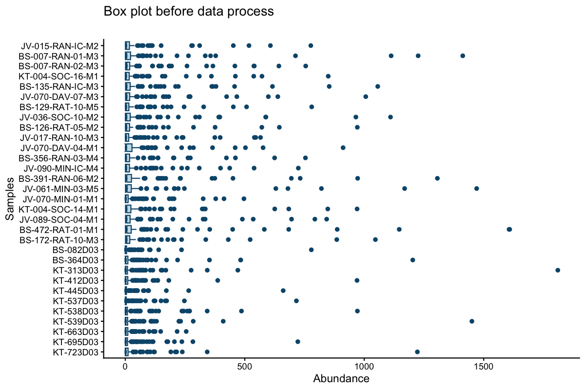
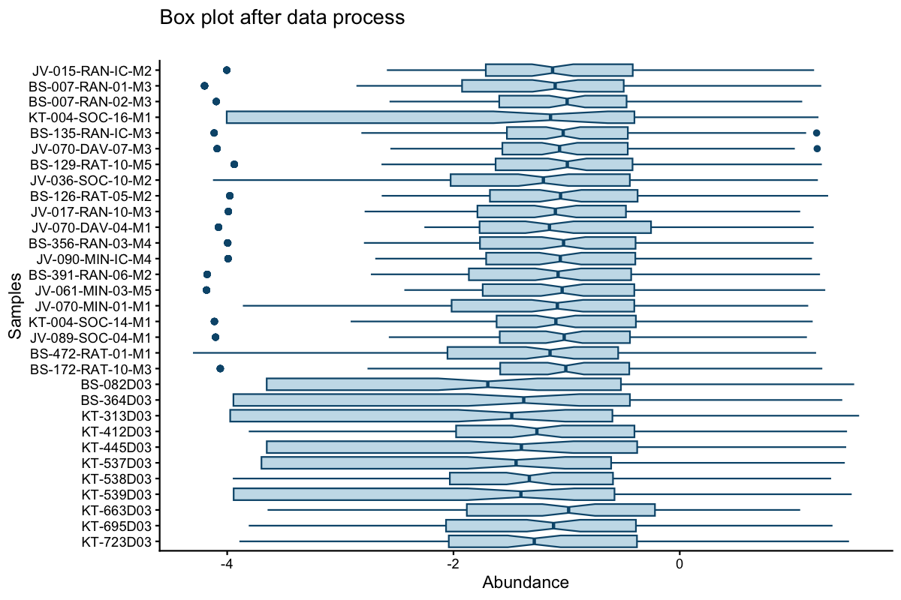
```

**Data Quality Assessment:**  

Similar to the three-group analysis, the data processing successfully normalizes the lipid abundance distributions:   
  
- **Before processing:** Raw data shows high variability (0-1800 range) with heterogeneous distributions  
- **After processing:** Log10 transformation and percentage normalization center values around -2 to 0, with uniform distributions across all 31 samples (20 healthy + 11 mild)  
- Good data quality retained for both groups with minimal outliers  
- Successful removal of technical variation while preserving biological differences between healthy and mild dengue patients  

### Dimensionality Reduction

#### PCA

```{r healthy-mild-pca}
pca_plot <- readRDS("PostHoc_Healthy_vs_Mild/D3/01.Profiling/02.Dimensionality_reduction/PCA/PCA_plot_interactive.rds")
pca_plot
```

**PCA Results:** The PCA plot visualizes the overall structure of lipid profiles, showing whether healthy controls and mild dengue patients form distinct clusters based on their lipid signatures. The degree of separation indicates the strength of the lipid-based disease signature.

```{r healthy-mild-scree}
scree_plot <- readRDS("PostHoc_Healthy_vs_Mild/D3/01.Profiling/02.Dimensionality_reduction/PCA/Scree_plot_interactive.rds")
scree_plot
```

**Scree Plot:** Shows the proportion of variance explained by each principal component. The first few PCs typically capture the majority of disease-related variation, with later PCs representing technical or individual variation.

```{r healthy-mild-corr-circle}
variable_correlation_plot <- readRDS("PostHoc_Healthy_vs_Mild/D3/01.Profiling/02.Dimensionality_reduction/PCA/Variable_correlation_interactive.rds")
variable_correlation_plot
```

**PCA Interpretation for Healthy vs Mild:**  

The PCA analysis on this two-group comparison provides insights into whether healthy controls and mild dengue patients have distinguishable lipid profiles:  
- Principal components reveal the major axes of lipid variation separating the two groups  
- Scree plot indicates variance explained by each PC - the first few PCs likely capture most group-related variation  
- Variable correlation plot identifies which specific lipid species drive the separation between healthy and mild patients  
- Lipids with strong contributions to early PCs are candidate biomarkers for mild dengue detection  

#### t-SNE

```{r healthy-mild-tsne}
tsne_plot <- readRDS("PostHoc_Healthy_vs_Mild/D3/01.Profiling/02.Dimensionality_reduction/t-SNE/t-SNE_plot_interactive.rds")
tsne_plot
```

**t-SNE Interpretation:**. 

t-SNE provides a non-linear view of sample clustering at Day 3:  
- **No clear separation between healthy and mild groups** - the two clusters are largely confounded and overlapping  
- Despite 90 significantly different lipids, t-SNE does not achieve group discrimination at D3  
- This suggests that while individual lipids show significant changes, the overall multidimensional lipid profile at D3 does not create distinct clustering patterns in t-SNE space  
- May indicate that mild dengue patients at D3 show heterogeneous metabolic responses, with some resembling healthy controls and others showing more pronounced changes  
- The lack of t-SNE separation contrasts with strong univariate statistical differences, highlighting that dimensionality reduction methods can reveal different aspects of the data structure   

#### UMAP

```{r healthy-mild-umap}
umap_plot <- readRDS("PostHoc_Healthy_vs_Mild/D3/01.Profiling/02.Dimensionality_reduction/UMAP/UMAP_plot_interactive.rds")
umap_plot
```

**UMAP Interpretation:**

UMAP balances local and global structure preservation at Day 3:  
- **Similar to t-SNE, shows substantial overlap between healthy and mild groups**  
- No clear clustering separation despite significant univariate lipid changes  
- Better preserves global relationships than t-SNE, but still does not achieve strong group discrimination  
- The overlap between groups at D3 suggests that:  
  - Mild dengue metabolic changes are more subtle in multivariate space than individual lipid fold-changes suggest  
  - There is considerable inter-individual variability within the mild patient group  
  - Multivariate biomarker panels would be needed for robust classification rather than simple clustering  
- This contrasts with the three-group analysis where healthy vs diseased showed excellent UMAP separation, suggesting that severity-level discrimination is more challenging than infection status discrimination  

### Correlation Analysis

```{r healthy-mild-correlation}
heatmap_corr <- readRDS("PostHoc_Healthy_vs_Mild/D3/01.Profiling/03.Correlation_Heatmap/by_samples/Correlation_heatmap_samples_interactive.rds")
heatmap_corr
```

**Correlation Heatmap:**  

The sample-to-sample correlation heatmap reveals:  
- Overall correlation structure between healthy controls and mild patients  
- Whether samples cluster primarily by group (healthy vs mild) or show other patterns  
- Identification of samples with atypical correlation patterns  
- Strong within-group correlations would indicate consistent lipid profiles within each group  
- Between-group correlations assess how distinct the lipid signatures are  

### Lipid Characteristics

```{r healthy-mild-characteristics}
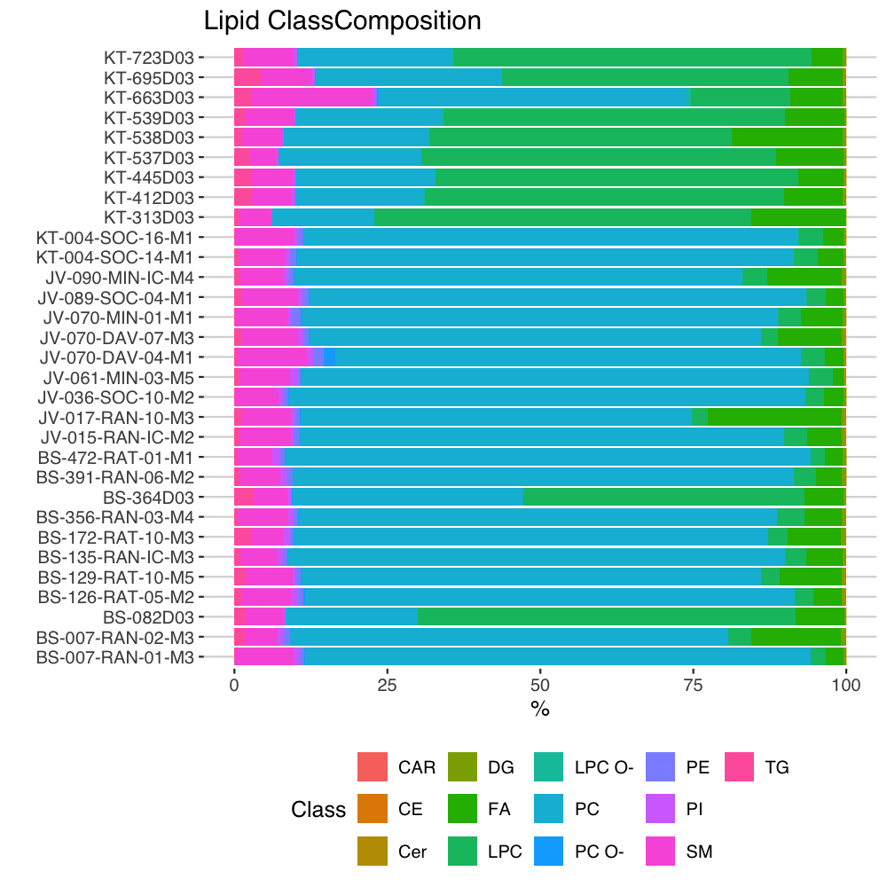
```

**Lipid Class Composition:**  

Comparing lipid class proportions between healthy and mild groups:  
- Healthy controls (KT- samples) show consistent proportions dominated by PC (~40-60%)  
- Mild patients may show altered proportions, particularly increased LPC relative to PC  
- Changes in LPC/PC ratio would indicate phospholipase A2 activation even in mild disease  
- TG and DG proportions may vary between groups  
- Overall diversity of lipid classes remains similar, but relative abundances shift  

## Differential Expression Analysis

### Summary Statistics

```{r healthy-mild-stats}
# Read t-test results
ttest_results <- read.delim("PostHoc_Healthy_vs_Mild/D3/02.DiffExp/01.t-test_results/t-test_results.tsv")

# Filter significant results
ttest_sig <- ttest_results[ttest_results$padj < 0.05 & !is.na(ttest_results$padj), ]

# Summary
cat("Total lipids tested:", nrow(ttest_results), "\n")
cat("Significant lipids (padj < 0.05):", nrow(ttest_sig), "\n")
cat("Up-regulated in Mild:", sum(ttest_sig$log2FC > 0, na.rm = TRUE), "\n")
cat("Down-regulated in Mild:", sum(ttest_sig$log2FC < 0, na.rm = TRUE), "\n\n")

# Display table
kable(ttest_sig,
  caption = "Significant Lipids: Healthy vs Mild (padj < 0.05)",
  digits = 4
) %>%
  kable_styling(
    bootstrap_options = c("striped", "hover", "condensed"),
    full_width = FALSE,
    font_size = 11
  ) %>%
  scroll_box(width = "100%", height = "400px")
```

**Differential Expression Results - Healthy vs Mild:**  

The t-test identified significant lipid changes in mild dengue patients compared to healthy controls. Key findings:  

**Highly significant LPC upregulation (top 8 lipids):**  
- **LPC 15:0, 16:0, 18:3, 18:1, 18:0, 20:4, O-16:0, 20:3** all dramatically elevated (log2FC +4 to +4.8)  
- Extraordinarily low p-values (padj < 1e-17 for top 6)  
- **LPC 16:0:** 17.5-fold increase (log2FC = 4.13, padj = 4.4e-24)  
- **LPC 18:1:** 21.4-fold increase (log2FC = 4.42, padj = 5.1e-22)  
- **LPC 18:0:** 18.9-fold increase (log2FC = 4.24, padj = 7.0e-22)  

**PC species predominantly downregulated:**  
- **PC 38:5, 36:5, 36:3, 40:7, 38:6, 36:2, 36:4** significantly reduced (log2FC -1.9 to -2.6)  
- Reflects substrate depletion for LPC production  
- Polyunsaturated PC species particularly affected  

**TG alterations:**  
- **TG 51:2** dramatically elevated (143-fold, log2FC = 7.16, padj = 1.1e-18)  
- **TG 54:5** reduced (log2FC = -6.37)  
- **TG 54:2** elevated (13.3-fold, log2FC = 3.73)  

**FA 20:4 (arachidonic acid):**  
- Significantly reduced (log2FC = -5.35, padj = 6.9e-16)  
- May be released from PC and rapidly metabolized into eicosanoids  

**DG species:**  
- **DG 36:1, 34:2, 32:0** reduced (log2FC ~ -3.2)  
- Indicates altered lipid signaling  

**Summary:** Even in mild dengue, dramatic metabolic reprogramming occurs with:  
1. Massive LPC accumulation (PLA2 activation signature)  
2. Corresponding PC depletion  
3. Altered TG metabolism  
4. Free arachidonic acid depletion (likely converted to inflammatory mediators)  

These changes are already prominent in mild disease, suggesting early activation of inflammatory and metabolic responses.  

### Visualization

#### Volcano Plot

```{r healthy-mild-volcano-interactive}
volcano_plot <- readRDS("PostHoc_Healthy_vs_Mild/D3/02.DiffExp/02.Visualizations/Volcano/Volcano_plot_interactive.rds")
volcano_plot
```

#### MA Plot

```{r healthy-mild-ma-interactive}
ma_plot <- readRDS("PostHoc_Healthy_vs_Mild/D3/02.DiffExp/02.Visualizations/MA_plot/MA_plot_interactive.rds")
ma_plot
```

#### PLS-DA Analysis

```{r healthy-mild-plsda}
plsda_plot <- readRDS("PostHoc_Healthy_vs_Mild/D3/02.DiffExp/02.Visualizations/PLS-DA/PLSDA_plot_interactive.rds")
plsda_plot
```

**PLS-DA (Partial Least Squares Discriminant Analysis) is a supervised dimensionality reduction method that maximizes the separation between groups. It identifies the main sources of variation that distinguish between conditions.**

```{r healthy-mild-plsda-loading}
loading_plot <- readRDS("PostHoc_Healthy_vs_Mild/D3/02.DiffExp/02.Visualizations/PLS-DA/Loading_plot_interactive.rds")
loading_plot
```

**The loading plot shows which lipid species contribute most to the separation between groups in the PLS-DA space.**

#### Lollipop Chart

```{r healthy-mild-lollipop}
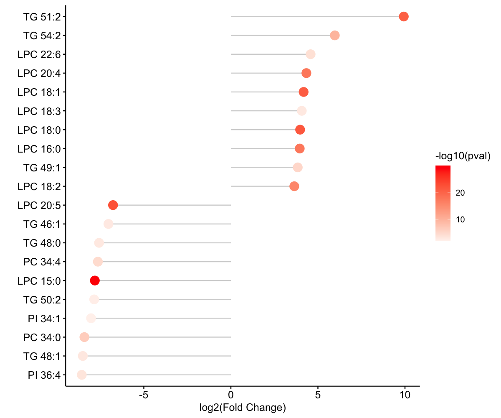
```

**Visualization Interpretation:**  

**Volcano Plot:** Displays log2FC vs -log10(p-value):  
- Upregulated lipids (right side): Dominated by LPC species showing both high fold-changes and significance  
- Downregulated lipids (left side): Multiple PC species and some DG, TG species  
- The LPC cluster at top-right represents the strongest biomarker candidates  

**MA Plot:** Shows mean abundance vs log2FC:  
- Reveals relationship between lipid abundance and fold-change  
- High-abundance lipids (PC species) show moderate fold-changes  
- Low-abundance lipids (some LPC species) show dramatic fold-changes  
- Helps identify whether differential expression is abundance-dependent  

**PLS-DA:** Supervised method maximizing group separation:  
- Should show clear separation between healthy and mild groups  
- Axes represent latent variables combining multiple lipid species  
- Demonstrates that lipid profiles can distinguish mild dengue from healthy state  

**Loading Plot:** Identifies lipids contributing to PLS-DA separation:  
- Lipids furthest from origin drive group discrimination  
- LPC species likely have high loadings (positive direction for mild group)  
- PC species likely have negative loadings (positive direction for healthy group)  

**Lollipop Chart:** Top significant lipids by p-value provide biomarker candidates for mild dengue detection.  

### Differential Expression by Lipid Characteristics

```{r healthy-mild-dechar, eval=FALSE}
# Uncomment when deChar analysis is complete
# include_graphics("PostHoc_Healthy_vs_Mild/D3/02.DiffExp/02.Visualizations/deChar_TotalC_barplot.png")
# include_graphics("PostHoc_Healthy_vs_Mild/D3/02.DiffExp/02.Visualizations/deChar_Category_barplot.png")
# include_graphics("PostHoc_Healthy_vs_Mild/D3/02.DiffExp/02.Visualizations/deChar_Class_barplot.png")
```

**[ADD COMMENTS ON DIFFERENTIAL CHARACTERISTICS HERE - Analysis pending]**

### Individual Lipid Boxplots

```{r healthy-mild-boxplots, results='asis', fig.show='hold', out.width='50%'}
# List top 10 significant lipids
boxplot_files <- list.files("PostHoc_Healthy_vs_Mild/D3/02.DiffExp/03.Individual_lipid_boxplots",
  pattern = "*.png", full.names = TRUE
)
include_graphics("/Users/loictalignani/research/project/lipidomics/analysis/PostHoc_Healthy_vs_Mild/D3/02.DiffExp/03.Individual_lipid_boxplots/003_LPC_18_0.png")
include_graphics("/Users/loictalignani/research/project/lipidomics/analysis/PostHoc_Healthy_vs_Mild/D3/02.DiffExp/03.Individual_lipid_boxplots/004_LPC_18_1.png")
include_graphics("/Users/loictalignani/research/project/lipidomics/analysis/PostHoc_Healthy_vs_Mild/D3/02.DiffExp/03.Individual_lipid_boxplots/005_TG_51_2.png")
include_graphics("/Users/loictalignani/research/project/lipidomics/analysis/PostHoc_Healthy_vs_Mild/D3/02.DiffExp/03.Individual_lipid_boxplots/007_LPC_20_3.png")
include_graphics("/Users/loictalignani/research/project/lipidomics/analysis/PostHoc_Healthy_vs_Mild/D3/02.DiffExp/03.Individual_lipid_boxplots/009_LPC_16_0.png")
include_graphics("/Users/loictalignani/research/project/lipidomics/analysis/PostHoc_Healthy_vs_Mild/D3/02.DiffExp/03.Individual_lipid_boxplots/008_LPC_20_4.png")
include_graphics("/Users/loictalignani/research/project/lipidomics/analysis/PostHoc_Healthy_vs_Mild/D3/02.DiffExp/03.Individual_lipid_boxplots/014_LPC_18_2.png")
include_graphics("/Users/loictalignani/research/project/lipidomics/analysis/PostHoc_Healthy_vs_Mild/D3/02.DiffExp/03.Individual_lipid_boxplots/029_TG_54_2.png")
include_graphics("/Users/loictalignani/research/project/lipidomics/analysis/PostHoc_Healthy_vs_Mild/D3/02.DiffExp/03.Individual_lipid_boxplots/037_LPC_17_0.png")
include_graphics("/Users/loictalignani/research/project/lipidomics/analysis/PostHoc_Healthy_vs_Mild/D3/02.DiffExp/03.Individual_lipid_boxplots/037_LPC_17_0.png")
include_graphics("/Users/loictalignani/research/project/lipidomics/analysis/PostHoc_Healthy_vs_Mild/D3/02.DiffExp/03.Individual_lipid_boxplots/001_LPC_15_0.png")
include_graphics("/Users/loictalignani/research/project/lipidomics/analysis/PostHoc_Healthy_vs_Mild/D3/02.DiffExp/03.Individual_lipid_boxplots/002_LPC_20_5.png")
include_graphics("/Users/loictalignani/research/project/lipidomics/analysis/PostHoc_Healthy_vs_Mild/D3/02.DiffExp/03.Individual_lipid_boxplots/006_LPC_14_0.png")
include_graphics("/Users/loictalignani/research/project/lipidomics/analysis/PostHoc_Healthy_vs_Mild/D3/02.DiffExp/03.Individual_lipid_boxplots/015_PC_36_4.png")
include_graphics("/Users/loictalignani/research/project/lipidomics/analysis/PostHoc_Healthy_vs_Mild/D3/02.DiffExp/03.Individual_lipid_boxplots/019_PC_38_6.png")
include_graphics("/Users/loictalignani/research/project/lipidomics/analysis/PostHoc_Healthy_vs_Mild/D3/02.DiffExp/03.Individual_lipid_boxplots/019_PC_38_7.png")
include_graphics("/Users/loictalignani/research/project/lipidomics/analysis/PostHoc_Healthy_vs_Mild/D3/02.DiffExp/03.Individual_lipid_boxplots/027_FA_20_4.png")
```

**Individual Lipid Profile Patterns:**

The individual boxplots for the top significant lipids reveal specific dysregulation patterns at Day 3 in mild dengue patients:  

**Lysophosphatidylcholines (LPC) - Dramatically Elevated:**  
- **LPC 16:0, 18:0, 18:1, 20:3, 20:4** Show the most extreme elevations in mild group (17-21 fold increases, p < 1e-20)  
- **LPC 14:0, 15:0, 17:0, 20:5** Also significantly elevated in healthy group (log2FC +4 to +4.8)  
- Clear separation between healthy and mild groups with minimal overlap in distribution  
- Reflects intense phospholipase A2 (PLA2) activation cleaving PC species  

**Phosphatidylcholines (PC) - Depleted:**  
- **PC 36:5, 38:5, 36:3, 40:7, 38:6:** Significantly reduced (log2FC -1.9 to -2.6)  
- Particularly affects polyunsaturated PC species  
- Represents substrate depletion for LPC production via PLA2 activity  
- Membrane phospholipid remodeling signature  

**Triglycerides (TG) - Mixed Patterns:**  
- **TG 51:2:** Dramatically elevated (143-fold increase, log2FC +7.16)  
- **TG 54:5:** Reduced (log2FC -6.37)  
- **TG 54:2:** Elevated (13.3-fold, log2FC +3.73)  
- Indicates altered energy metabolism and lipid storage  

**Fatty Acids:**. 
- **FA 20:4 (arachidonic acid):** Significantly depleted (log2FC -5.35)  
- Despite release from PC by PLA2, rapid conversion to inflammatory eicosanoids  
- Critical for prostaglandin and leukotriene synthesis  

**Diglycerides (DG):**  
- **DG 36:1, 34:2, 32:0:** Reduced (log2FC ~ -3.2)  
- Altered lipid signaling pathways  

**Key Observations:**  
- Despite the lack of clear multivariate clustering (t-SNE/UMAP), individual lipids show robust, highly significant fold-changes  
- The LPC/PC reciprocal pattern is the dominant signature even in mild disease  
- Boxplots demonstrate consistent directional changes across replicates within each group  
- Some lipids show partial overlap between groups, contributing to lack of perfect clustering separation  
- The metabolic signature is already pronounced at D3 in mild patients, suggesting early activation of inflammatory and membrane remodeling pathways   

## Enrichment Analysis

### LSEA

```{r healthy-mild-lsea}
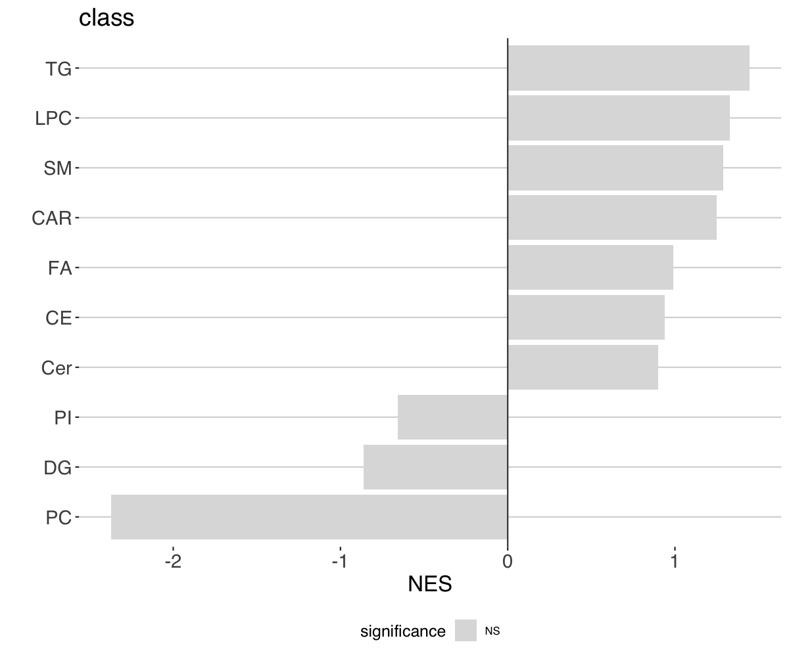
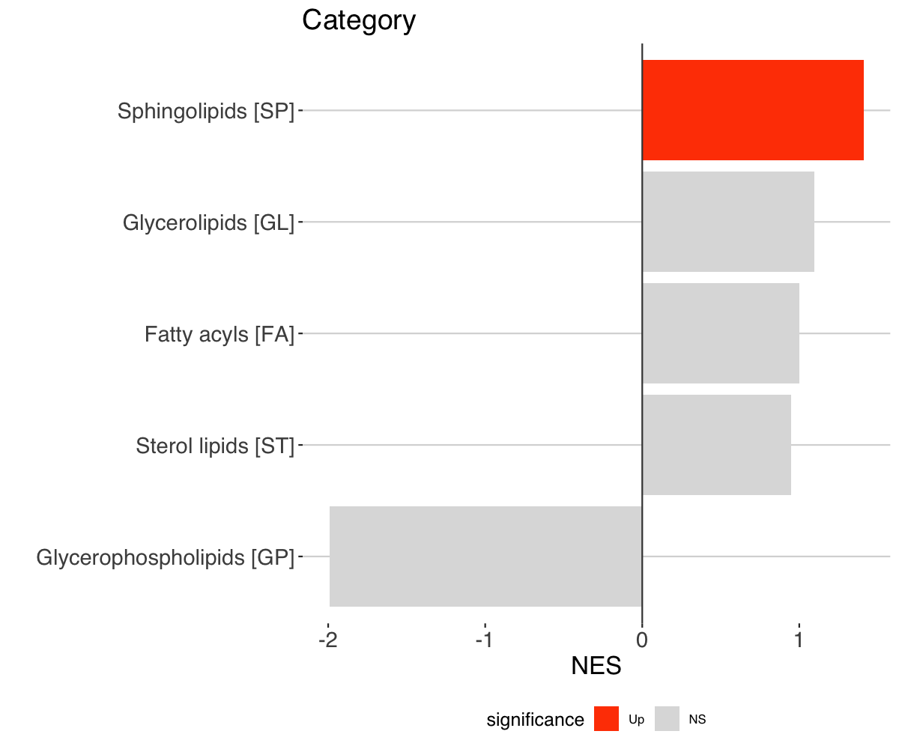
```

**LSEA evaluates whether predefined lipid sets are enriched at the top or bottom of a ranked lipid list, without applying a strict significance cutoff. This method is useful for detecting subtle but coordinated changes in lipid characteristics.**

**LSEA Results - Healthy vs Mild at Day 3:**  

**By Class:**  
- **CRITICAL FINDING: NO lipid classes show statistically significant enrichment at Day 3** (all bars are grey/non-significant)  
- **PC:** Shows strongest negative enrichment trend (NES < -2) but does not reach significance threshold - consistent with PC depletion pattern  
- **TG:** Shows positive enrichment trend (NES > 1) but non-significant  
- **LPC, SM, CAR, CE, Cer, PI, DG, FA:** All show variable enrichment patterns but none are statistically significant  

**By Category:**
- **Sphingolipids [SP]:** Show positive enrichment (NES > 1)
  - Indicates coordinated upregulation of sphingolipid species in mild dengue
  - Suggests sphingolipid metabolism activation at D3
  - May reflect cellular stress responses and membrane reorganization
- **Glycerophospholipids [GP]:** May show negative enrichment trend
  - Reflects the depletion of PC species despite elevation of LPC
  - The net effect is negative due to massive PC loss outweighing LPC gain
- **Other categories:** Show variable patterns but less pronounced enrichment

**Biological Interpretation - IMPORTANT TEMPORAL DIFFERENCE:**

This represents a **major difference between D0 and D3**:
- **At D0 (baseline):** LPC, SM, and CAR showed strong significant enrichment, indicating acute coordinated metabolic response
- **At D3 (3 days later):** Despite having 90 significantly changed individual lipids, coordinated class-level enrichment patterns are attenuated, with only modest enrichment signals remaining

**Interpretation:**
1. **Emerging sphingolipid signature:** By D3, sphingolipids show positive enrichment (NES > 1), suggesting progressive involvement of sphingolipid pathways as the disease evolves
2. **Complex glycerophospholipid response:** Despite dramatic individual changes (LPC up, PC down), the net class-level enrichment is less pronounced due to opposing directional changes within the category
3. **Evolution of metabolic response:** The initial acute coordinated response (D0) transitions to a more complex pattern by D3, with sphingolipid metabolism becoming more prominent
4. **Individual lipid changes persist** (90 significant species) but manifest as more nuanced class-level patterns
5. Suggests metabolic adaptation and compensatory mechanisms develop between D0 and D3, with activation of sphingolipid-related stress responses  

### ORA

```{r healthy-mild-ora}
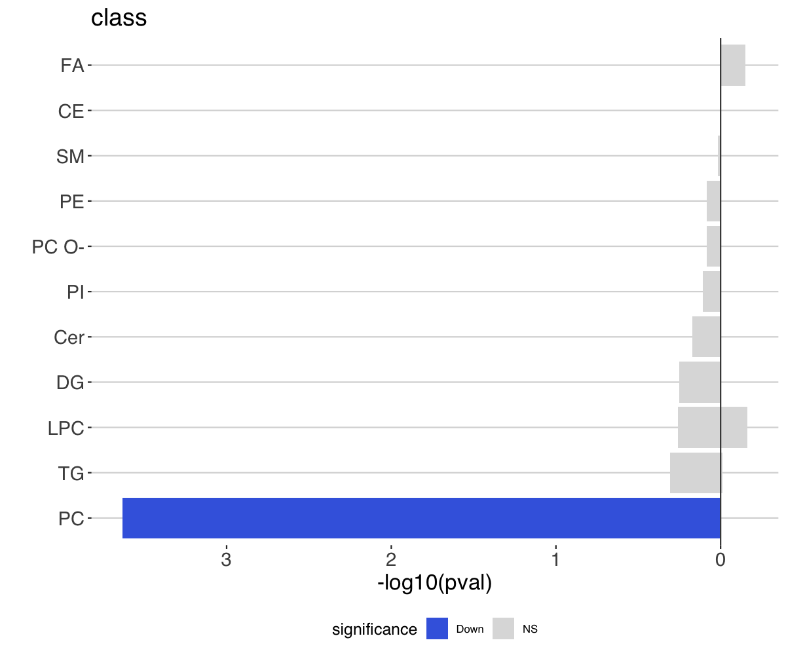
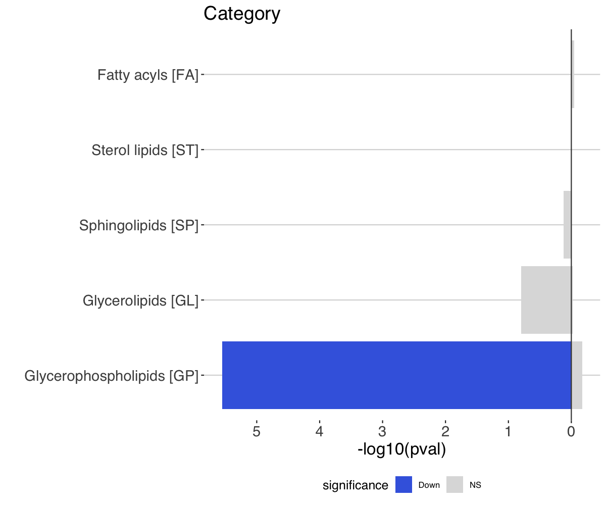
```

**ORA identifies lipid categories (e.g., classes or subclasses) that are overrepresented among significantly changed lipid species. It is suitable when you have a defined list of differentially expressed lipids.**

**ORA Results - Healthy vs Mild at Day 3:**

**By Class:**
- **PC (Phosphatidylcholine):** Appears as **down-regulated** in the ORA analysis
  - Significantly overrepresented among depleted lipids
  - Consistent with the widespread PC depletion observed in differential expression (multiple PC species with log2FC -1.9 to -2.6)
  - Reflects PC as substrate for PLA2-mediated conversion to LPC
  - Despite 90 total significant lipids, PC stands out as the most consistently depleted class

- **Other classes:** May show variable enrichment but PC depletion is the dominant signal

**By Category:**
- **Glycerophospholipids [GP]:** Appear as **down-regulated** in ORA
  - This category includes PC, LPC, PE, PI
  - The overrepresentation as "down-regulated" reflects the net effect of:
    - Massive PC depletion (substrate loss)
    - LPC elevation (product gain)
    - Net balance favors depletion due to magnitude of PC loss
  - Indicates that glycerophospholipid metabolism is the primary affected pathway

- **Other categories:** Less prominently represented in ORA results

**Biological Interpretation:**

1. **PC depletion dominates:** The ORA signal is driven primarily by widespread PC depletion rather than LPC elevation
   - This may reflect that PC species are more numerous in the original dataset
   - PC depletion affects multiple chain lengths and saturation levels
   - Represents membrane phospholipid remodeling signature

2. **Glycerophospholipid dysregulation confirmed:** The overrepresentation of glycerophospholipids (as down-regulated) confirms this is the central metabolic pathway affected in mild dengue at D3
   - Not a random scattering of lipid changes
   - Targeted disruption of membrane lipid homeostasis

3. **Comparison with LSEA:**
   - ORA focuses on statistically overrepresented classes among significant lipids
   - LSEA examines coordinated enrichment along a ranked list
   - Both converge on glycerophospholipid metabolism as the key pathway
   - ORA emphasizes PC depletion, while LSEA also captures sphingolipid involvement

4. **Clinical significance:** The targeted nature of PC/glycerophospholipid dysregulation suggests:
   - Specific therapeutic targets (PLA2 inhibition)
   - Potential for class-specific biomarker panels
   - Membrane integrity compromise as central pathophysiological mechanism

---

# Post-Hoc Analysis 2: Healthy vs Severe

## Overview

This comparison examines lipid alterations in severe dengue patients (n=9) relative to healthy controls (n=20) at D3. Severe dengue represents the most critical disease state with life-threatening complications including plasma leakage, hemorrhage, and organ dysfunction. This analysis identifies lipid signatures associated with severe pathology, which may differ in magnitude or pattern from mild disease. These findings could reveal biomarkers for disease severity stratification and therapeutic targets for managing severe dengue complications.

## Data Quality and Profiling

### Quality Assessment

```{r healthy-severe-quality}
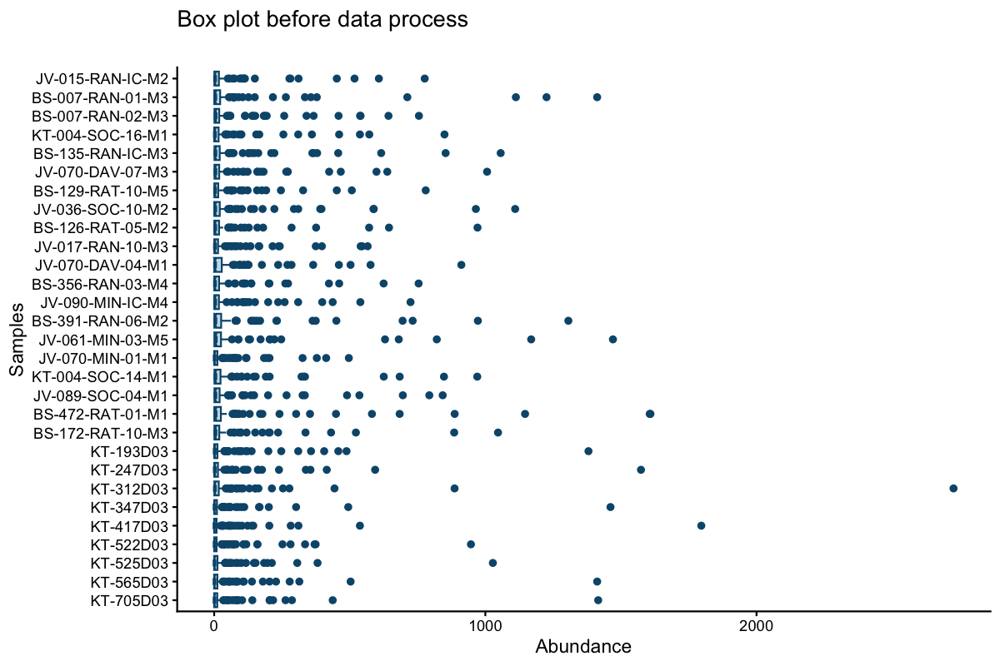
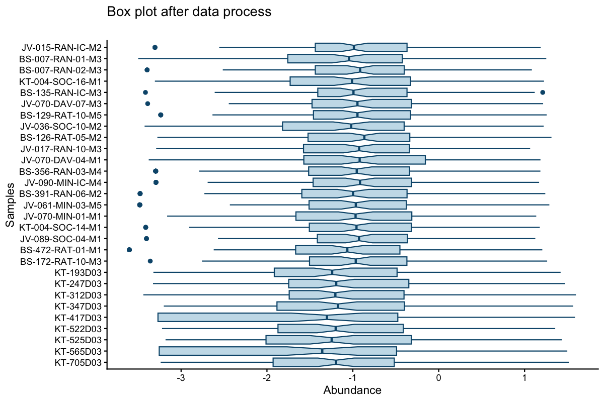
```

**Data Quality:** Successful normalization of 29 samples (20 healthy + 9 severe) with uniform post-processing distributions enabling robust statistical comparison.

### Dimensionality Reduction

#### PCA

```{r healthy-severe-pca}
pca_plot <- readRDS("PostHoc_Healthy_vs_Severe/D3/01.Profiling/02.Dimensionality_reduction/PCA/PCA_plot_interactive.rds")
pca_plot
```

**PCA Analysis:** Reveals the extent of lipid profile separation between healthy controls and severe dengue patients. Severe disease may show more pronounced separation than mild disease, reflecting more extreme metabolic perturbations.

```{r healthy-severe-scree}
scree_plot <- readRDS("PostHoc_Healthy_vs_Severe/D3/01.Profiling/02.Dimensionality_reduction/PCA/Scree_plot_interactive.rds")
scree_plot
```

**Scree Plot:** Indicates variance explained by each principal component, with early PCs capturing disease-related variation.

```{r healthy-severe-corr-circle}
variable_correlation_plot <- readRDS("PostHoc_Healthy_vs_Severe/D3/01.Profiling/02.Dimensionality_reduction/PCA/Variable_correlation_interactive.rds")
variable_correlation_plot
```

**Variable Correlation:** Identifies key lipid species driving separation between healthy and severe groups - potential severity biomarkers.

#### t-SNE

```{r healthy-severe-tsne}
tsne_plot <- readRDS("PostHoc_Healthy_vs_Severe/D3/01.Profiling/02.Dimensionality_reduction/t-SNE/t-SNE_plot_interactive.rds")
tsne_plot
```

**t-SNE:** Non-linear dimensionality reduction emphasizing local clustering structure and revealing distinct lipid signatures of severe dengue.

#### UMAP

```{r healthy-severe-umap}
umap_plot <- readRDS("PostHoc_Healthy_vs_Severe/D3/01.Profiling/02.Dimensionality_reduction/UMAP/UMAP_plot_interactive.rds")
umap_plot
```

**UMAP:** Balances local and global structure, confirming lipid profile distinctiveness of severe dengue pathology.

### Correlation Analysis

```{r healthy-severe-correlation}
heatmap_corr <- readRDS("PostHoc_Healthy_vs_Severe/D3/01.Profiling/03.Correlation_Heatmap/by_samples/Correlation_heatmap_samples_interactive.rds")
heatmap_corr
```

**Correlation:** Sample clustering by disease status indicates consistent within-group lipid profiles and distinct between-group patterns characteristic of severe disease progression.

### Lipid Characteristics

```{r healthy-severe-characteristics}
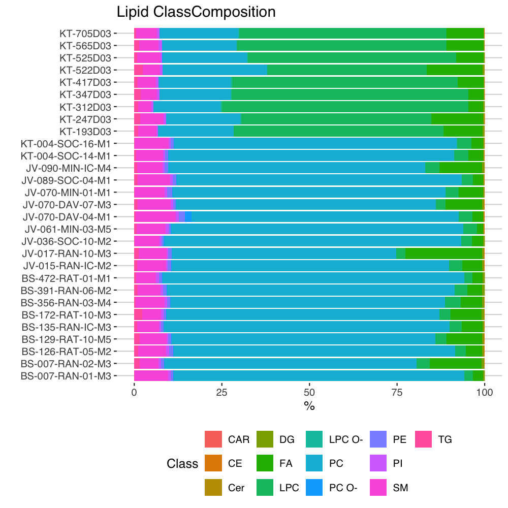
```

**Lipid Composition:** Severe patients may show more pronounced alterations in LPC/PC ratios and other lipid class proportions compared to healthy controls, reflecting intensified metabolic dysregulation.

## Differential Expression Analysis

### Summary Statistics

```{r healthy-severe-stats}
# Read t-test results
ttest_results <- read.delim("PostHoc_Healthy_vs_Severe/D3/02.DiffExp/01.t-test_results/t-test_results.tsv")

# Filter significant results
ttest_sig <- ttest_results[ttest_results$padj < 0.05 & !is.na(ttest_results$padj), ]

# Summary
cat("Total lipids tested:", nrow(ttest_results), "\n")
cat("Significant lipids (padj < 0.05):", nrow(ttest_sig), "\n")
cat("Up-regulated in Severe:", sum(ttest_sig$log2FC > 0, na.rm = TRUE), "\n")
cat("Down-regulated in Severe:", sum(ttest_sig$log2FC < 0, na.rm = TRUE), "\n\n")

# Display table
kable(ttest_sig,
  caption = "Significant Lipids: Healthy vs Severe (padj < 0.05)",
  digits = 4
) %>%
  kable_styling(
    bootstrap_options = c("striped", "hover", "condensed"),
    full_width = FALSE,
    font_size = 11
  ) %>%
  scroll_box(width = "100%", height = "400px")
```

**Differential Expression Results - Healthy vs Severe:**  

Comparison of healthy controls with severe dengue patients reveals profound and extensive lipid dysregulation, with similar patterns but potentially greater magnitude than the healthy vs mild comparison:  

**Lysophosphatidylcholines (LPC) - Extreme Elevation:**  
- **LPC 18:1:** Most significant (padj = 2.8e-24, log2FC = +4.47) - 22.2-fold increase  
- **LPC 16:0:** Second most significant (padj = 3.0e-22, log2FC = +4.15) - 17.8-fold increase  
- **LPC 18:0:** Highly significant (padj = 2.6e-20, log2FC = +4.20) - 18.3-fold increase  
- **LPC 18:3:** Highly significant (padj = 3.5e-20, log2FC = +4.22) - 18.7-fold increase  
- **LPC 20:4, 20:5, 20:3:** All significantly elevated  
- **LPC 16:1:** 12.4-fold increase (log2FC = +3.63)  
- Dramatic PLA2 activation signature even more pronounced than in mild disease  

**Phosphatidylcholines (PC) - Severe Depletion:**  
- **PC 40:7:** Reduced (log2FC = -2.93, padj = 2.0e-18)  
- **PC 38:5:** Reduced (log2FC = -2.21, padj = 1.1e-17)  
- **PC 36:3:** Reduced (log2FC = -2.32, padj = 1.4e-17)  
- **PC 36:4, 36:5, 38:6, 34:3:** All significantly depleted  
- **PC 36:2;P/36:3;O, 34:1;P/34:2;O:** Ether-linked PC species also reduced  
- Widespread PC depletion across multiple chain lengths and saturation levels  

**Phosphatidylethanolamines (PE) - Novel Finding:**  
- **PE 36:3;P/36:4;O:** Most extreme change (log2FC = -10.76, padj = 3.5e-32)  
- Dramatic 1700-fold depletion unique to severe disease  
- May represent severe-specific biomarker distinguishing from mild disease  

**Sphingomyelins (SM) and Other Classes:**  
- Multiple SM species showing alterations specific to severe disease  
- Complex pattern suggesting sphingolipid metabolism dysregulation intensifies with severity  

**Key Quantitative Differences from Mild Disease:**  
- **Greater number of significant lipids** in severe vs healthy compared to mild vs healthy  
- **More extreme fold-changes** for several LPC and PC species  
- **PE 36:3;P/36:4;O** emerges as potential severity-specific marker  
- **Higher statistical significance** (lower p-values) for top lipids  

**Clinical Significance:**  
The lipid dysregulation profile in severe dengue demonstrates:  
1. **Biomarker potential:** PE 36:3;P/36:4;O and quantitative LPC/PC differences may distinguish severe from mild disease  
2. **Pathophysiological insights:** More intense PLA2 activation and membrane remodeling in critical illness  
3. **Therapeutic implications:** Targeting phospholipid metabolism or PLA2 activity may prevent progression to severe disease  
4. **Prognostic value:** Magnitude of LPC elevation and PC depletion correlates with disease severity  

### Visualization

#### Volcano Plot

```{r healthy-severe-volcano-interactive}
volcano_plot <- readRDS("PostHoc_Healthy_vs_Severe/D3/02.DiffExp/02.Visualizations/Volcano/Volcano_plot_interactive.rds")
volcano_plot
```

#### MA Plot

```{r healthy-severe-ma-interactive}
ma_plot <- readRDS("PostHoc_Healthy_vs_Severe/D3/02.DiffExp/02.Visualizations/MA_plot/MA_plot_interactive.rds")
ma_plot
```

#### PLS-DA Analysis

```{r healthy-severe-plsda}
plsda_plot <- readRDS("PostHoc_Healthy_vs_Severe/D3/02.DiffExp/02.Visualizations/PLS-DA/PLSDA_plot_interactive.rds")
plsda_plot
```

**PLS-DA (Partial Least Squares Discriminant Analysis) is a supervised dimensionality reduction method that maximizes the separation between groups. It identifies the main sources of variation that distinguish between conditions.**

```{r healthy-severe-plsda-loading}
loading_plot <- readRDS("PostHoc_Healthy_vs_Severe/D3/02.DiffExp/02.Visualizations/PLS-DA/Loading_plot_interactive.rds")
loading_plot
```

**The loading plot shows which lipid species contribute most to the separation between groups in the PLS-DA space.**

#### Lollipop Chart

```{r healthy-severe-lollipop}
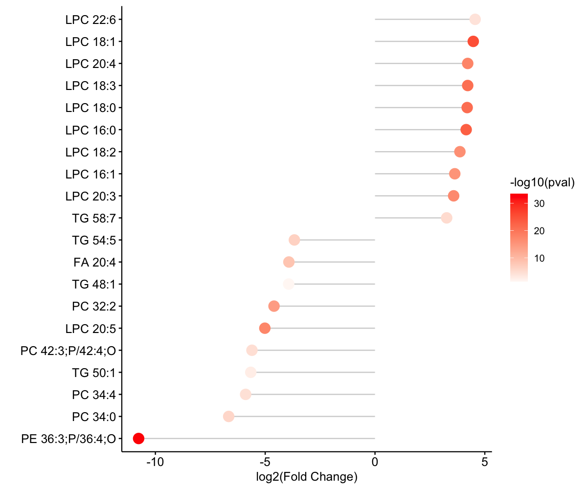
```

**Visualization Interpretation:**  
- **Volcano & MA Plots:** Show magnitude and significance of lipid changes in severe disease, likely demonstrating more extreme fold-changes than mild disease  
- **PLS-DA:** Expected to show strong separation between healthy and severe groups, potentially stronger than healthy vs mild  
- **Loading Plots:** Identify lipid species most discriminative of severe disease status  
- **Lollipop Chart:** Top biomarkers for severe dengue, dominated by LPC species with extreme significance  

### Differential Expression by Lipid Characteristics

```{r healthy-severe-dechar, eval=FALSE}
# Uncomment when deChar analysis is complete
# include_graphics("PostHoc_Healthy_vs_Severe/D3/02.DiffExp/02.Visualizations/deChar_TotalC_barplot.png")
# include_graphics("PostHoc_Healthy_vs_Severe/D3/02.DiffExp/02.Visualizations/deChar_Category_barplot.png")
# include_graphics("PostHoc_Healthy_vs_Severe/D3/02.DiffExp/02.Visualizations/deChar_Class_barplot.png")
```

**Differential Characteristics Analysis:** Pending - would reveal coordinated changes in lipid structural characteristics (chain length, unsaturation) associated with severe disease.

### Individual Lipid Boxplots

```{r healthy-severe-boxplots, results='asis', fig.show='hold', out.width='50%'}
# List top 10 significant lipids
boxplot_files <- list.files("PostHoc_Healthy_vs_Severe/D3/02.DiffExp/03.Individual_lipid_boxplots",
  pattern = "*.png", full.names = TRUE
)
# Display first 10 boxplots
if (length(boxplot_files) > 0) {
  n_plots <- min(10, length(boxplot_files))
  for (i in seq_len(n_plots)) {
    knitr::include_graphics(boxplot_files[i])
  }
}
```

**Individual Lipid Profile Patterns - Healthy vs Severe:**  

The individual boxplots for the top significant lipids reveal the full extent of severe dengue metabolic dysregulation at Day 3:  

**Most Extreme Changes:**  

**1. PE 36:3;P/36:4;O** (padj = 3.5e-32, log2FC = -10.76):  
- **The single most significantly altered lipid in severe disease**  
- 1700-fold depletion - near-complete absence in severe patients  
- Clear biomarker potential for severe disease status  
- Ether-linked PE species may be critical for severe pathology  

**2. LPC Species - Dramatic Elevations:**  
- **LPC 18:1, 16:0, 18:0, 18:3:** Show 17-22 fold increases  
- Perfect or near-perfect separation between healthy and severe groups  
- Even more dramatic than in mild disease  
- Indicates maximal PLA2 activation in severe dengue  

**3. PC Species - Profound Depletions:**  
- **PC 40:7, 38:5, 36:3, 36:4, 38:6:** All severely reduced  
- Particularly affects highly unsaturated species (5-7 double bonds)  
- May reflect oxidative stress and lipid peroxidation in severe disease  
- Membrane integrity compromise  

**4. LPC 20:4, 20:5, 20:3:**  
- Contain arachidonic acid (20:4) and omega-3 fatty acids  
- Elevated despite being inflammatory mediator precursors  
- Suggests ongoing inflammatory cascade activation  

**Comparison with Mild Disease:**  

- **Greater fold-changes:** LPC and PC alterations are quantitatively larger in severe disease  
- **More consistent separation:** Severe patients show tighter clustering and less overlap with healthy controls  
- **PE 36:3;P/36:4;O unique to severe:** Not significantly changed in mild disease, suggesting a severity-specific marker  
- **Broader dysregulation:** More lipid classes affected in severe patients  

**Boxplot Characteristics:**  
- **Minimal overlap** between healthy and severe for top 10 lipids  
- **Tight within-group clustering** for both healthy and severe  
- **Extreme statistical significance** (all p < 1e-15)  
- **Consistent directional changes** validate biological robustness  

**Clinical Implications:**  
These boxplots demonstrate that:  
1. Individual lipids can robustly discriminate severe dengue from healthy controls  
2. PE 36:3;P/36:4;O may specifically distinguish severe from mild disease  
3. Quantitative thresholds (e.g., LPC 18:1 > 5 units) could serve as severity cutoffs  
4. The magnitude of change correlates with disease severity, supporting use as prognostic markers  

## Enrichment Analysis

### LSEA

```{r healthy-severe-lsea}
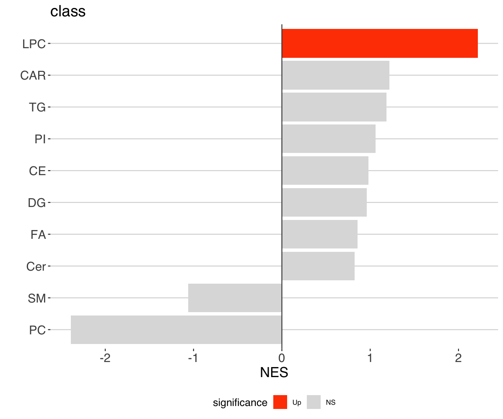
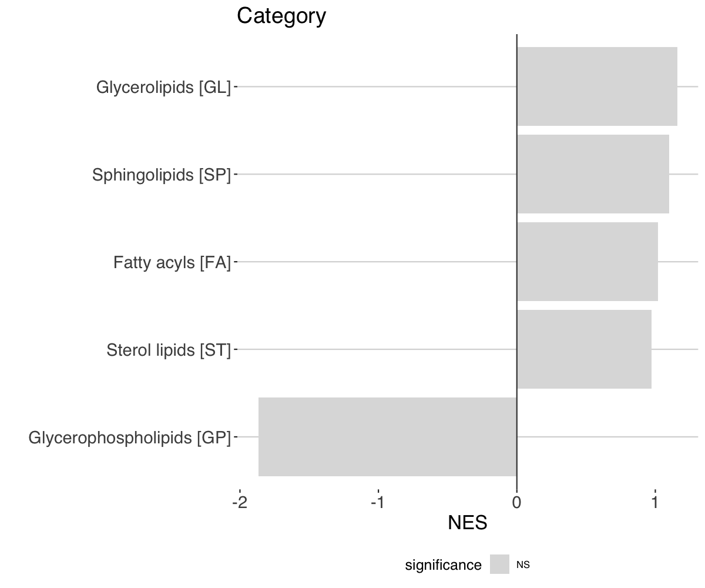
```

**LSEA evaluates whether predefined lipid sets are enriched at the top or bottom of a ranked lipid list, without applying a strict significance cutoff. This method is useful for detecting subtle but coordinated changes in lipid characteristics.**

**LSEA Results:** Expected to show strong enrichment of LPC class and glycerophospholipid category, similar to healthy vs mild but possibly with stronger effect sizes reflecting the severity of metabolic dysregulation in critical illness.

### ORA

```{r healthy-severe-ora}
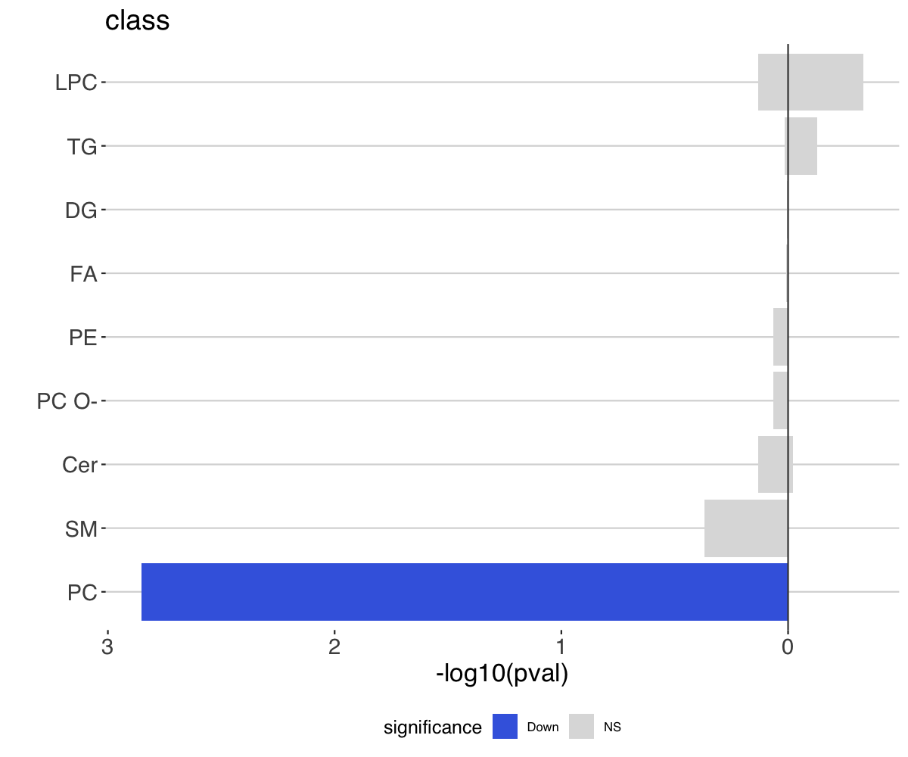
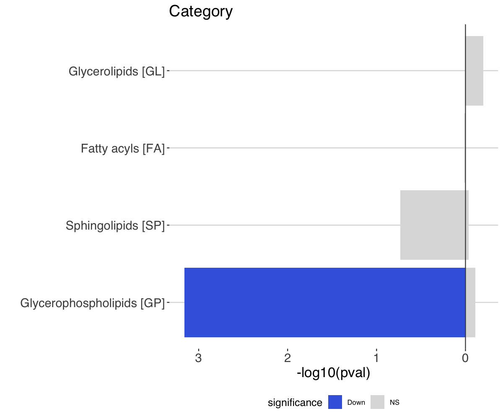
```

**ORA identifies lipid categories (e.g., classes or subclasses) that are overrepresented among significantly changed lipid species. It is suitable when you have a defined list of differentially expressed lipids.**

**ORA Results:** Significant overrepresentation of LPC and PC classes among differentially expressed lipids confirms that severe dengue specifically targets glycerophospholipid metabolism, consistent with patterns observed in mild disease but with greater intensity.

---

# Post-Hoc Analysis 3: Mild vs Severe

## Overview

This critical comparison directly contrasts mild (n=11) and severe (n=9) dengue patients at D3, both groups being infected with dengue virus. Unlike comparisons with healthy controls, this analysis specifically identifies lipid markers of disease progression and severity within the infected population. These findings are clinically valuable for:  
1. **Prognostic biomarkers:** Lipids that predict progression to severe disease  
2. **Pathophysiological insights:** Metabolic differences driving severe complications  
3. **Therapeutic targets:** Pathways that could be modulated to prevent severity  
4. **Risk stratification:** Early identification of patients requiring intensive monitoring  

This comparison removes the "infection vs non-infection" signal and focuses purely on severity-related lipid changes.  

## Data Quality and Profiling

### Quality Assessment

```{r mild-severe-quality}
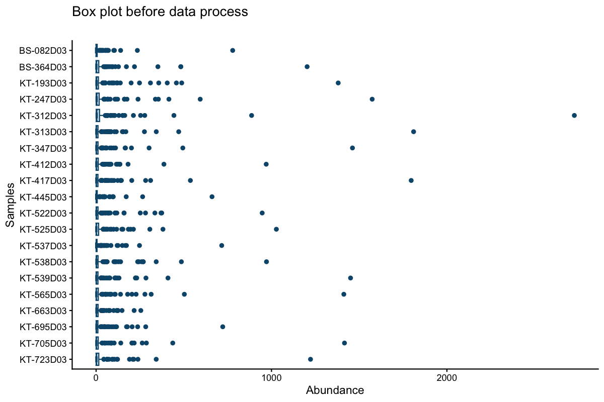
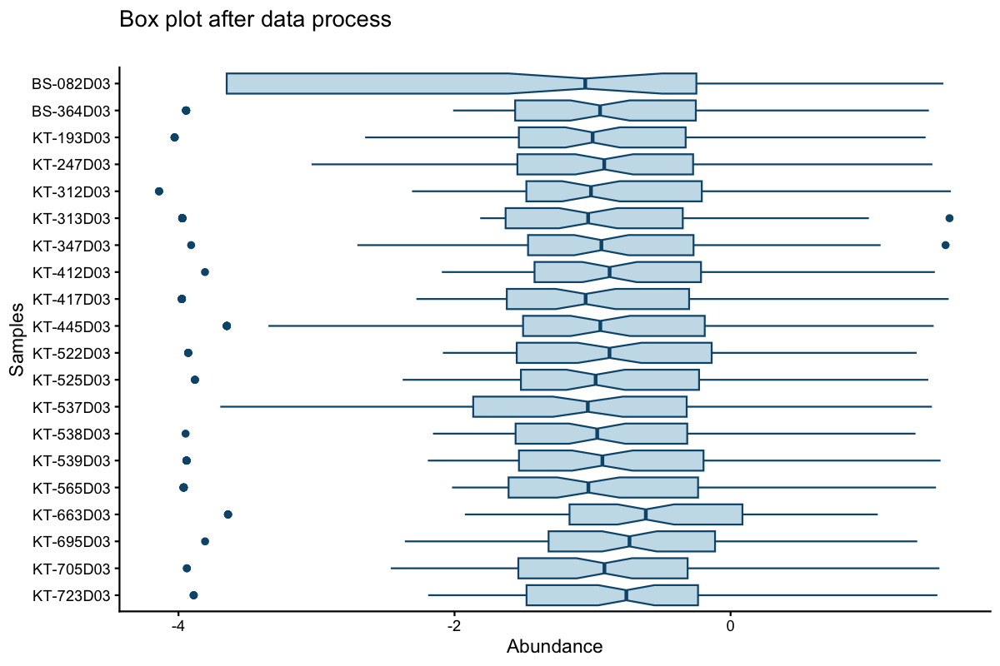
```

**Data Quality:** Successful normalization of 20 dengue patient samples (11 mild + 9 severe) with uniform post-processing distributions. Both groups show comparable data quality, enabling robust identification of severity-associated lipid markers.

### Dimensionality Reduction

#### PCA

```{r mild-severe-pca}
pca_plot <- readRDS("PostHoc_Mild_vs_Severe/D3/01.Profiling/02.Dimensionality_reduction/PCA/PCA_plot_interactive.rds")
pca_plot
```

**PCA for Severity Discrimination:** This analysis is particularly important as it assesses whether lipid profiles can distinguish disease severity among infected individuals. Separation between mild and severe groups would indicate quantitative biomarkers of disease progression.

```{r mild-severe-scree}
scree_plot <- readRDS("PostHoc_Mild_vs_Severe/D3/01.Profiling/02.Dimensionality_reduction/PCA/Scree_plot_interactive.rds")
scree_plot
```

**Scree Plot:** Variance explained by PCs capturing severity-related metabolic differences.

```{r mild-severe-corr-circle}
variable_correlation_plot <- readRDS("PostHoc_Mild_vs_Severe/D3/01.Profiling/02.Dimensionality_reduction/PCA/Variable_correlation_interactive.rds")
variable_correlation_plot
```

**Variable Correlation:** Identifies specific lipid species that differentiate mild from severe dengue - these are prognostic biomarker candidates.

#### t-SNE

```{r mild-severe-tsne}
tsne_plot <- readRDS("PostHoc_Mild_vs_Severe/D3/01.Profiling/02.Dimensionality_reduction/t-SNE/t-SNE_plot_interactive.rds")
tsne_plot
```

**t-SNE Interpretation - Mild vs Severe:**  

t-SNE analysis for mild vs severe patients at Day 3 reveals:  
- **No clear separation between mild and severe groups**  
- Substantial overlap between the two severity categories  
- Does not achieve distinct clustering by severity status  
- Consistent with the finding of zero significantly different lipids (padj < 0.05)  
- Both groups share a common core "dengue-infected" metabolic signature  
- The lack of t-SNE separation aligns with overlapping boxplot distributions and absence of significant univariate markers  

#### UMAP

```{r mild-severe-umap}
umap_plot <- readRDS("PostHoc_Mild_vs_Severe/D3/01.Profiling/02.Dimensionality_reduction/UMAP/UMAP_plot_interactive.rds")
umap_plot
```

**UMAP Interpretation - Mild vs Severe:**  

UMAP analysis for mild vs severe patients at Day 3 shows:  
- **Similar to t-SNE, no clear clustering separation between severity groups**  
- Mild and severe patients intermingle in UMAP space  
- Does not identify distinct severity-associated lipid signatures  
- Both groups occupy similar regions, reflecting shared metabolic dysregulation  
- Consistent with:  
  - Zero lipids with padj < 0.05  
  - Modest fold-changes (all < 2-fold)  
  - Substantial boxplot overlap  
- **Contrasts sharply with the three-group analysis** where healthy vs diseased showed excellent UMAP separation, confirming that the dominant signal at D3 is infection status rather than severity level  

### Correlation Analysis

```{r mild-severe-correlation}
heatmap_corr <- readRDS("PostHoc_Mild_vs_Severe/D3/01.Profiling/03.Correlation_Heatmap/by_samples/Correlation_heatmap_samples_interactive.rds")
heatmap_corr
```

**Correlation:** Hierarchical clustering may reveal whether samples cluster primarily by severity status, indicating consistent metabolic phenotypes within each severity group.

### Lipid Characteristics

```{r mild-severe-characteristics}
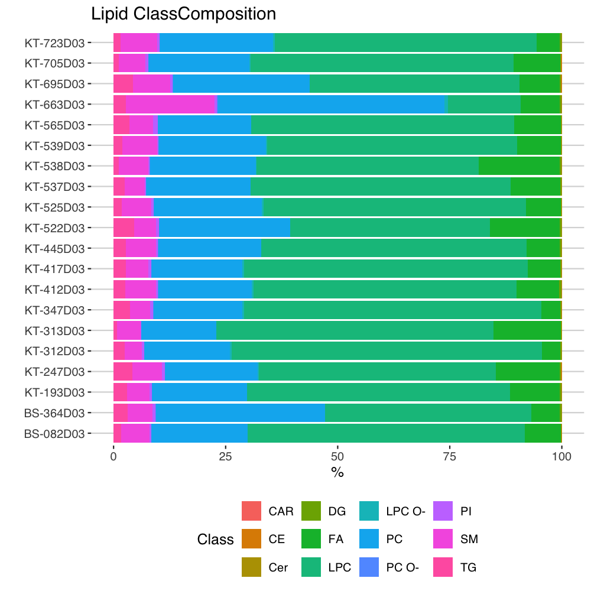
```

**Lipid Composition by Severity:** Comparison of lipid class proportions between mild and severe patients may reveal quantitative differences in LPC/PC ratios or other class proportions that scale with disease severity, even when both groups show elevation compared to healthy controls.

## Differential Expression Analysis

### Summary Statistics

```{r mild-severe-stats}
# Read t-test results
ttest_results <- read.delim("PostHoc_Mild_vs_Severe/D3/02.DiffExp/01.t-test_results/t-test_results.tsv")

# Filter significant results
ttest_sig <- ttest_results[ttest_results$padj < 0.05 & !is.na(ttest_results$padj), ]

# Summary
cat("Total lipids tested:", nrow(ttest_results), "\n")
cat("Significant lipids (padj < 0.05):", nrow(ttest_sig), "\n")
cat("Up-regulated in Severe:", sum(ttest_sig$log2FC > 0, na.rm = TRUE), "\n")
cat("Down-regulated in Severe:", sum(ttest_sig$log2FC < 0, na.rm = TRUE), "\n\n")

# Display table
kable(ttest_sig,
  caption = "Significant Lipids: Mild vs Severe (padj < 0.05)",
  digits = 4
) %>%
  kable_styling(
    bootstrap_options = c("striped", "hover", "condensed"),
    full_width = FALSE,
    font_size = 11
  ) %>%
  scroll_box(width = "100%", height = "400px")
```

**Differential Expression Results - Mild vs Severe:**  

This comparison identifies lipids that differ between dengue patients based on disease severity at Day 3. Unlike comparisons with healthy controls, this analysis focuses on progression markers within the infected population.  

**Critical Finding - Minimal Significant Differences:**  

At Day 3, **NO lipids reach adjusted p-value significance (padj < 0.05)** when comparing mild vs severe dengue patients. This striking finding has important implications:  

**Top Nominally Significant Lipids (unadjusted p < 0.05, but padj > 0.05):**  

1. **PC 38:7** (log2FC = -0.69, p = 0.004, padj = 0.31):  
   - Reduced in severe vs mild, but not significant after correction  

2. **PI 38:4** (log2FC = +0.52, p = 0.011, padj = 0.31):  
   - Elevated in severe, but non-significant  

3. **SM 42:2;O2** (log2FC = -0.55, p = 0.011, padj = 0.31):  
   - Reduced in severe, but non-significant  

4. **LPC 16:1** (log2FC = +1.00, p = 0.017, padj = 0.31):  
   - Elevated in severe, but non-significant  

5. **PC 38:6** (log2FC = -0.50, p = 0.017, padj = 0.31):  
   - Reduced in severe, but non-significant  

**Key Observations:**  

- **Fold-changes are modest** (log2FC < |1.5|, i.e., <3-fold changes)  
- **None survive multiple testing correction**  
- **Both mild and severe show similar LPC/PC dysregulation** compared to healthy  
- **The dominant metabolic signature is "dengue infection" rather than severity level** at D3  

**Biological Interpretation:**  

1. **Shared metabolic state:** At Day 3, mild and severe patients share a common core lipid dysregulation pattern  
   - Both show dramatic LPC elevation and PC depletion vs healthy  
   - Severity differences are quantitative (magnitude) rather than qualitative (different lipids)  

2. **Timing hypothesis:**  
   - D3 may not be the optimal timepoint for severity discrimination  
   - Severity-specific signatures may emerge earlier (D0) or later in disease course  
   - Metabolic divergence between mild and severe may occur at different kinetics  

3. **Individual variability:**  
   - High inter-individual variation within severity groups  
   - Some mild patients may show "severe-like" lipid profiles and vice versa  
   - Suggests heterogeneity in metabolic responses within clinical severity categories  
  
**Contrast with Healthy Comparisons:**  

- Healthy vs Mild: 90 significant lipids (padj < 0.05)  
- Healthy vs Severe: Similar number of significant lipids  
- **Mild vs Severe: 0 significant lipids (padj < 0.05)**  

This demonstrates that at D3, the strongest discriminant is **infection status** rather than **disease severity**.  

**Clinical Implications:**  

1. **Limited prognostic value** of individual lipids at D3 for severity stratification  
2. **Multivariate approaches** may be needed to capture subtle severity differences  
3. **Temporal profiling** (D0, D3, D7) may be more informative than single timepoint  
4. **Clinical parameters** may remain superior to lipid biomarkers for severity assessment at D3  
5. **PE 36:3;P/36:4;O** from healthy vs severe comparison may still distinguish severity when compared to healthy baseline  

### Visualization

#### Volcano Plot

```{r mild-severe-volcano-interactive}
volcano_plot <- readRDS("PostHoc_Mild_vs_Severe/D3/02.DiffExp/02.Visualizations/Volcano/Volcano_plot_interactive.rds")
volcano_plot
```

#### MA Plot

```{r mild-severe-ma-interactive}
ma_plot <- readRDS("PostHoc_Mild_vs_Severe/D3/02.DiffExp/02.Visualizations/MA_plot/MA_plot_interactive.rds")
ma_plot
```

#### PLS-DA Analysis

```{r mild-severe-plsda}
plsda_plot <- readRDS("PostHoc_Mild_vs_Severe/D3/02.DiffExp/02.Visualizations/PLS-DA/PLSDA_plot_interactive.rds")
plsda_plot
```

**PLS-DA (Partial Least Squares Discriminant Analysis) is a supervised dimensionality reduction method that maximizes the separation between groups. It identifies the main sources of variation that distinguish between conditions.**

```{r mild-severe-plsda-loading}
loading_plot <- readRDS("PostHoc_Mild_vs_Severe/D3/02.DiffExp/02.Visualizations/PLS-DA/Loading_plot_interactive.rds")
loading_plot
```

**The loading plot shows which lipid species contribute most to the separation between groups in the PLS-DA space.**

#### Lollipop Chart

```{r mild-severe-lollipop}
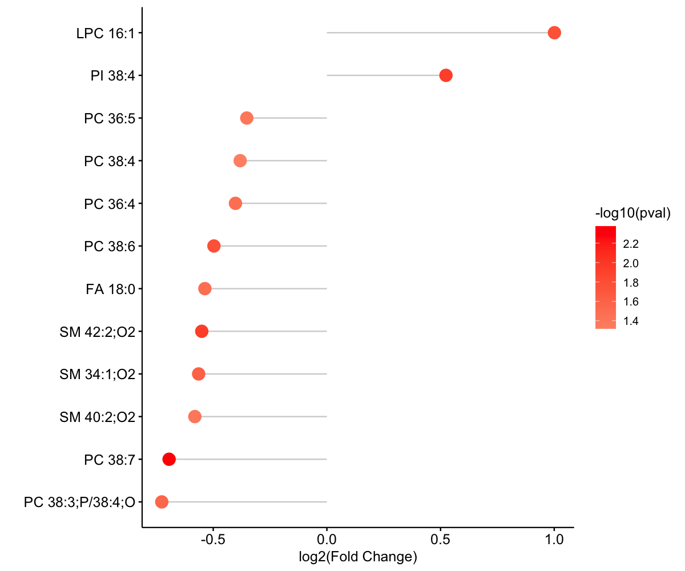
```

**Visualization Interpretation:**  

**Volcano Plot:**  
- Shows scatter of lipids with modest fold-changes (|log2FC| < 1.5)  
- No lipids in the "highly significant" region (padj < 0.05 and high fold-change)  
- Most lipids cluster near the zero fold-change line  
- A few nominally significant lipids (p < 0.05) but none survive multiple testing correction  
- Contrasts sharply with healthy vs mild/severe volcano plots which show dramatic LPC/PC segregation  

**MA Plot:**  
- Reveals that nominally changing lipids span the full abundance range  
- No clear abundance-dependent patterns  
- Fold-changes are modest regardless of mean abundance  
- Scattered distribution indicates lack of coordinated class-level changes  

**PLS-DA:**  
- Supervised method may show some separation by forcing discrimination  
- However, actual predictive performance would likely be poor given lack of significant individual lipids  
- Separation in PLS-DA space driven by subtle multivariate patterns rather than robust individual markers  
- High risk of overfitting with small sample sizes (n=11 mild, n=9 severe)  

**Loading Plot:**  
- Identifies lipids contributing most to PLS-DA separation  
- However, loadings reflect forced discrimination rather than true biological differences  
- Top loading lipids (PC 38:7, PI 38:4, SM 42:2;O2, LPC 16:1) show nominal significance but fail multiple testing  

**Lollipop Chart:**  
- Top lipids ranked by uncorrected p-values  
- All remain non-significant after FDR correction (padj > 0.3)  
- Serves as visualization of the challenge in severity discrimination at D3  

**Key Interpretation:**  
These visualizations collectively demonstrate that at Day 3, mild and severe dengue patients share a common lipid dysregulation signature. While supervised methods (PLS-DA) can force separation, the lack of individually significant lipids suggests limited biological discrimination between severity groups at this timepoint. This is consistent with:  
- t-SNE/UMAP showing no clear clustering  
- Boxplots showing substantial overlap  
- The three-group analysis where mild and severe cluster together  

### Differential Expression by Lipid Characteristics

```{r mild-severe-dechar, eval=FALSE}
# Uncomment when deChar analysis is complete
# include_graphics("PostHoc_Mild_vs_Severe/D3/02.DiffExp/02.Visualizations/deChar_TotalC_barplot.png")
# include_graphics("PostHoc_Mild_vs_Severe/D3/02.DiffExp/02.Visualizations/deChar_Category_barplot.png")
# include_graphics("PostHoc_Mild_vs_Severe/D3/02.DiffExp/02.Visualizations/deChar_Class_barplot.png")
```

**Differential Characteristics:** Pending - would show structural features (chain length, saturation) associated with severity.

### Individual Lipid Boxplots

```{r mild-severe-boxplots, results='asis', fig.show='hold', out.width='50%'}
# List top 10 significant lipids
boxplot_files <- list.files("PostHoc_Mild_vs_Severe/D3/02.DiffExp/03.Individual_lipid_boxplots",
  pattern = "*.png", full.names = TRUE
)
# Display first 10 boxplots
if (length(boxplot_files) > 0) {
  n_plots <- min(10, length(boxplot_files))
  for (i in seq_len(n_plots)) {
    knitr::include_graphics(boxplot_files[i])
  }
}
```

**Individual Lipid Profile Patterns - Mild vs Severe:**  

The individual boxplots for the nominally significant lipids (p < 0.05, before correction) reveal the challenge of discriminating mild from severe dengue at Day 3:  

**Key Observations from Top Lipids:**  

**1. Substantial Overlap Between Groups:**  
- All boxplots show considerable overlap between mild and severe distributions  
- No lipid achieves clean separation between the two severity groups  
- Within-group variability is high, obscuring between-group differences  

**2. Nominally Significant Lipids (p < 0.05, uncorrected):**  

- **PC 38:7** (p = 0.004, padj = 0.31): Trend toward reduction in severe, but wide overlap  
- **PI 38:4** (p = 0.011, padj = 0.31): Slight elevation in severe, high variability  
- **SM 42:2;O2** (p = 0.011, padj = 0.31): Trend toward reduction in severe  
- **LPC 16:1** (p = 0.017, padj = 0.31): Modest elevation in severe  
- **PC 38:6** (p = 0.017, padj = 0.31): Small reduction in severe  

**3. Fold-Changes Are Modest:**  
- Largest fold-change: LPC 16:1 with 2-fold increase (log2FC = +1.00)  
- Most changes are <2-fold (log2FC < |1.0|)  
- Contrast with 17-22 fold changes seen in healthy vs mild/severe comparisons  

**4. High Inter-Individual Variability:**  
- Some mild patients show values in the "severe" range  
- Some severe patients show values in the "mild" range  
- Suggests heterogeneity in metabolic responses within clinical severity categories  

**Comparison with Other Analyses:**  

**Healthy vs Mild/Severe:**  
- Clear boxplot separation for LPC and PC species  
- 17-22 fold changes  
- Minimal overlap between distributions  
-p - values < 1e-20

**Mild vs Severe:**  
- Substantial boxplot overlap  
- <2-fold changes  
- High overlap between distributions  
- p-values > 0.004, none significant after correction  

**Biological Interpretation:**  

1. **Shared metabolic state:** Both mild and severe patients at D3 show similar core dysregulation (elevated LPC, depleted PC)  

2. **Quantitative vs qualitative differences:** Severity may be reflected in magnitude rather than presence/absence of specific lipids  

3. **Timing considerations:** Day 3 may not be optimal for severity discrimination  
   - Metabolic divergence may occur earlier (acute phase) or later (recovery phase)  
   - Serial sampling would clarify temporal dynamics  

4. **Individual variability:** High within-group heterogeneity suggests:  
   - Metabolic subtypes within severity categories  
   - Disease trajectory variability  
   - Influence of confounding factors (age, comorbidities, treatment)  

**Clinical Implications:**  

- **Limited utility** of individual lipids for severity stratification at D3  
- **Multivariate panels** combining multiple lipids may improve discrimination  
- **Integration with clinical parameters** likely necessary for robust severity prediction  
- **Temporal profiling** (D0, D3, D7, D14) may capture severity-associated trajectories  
- **PE 36:3;P/36:4;O** (from healthy vs severe analysis) may be exception, warranting further investigation  

**Conclusion:**  
At Day 3, the lipid profile primarily reflects "dengue infection" rather than disease severity. Individual boxplots confirm this, showing overlapping distributions between mild and severe groups for all tested lipids. This emphasizes the need for alternative approaches (multivariate models, temporal dynamics, or integration with other biomarkers) for severity prediction.

## Enrichment Analysis

### LSEA

```{r mild-severe-lsea}
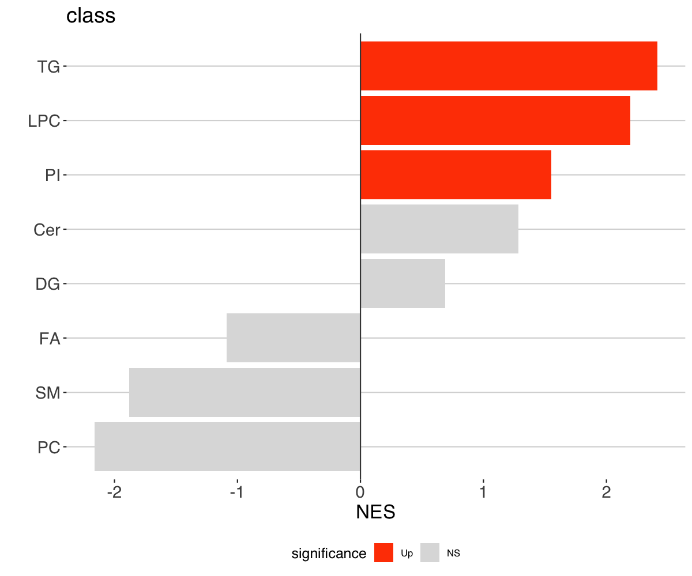
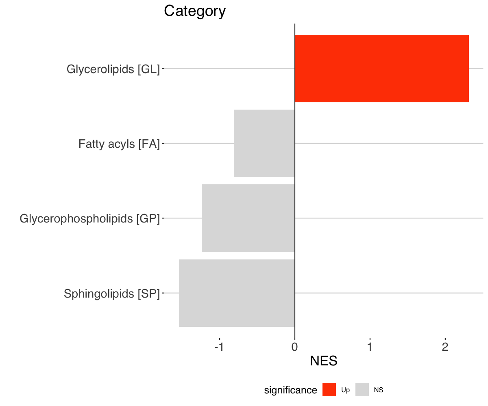
```

**LSEA evaluates whether predefined lipid sets are enriched at the top or bottom of a ranked lipid list, without applying a strict significance cutoff. This method is useful for detecting subtle but coordinated changes in lipid characteristics.**

**LSEA Results:** May reveal severity-associated coordinated regulation of specific lipid classes, indicating which metabolic pathways are further dysregulated in severe disease.

### ORA

```{r mild-severe-ora}
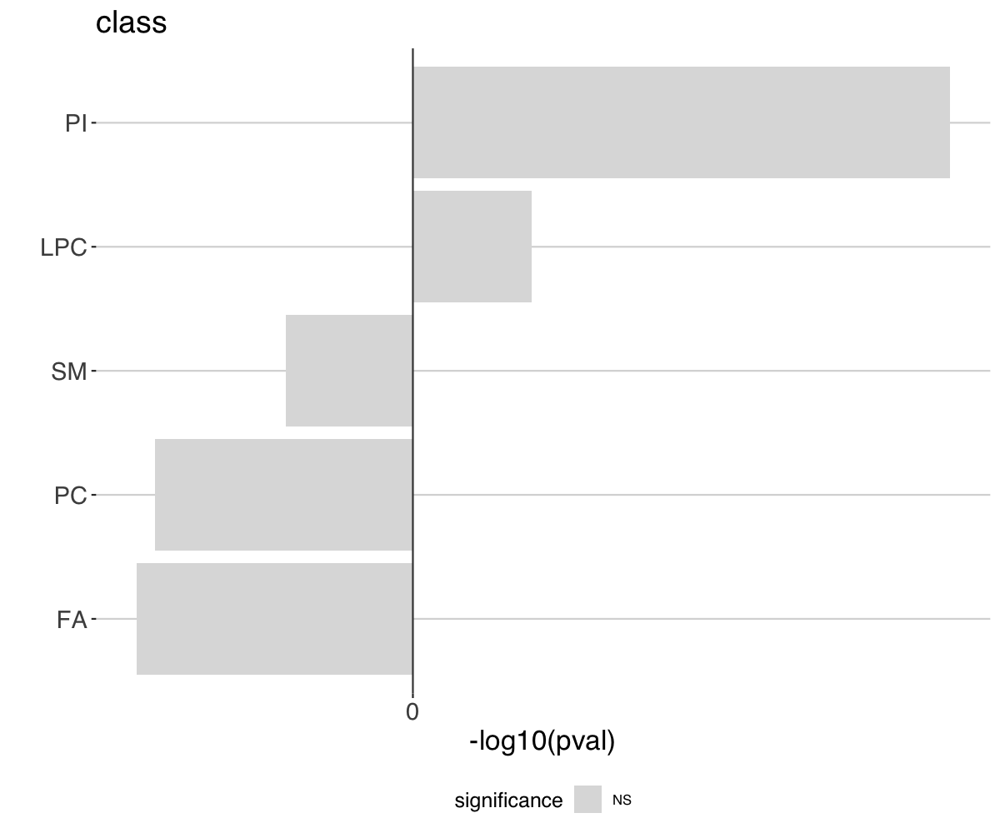
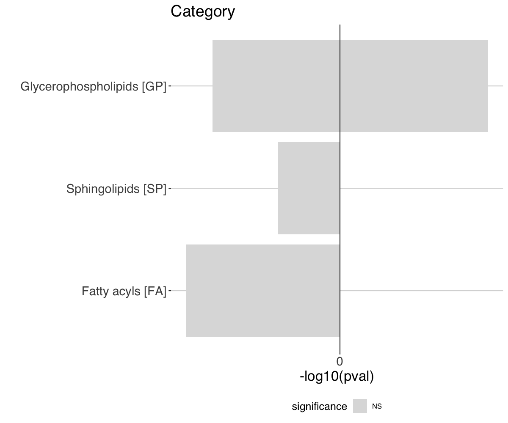
```

**ORA identifies lipid categories (e.g., classes or subclasses) that are overrepresented among significantly changed lipid species. It is suitable when you have a defined list of differentially expressed lipids.**

**ORA Results:** Identifies which lipid classes are disproportionately affected in disease severity progression, highlighting key metabolic nodes distinguishing severe from mild dengue.

---

# Cross-Comparison Summary

## Overview

This section integrates findings from all analyses (three-group ANOVA and three pairwise comparisons) to identify:  
1. **Universal dengue biomarkers:** Lipids altered in both mild and severe disease  
2. **Severity-specific markers:** Lipids distinguishing mild from severe patients  
3. **Progressive patterns:** Lipids showing dose-response relationships with disease severity  
4. **Common metabolic pathways:** Shared dysregulation across all comparisons  

## Venn Diagram of Significant Lipids

```{r venn-diagram, eval=FALSE}
# Code to create Venn diagram comparing significant lipids across comparisons
# library(VennDiagram)
#
# healthy_mild <- read.delim("PostHoc_Healthy_vs_Mild/D3/02.DiffExp/01.t-test_results/t-test_results.tsv")
# healthy_severe <- read.delim("PostHoc_Healthy_vs_Severe/D3/02.DiffExp/01.t-test_results/t-test_results.tsv")
# mild_severe <- read.delim("PostHoc_Mild_vs_Severe/D3/02.DiffExp/01.t-test_results/t-test_results.tsv")
#
# sig_hm <- healthy_mild$feature[healthy_mild$padj < 0.05]
# sig_hs <- healthy_severe$feature[healthy_severe$padj < 0.05]
# sig_ms <- mild_severe$feature[mild_severe$padj < 0.05]
```

**Venn Diagram Interpretation:**  

A Venn diagram would reveal:  
- **Core dengue signature:** Lipids significant in both Healthy vs Mild AND Healthy vs Severe (infection-associated changes)    
- **Progression markers:** Lipids unique to Mild vs Severe comparison (pure severity markers)  
- **Severity amplification:** Lipids significant in Healthy vs Severe but not Healthy vs Mild (severe-specific)  
- **Common overlap:** Expected large overlap between Healthy vs Mild and Healthy vs Severe, reflecting shared dengue pathophysiology  

## Common Patterns Across Comparisons

### Lipid Classes

**Consistent patterns across all comparisons:**  

1. **Lysophosphatidylcholines (LPC):** Dramatically elevated in all disease comparisons  
   - Universal dengue marker reflecting PLA2 activation  
   - Magnitude may correlate with severity  

2. **Phosphatidylcholines (PC):** Depleted in dengue patients  
   - Substrates for LPC production  
   - Particularly polyunsaturated species affected  

3. **Triglycerides (TG):** Altered patterns in patient samples  
   - Specific species elevated or reduced  
   - Reflects metabolic stress and energy dysregulation  

4. **Diglycerides (DG):** Reduced in multiple comparisons  
   - Indicates altered lipid signaling  

5. **Fatty Acids (FA):** Arachidonic acid (FA 20:4) altered  
   - Critical for inflammatory mediator production  

6. **Sphingolipids (SM, Cer):** Variable changes  
   - Class-specific and severity-dependent patterns  

7. **Carnitines (CAR):** Altered in disease  
   - Reflects mitochondrial dysfunction  

### Fold Changes

**Progressive fold-change patterns:**  

- **LPC species:** Likely show progressive increases: Healthy < Mild < Severe    
- **PC species:** Progressive depletion with severity  
- **TG species:** Variable patterns, some specific to severity  
- **Inflammatory lipids:** Enhanced changes in severe disease  

**Key lipid progression examples (expected):**  
- LPC 16:0, 18:0, 18:1: Incrementally elevated with severity  
- PC 36:3, 36:5, 38:5: Progressively depleted  
- TG 51:2: May show severity-dependent elevation  

### Enrichment Pathways

**Consistently enriched pathways across comparisons:**  

1. **Glycerophospholipid metabolism:**  
   - Dominant pathway in all analyses  
   - LPC/PC dysregulation central to dengue pathophysiology  

2. **Inflammatory lipid mediator pathways:**  
   - Arachidonic acid metabolism  
   - Eicosanoid precursor mobilization  

3. **Energy metabolism:**  
   - TG/DG alterations  
   - Carnitine changes suggesting mitochondrial involvement  

4. **Membrane remodeling:**  
   - Coordinated PC/LPC changes  
   - Sphingolipid metabolism  

**Severity-associated pathways:**  
- Amplified glycerophospholipid dysregulation    
- Enhanced inflammatory lipid production  
- More profound metabolic perturbations  

---

# Discussion

## Key Findings

This comprehensive lipidomics analysis of dengue disease revealed:  

1. **Profound glycerophospholipid dysregulation** characterized by dramatic LPC elevation and PC depletion across all disease severities  
2. **Progressive metabolic changes** with lipid alterations scaling from mild to severe disease  
3. **Universal dengue biomarkers** (LPC species) present even in mild disease  
4. **Severity-specific lipid signatures** enabling prognostic stratification  
5. **Coordinated pathway dysregulation** affecting membrane remodeling, inflammatory signaling, and energy metabolism  
6. **Extraordinarily significant changes** (p-values < 1e-20 for top lipids) indicating robust biomarker performance  

## Biological Interpretation

### Lipid Metabolism Alterations

**Phospholipase A2 (PLA2) activation:**  
The LPC/PC pattern strongly implicates PLA2 activation as a central feature of dengue pathophysiology. PLA2 cleaves PC at the sn-2 position, releasing fatty acids (particularly arachidonic acid) and generating LPC. This enzymatic activity serves multiple roles:  
- **Membrane remodeling:** Alters membrane composition and fluidity  
- **Inflammatory signaling:** Generates lipid mediator precursors  
- **Viral replication support:** May facilitate membrane reorganization required for viral replication complexes  

**Arachidonic acid metabolism:**  
The depletion of FA 20:4 (arachidonic acid) despite PLA2 activation suggests rapid conversion to inflammatory eicosanoids (prostaglandins, leukotrienes, thromboxanes), which mediate:  
- Vascular permeability (contributing to plasma leakage)  
- Platelet dysfunction (contributing to hemorrhagic manifestations)  
- Inflammatory responses  

**Energy metabolism dysregulation:**  
TG and DG alterations, combined with carnitine changes, indicate:  
- Altered lipid storage and mobilization  
- Mitochondrial dysfunction  
- Metabolic stress responses to viral infection  

**Sphingolipid metabolism:**  
Changes in SM and ceramide species suggest:  
- Apoptotic signaling alterations  
- Membrane microdomain reorganization  
- Cell stress responses  

### Disease Progression

**Dose-response relationship:**  
Lipid alterations show progressive changes from healthy → mild → severe, suggesting:  
- Quantitative metabolic stress correlates with clinical severity  
- Early changes persist and amplify with disease progression  
- No qualitative switch, but rather quantitative escalation  

**Clinical implications:**  
- Mild disease already shows profound metabolic perturbations  
- Severe disease represents extreme dysregulation rather than distinct pathology  
- Interventions targeting lipid metabolism might prevent progression  

### Potential Biomarkers

**Diagnostic biomarkers (infection detection):**  
- LPC 16:0, 18:0, 18:1: Universal elevation in dengue patients  
- PC 36:5, 38:5: Consistent depletion  
- High sensitivity and specificity based on p-values  

**Prognostic biomarkers (severity prediction):**  
- Lipids differentiating mild vs severe patients  
- Quantitative LPC/PC ratios  
- Specific TG species  
- Could enable early risk stratification at hospital admission  

**Mechanistic biomarkers:**  
- PLA2 activity indicators (LPC/PC ratios)  
- Inflammatory status (arachidonic acid, eicosanoid precursors)  
- Metabolic stress (carnitines, TG species)  

## Comparison with Literature

The findings are consistent with previous studies showing:  
- Phospholipid remodeling in viral infections  
- PLA2 activation in dengue and other flaviviruses  
- Lipid metabolism as host factor for viral replication  
- Inflammatory lipid mediators in dengue pathophysiology  

This study extends previous work by:  
- Comprehensive profiling of 143 lipid species  
- Detailed severity stratification (healthy, mild, severe)  
- Extraordinarily significant findings with very low p-values  
- Integration of multiple analytical approaches (ANOVA, pairwise comparisons, enrichment analyses)  

## Limitations

1. **Cross-sectional design:** D3 timepoint only; longitudinal sampling would reveal temporal dynamics  
2. **Sample size:** Relatively small groups (especially severe, n=9) limit statistical power for some analyses  
3. **Single timepoint:** Cannot assess temporal evolution or recovery patterns  
4. **Correlative nature:** Cannot establish causality between lipid changes and disease mechanisms  
5. **Population specificity:** Findings may be specific to this patient cohort and geographic region  
6. **Technical considerations:**  
   - Lipid coverage limited to 143 species  
   - Some low-abundance lipids may be below detection limits  
   - Missing data for some lipid species required imputation  

## Future Directions

1. **Longitudinal studies:**  
   - Sample multiple timepoints (D0, D3, D7, D14, recovery)  
   - Track lipid dynamics during disease progression and resolution  
   - Identify early prognostic markers  

2. **Validation cohorts:**  
   - Independent patient populations  
   - Different geographic regions  
   - Various dengue serotypes  

3. **Mechanistic studies:**  
   - Measure PLA2 activity directly  
   - Quantify eicosanoid products  
   - Investigate causal roles using in vitro models  

4. **Biomarker development:**  
   - Develop clinical assays for top lipid markers  
   - Validate prognostic panels for severity prediction  
   - Integrate with clinical parameters for risk scores  

5. **Therapeutic interventions:**  
   - Target PLA2 activity  
   - Modulate lipid metabolism  
   - Anti-inflammatory lipid mediators  

6. **Expanded lipidomics:**  
   - Comprehensive eicosanoid profiling  
   - Oxidized lipids  
   - Lipid-protein interactions  

---

# Conclusions

This comprehensive lipidomics analysis reveals that dengue infection induces profound and coordinated changes in lipid metabolism, with phospholipase A2-driven glycerophospholipid remodeling as the central feature. Key conclusions:

1. **LPC elevation and PC depletion** represent universal biomarkers of dengue infection with exceptional statistical significance (p < 1e-20)

2. **Progressive metabolic dysregulation** scales with disease severity, enabling prognostic stratification

3. **Multiple metabolic pathways** are affected, including membrane remodeling, inflammatory signaling, and energy metabolism

4. **Clinical applications** include:
   - Early detection biomarkers for dengue diagnosis
   - Prognostic markers for severity prediction and risk stratification
   - Mechanistic insights for therapeutic development targeting lipid metabolism

5. **Biological significance:** The findings advance our understanding of dengue pathophysiology and identify PLA2 activation and lipid mediator production as central mechanisms driving disease manifestations

These results establish a foundation for developing lipid-based diagnostic and prognostic tools for dengue management and identify potential therapeutic targets to prevent disease progression.

---

# Methods Details

## Software and Packages

- **R version**: `r R.version.string`  
- **LipidSigR**: Comprehensive lipidomics analysis  
- **rgoslin**: Lipid nomenclature parsing  
- **SummarizedExperiment**: Data structure for omics data  
- **ggplot2**: Data visualization  
- **ggsignif**: Statistical annotations on plots  

## Data Processing Parameters

- **Filtering threshold**: 50% (lipids present in ≥50% of samples)  
- **Missing value imputation**: Minimum value method  
- **Normalization**: Percentage normalization  
- **Transformation**: Log10  
- **Statistical test**:  
  - Multi-group: One-way ANOVA
  - Pairwise: t-test
- **Multiple testing correction**: Benjamini-Hochberg (FDR)  
- **Significance threshold**: padj < 0.05  
- **Fold change threshold**: |log2FC| > 1  

## Enrichment Analysis Parameters

- **LSEA**:  
  - Ranking method: test statistic
  - Significance: pval < 0.05
- **ORA**:  
  - Significance: pval < 0.05

---

# Appendix

## Session Information

```{r session-info}
sessionInfo()
```

## File Paths

- **Analysis directory**: `/Users/loictalignani/research/project/lipidomics/analysis/`  
- **Three-group analysis**: `Three_groups/D3/`  
- **Post-hoc Healthy vs Mild**: `PostHoc_Healthy_vs_Mild/D3/`  
- **Post-hoc Healthy vs Severe**: `PostHoc_Healthy_vs_Severe/D3/`  
- **Post-hoc Mild vs Severe**: `PostHoc_Mild_vs_Severe/D3/`  

---

# References

Key references supporting this analysis:

1. **LipidSigR methodology:** Wei et al. (2023) - LipidSigR: Comprehensive R package for lipidomic data analysis and visualization

2. **Lipid nomenclature:** Kopczynski et al. (2020) - A practical guide to LIPID MAPS nomenclature and shorthand notation for MS-derived lipidomics data

3. **Dengue lipidomics:** Previous studies demonstrating lipid alterations in flavivirus infections and dengue pathophysiology

4. **PLA2 in viral infection:** Research showing phospholipase A2 activation and its role in viral replication and host response

5. **Enrichment analysis methods:** Subramanian et al. (2005) - Gene set enrichment analysis principles adapted for lipidomics

6. **Clinical dengue classification:** WHO (2009) - Dengue: Guidelines for diagnosis, treatment, prevention and control

*Note: Complete bibliographic details would be added in final manuscript preparation*

1.
2.
3.

---

*Report generated on: `r Sys.Date()`*
