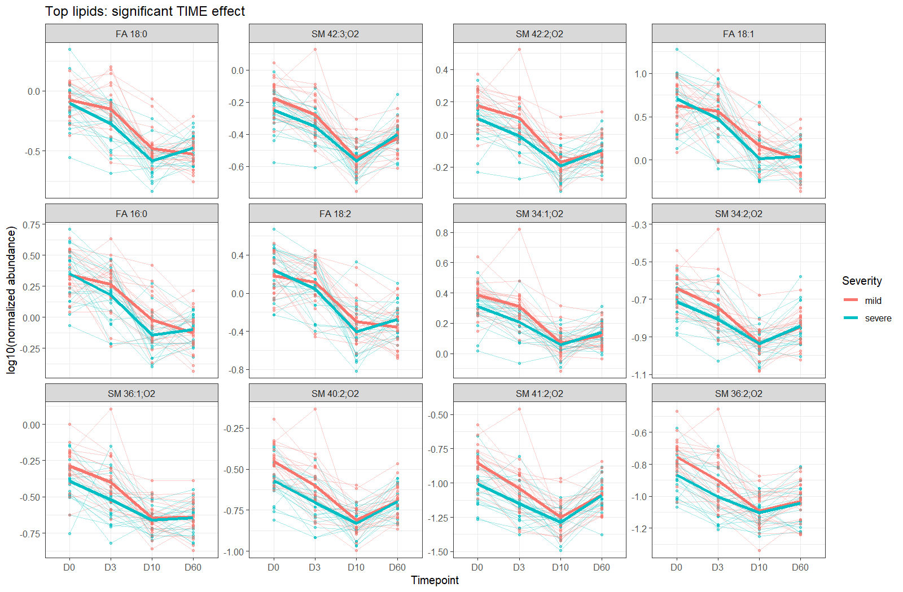
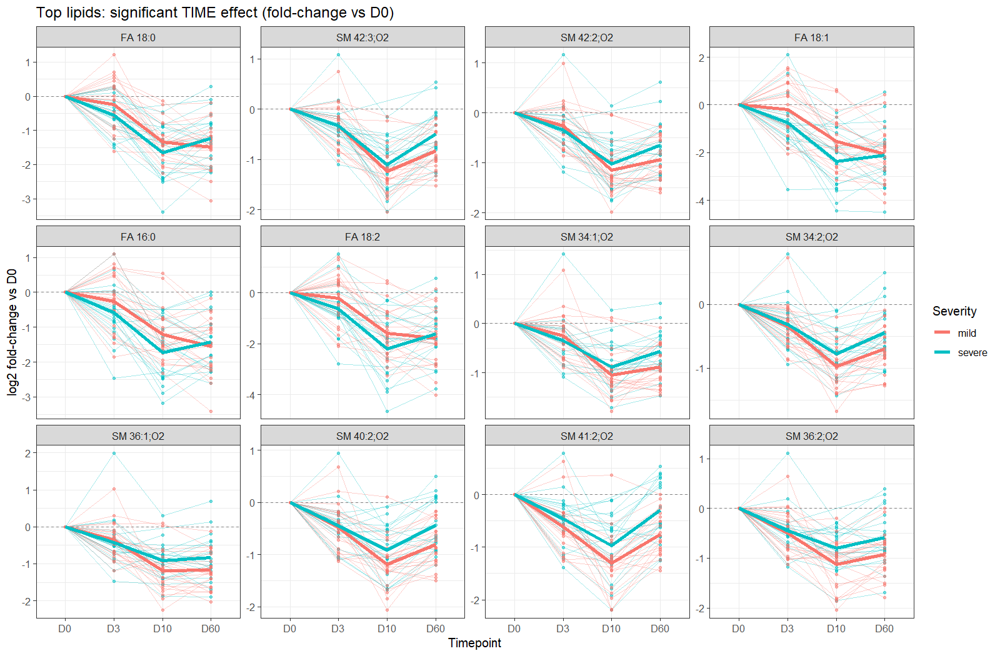
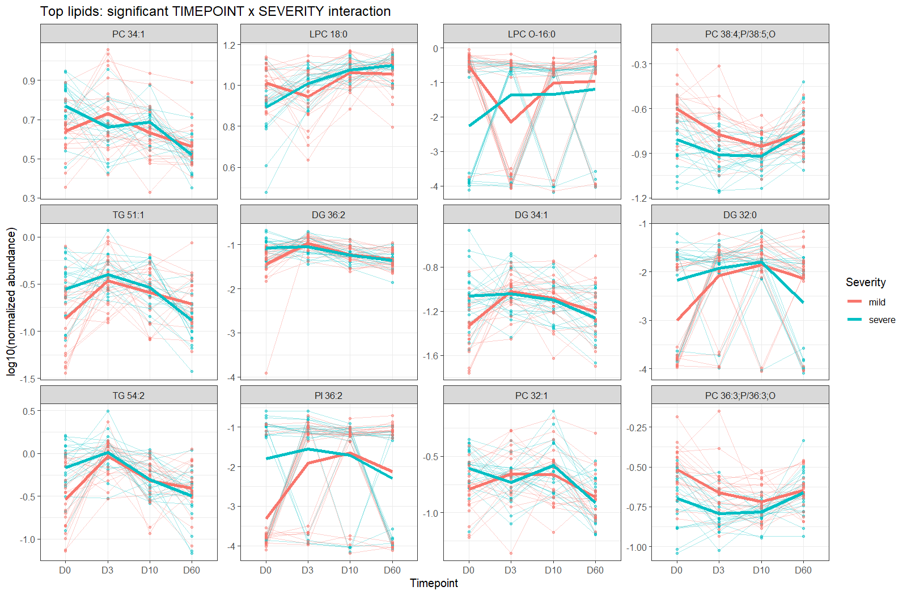
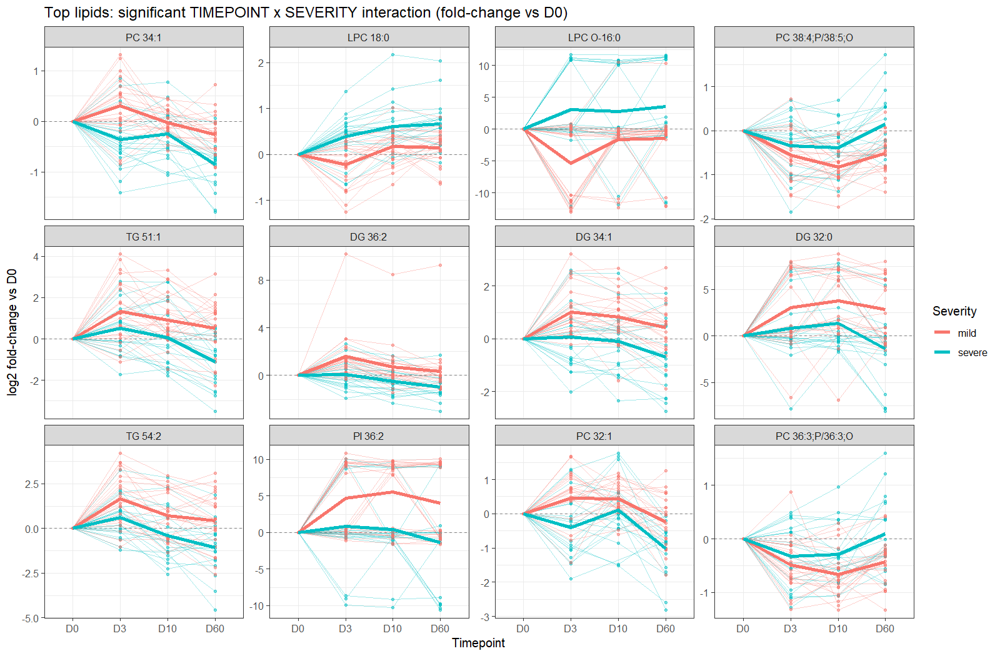
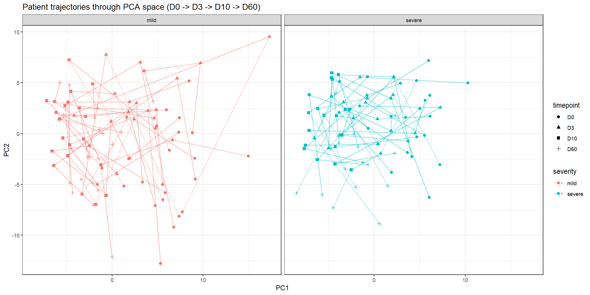
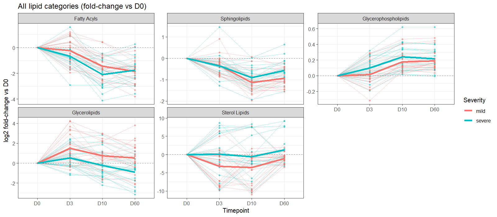
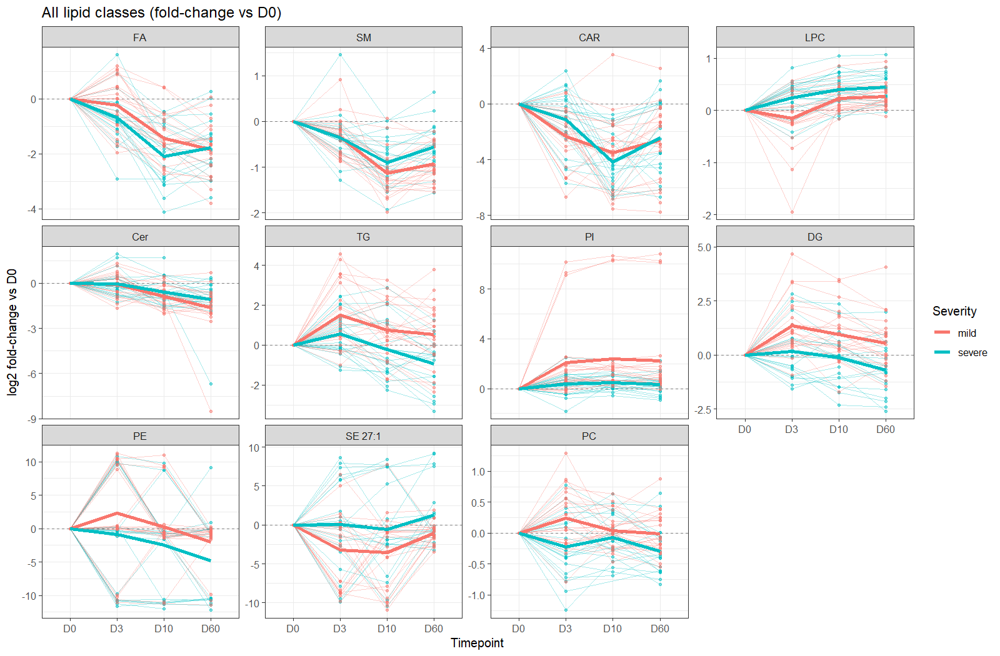

**Design:** Plasma lipidome tracked at D0, D3, D10, D60 in the same 43 patients (mild/severe dengue patients, no healthy arm)
**Script:** [code/05_longitudinal_analysis.R](../../code/05_longitudinal_analysis.R)
**Output directory:** `analysis/Longitudinal/`

---

## Objective

Earlier analyses in this project (`01_analysis_three_groups.R` and related scripts) compare Healthy / Mild / Severe groups **cross-sectionally**, one timepoint at a time. This analysis instead asks: **how does each patient's lipidome evolve over time**, and does that evolution differ between mild and severe patients?

## Data

| | |
|---|---|
| Source | `data/lipidsig_datasets/Deprecated/Lipid_abundance_data_{D0,D03,D10,D60}.tsv` + matching `group_information_table_*.xlsx` |
| Patients | 43 (mild + severe only — **no longitudinal healthy-control data exists in this project**) |
| Timepoints | D0, D3, D10, D60 (uneven spacing: 0, 3, 10, 60 days) |
| Raw features | 164 lipids × 172 sample-timepoints |

Despite living in a folder named "Deprecated", this is the only dataset in the project where the **same patients are matched by raw abundance across all 4 timepoints** in consistent column order — the "current" folders (`healthy_vs_sick_patients`, `selected_patients`) only cover 2–3 of the 4 timepoints. This was confirmed by direct header comparison before use.

**Cleaning applied before analysis:**
- 3 constant (all-zero) lipids removed: `SM 34:0;O2`, `SM 36:0;O2`, `SM 40:0;O2`
- 3 constant (all-zero) sample-timepoints removed: `JV-071 D10`, `JV-048 D60`, `KT-565 D60` — these 3 patients each have only 3 of the 4 timepoints in the model; everyone else has all 4.
  (Removed manually before building the `SummarizedExperiment` because LipidSigR's own constant-value filter has a rowname bookkeeping bug that crashes when both axes need trimming at once.)

## Processing & normalization

Standard LipidSigR pipeline: rgoslin lipid-name annotation (157/161 recognized), missing-value filtering (≥70% presence required, min-value imputation), **Percentage normalization**, **log10 transform**. 119 lipids passed filtering and were modeled at the species level.

**Why normalize at all in a within-patient design?** Percentage normalization divides each *individual sample's* lipid values by that sample's own total, correcting for technical loading differences (extraction yield, instrument sensitivity) that vary **per sample** — including between a single patient's own D0 and D60 draws, which were extracted and run independently. Pairing (patient as random effect, see below) controls for stable *biological* differences between people; normalization controls for *technical* differences between individual samples. Skipping it would let a purely technical loading difference between two draws masquerade as a biological time effect.

**Note on the normalized scale:** after Percentage+log10, a lipid's value is `log10(% of total lipidome in that sample)`. Any lipid under 1% of the total gives a negative number (e.g. `log10(0.79%) ≈ -0.1`) — this is expected arithmetic, not an error. For interpretation, the Results section below also reports each patient's trajectory as **log2 fold-change from their own D0 baseline**, which is more directly readable (0 = no change, positive = up, negative = down).

## Statistical model

LipidSigR's built-in multi-group test (`deSp_multiGroup`, One-way ANOVA / Kruskal-Wallis) was **deliberately not used** for the time comparison: it assumes independent samples, and treating a patient's 4 repeated measurements as 4 independent observations is pseudoreplication — it would inflate significance and ignore that each patient is their own baseline.

Instead, a **linear mixed model was fit per lipid** (and, below, per lipid class and per lipid category):

```
value ~ timepoint * severity + day_of_fever + (1 | patient_id)
```

- `timepoint` is a 4-level **factor**, not a numeric day count — the D0/D3/D10/D60 spacing (0, 3, 10, 60 days) is too uneven to assume a linear trend.
- `patient_id` is a random intercept, accounting for each patient's own stable baseline.
- `day_of_fever` — days of fever the patient had *before* hospitalization/sampling (`data/sick_patients_day_of_fever.tsv`, sourced from the `Day.of.Fever` column of the Montpellier patient-list spreadsheet) — is included because **all mild/severe patients here were hospitalized**, and D0 is the hospital enrollment/sampling day, not a fixed point relative to symptom onset. Two patients both sampled at "D0" can already be at different points in their actual illness course (in this cohort, severe patients average ~1 day later presentation than mild: 3.24 vs 2.32 days). It's kept in *every* nested model below so it never changes what a given LRT comparison isolates — it only controls for this baseline heterogeneity.
- Models fit by ML (`REML=FALSE`) so nested models are comparable via **likelihood-ratio test (LRT)**:
  - `p_time`: does abundance change over time at all (averaged across severity)?
  - `p_severity`: do mild and severe differ on average (averaged across time)?
  - `p_interaction`: does the *shape* of the trajectory differ between mild and severe?
- All three p-value sets are BH-FDR-corrected across the tested features, separately at each level (species / class / category).

**Robustness check (day of fever):** adding `day_of_fever` changed results negligibly — the same 23 species are interaction-significant, with nearly identical p-values (e.g. `PC 34:1` interaction FDR 0.001523 → 0.001522 with the covariate added). This is expected rather than a strong validation: `day_of_fever` is constant within each patient, so it overlaps substantially with what the `(1 | patient_id)` random intercept already absorbs. A more decisive test of D0 comparability would realign each patient's own timeline to days-since-fever-onset rather than adding this as a fixed-effect covariate on top of the study-day factor — not done here.

**Robustness check (normalization):** a second check re-fit every per-lipid LMM on **PQN**-normalized values instead of Percentage, to see whether the choice of normalization method (rather than the model itself) is driving the headline interaction result. It is not: 22 of 119 lipids are interaction-significant under PQN (vs. 23 under Percentage), with **21 lipids significant under both methods** — `LPC 16:0` and `PC 34:2` drop out under PQN, and `SM 41:2;O2` is significant only under PQN, a 91% overlap. The time-effect result is similarly stable (104/119 under PQN vs. 97/119 under Percentage, 91 lipids common to both). Percentage was kept as the primary analysis for consistency with the rest of this project, but the D3-divergence finding below does not depend on that specific choice — the same conclusion (and nearly the same lipid list) holds under a normalization method built specifically to be robust to the compositional-closure concern that motivated checking this at all. (Script: `code/07_plasma_normalization_sensitivity_longitudinal.R`; full comparison table: `analysis/Normalization_sensitivity/Longitudinal/Longitudinal_normalization_comparison.tsv`.)

LipidSigR was still used for what doesn't require independent samples: rgoslin annotation, QC, normalization, and PCA (all per-sample operations).

## Results — species level

### Overview

| Metric | Value |
|---|---|
| Lipids tested | 119 |
| Significant **time** effect (FDR<0.05) | **97 / 119** |
| Significant **timepoint × severity** interaction (FDR<0.05) | **23 / 119** |
| Significant **severity main effect** (FDR<0.05) | see `LMM_all_results.tsv` (`fdr_severity` column) |
| Models with singular fit (near-zero patient variance — interpret with extra caution) | 19 / 119 |

Full results: [`LMM_all_results.tsv`](02.Mixed_models/LMM_all_results.tsv) · significant subsets: [`LMM_significant_time_effect.tsv`](02.Mixed_models/LMM_significant_time_effect.tsv), [`LMM_significant_interaction.tsv`](02.Mixed_models/LMM_significant_interaction.tsv)

### Time effect — most lipids fall sharply, then partially rebound

The dominant pattern across almost all 97 significant lipids (mostly free fatty acids and sphingomyelins) is a sharp drop from D0 to D10, with partial recovery by D60 — consistent in both severity groups.

Top hits by FDR: `FA 18:0`, `SM 42:3;O2`, `SM 42:2;O2`, `FA 18:1`, `FA 16:0`, `SM 34:2;O2`, `SM 34:1;O2`, `FA 18:2`, `SM 36:1;O2`, `SM 40:2;O2`, `SM 41:2;O2`, `SM 36:2;O2` (all FDR < 1e-20).



Same lipids, shown as log2 fold-change from each patient's own D0 (more directly readable):



### Timepoint × severity interaction — where mild and severe diverge

23 lipids show trajectories that genuinely differ in *shape* between mild and severe, not just in average level — these are the more interesting candidates if the goal is a severity-associated biomarker.

| Lipid | FDR (interaction) | Note |
|---|---|---|
| PC 34:1 | 0.0015 | |
| LPC 18:0 | 0.0015 | |
| LPC O-16:0 | 0.0077 | |
| PC 38:4;P/38:5;O | 0.0085 | |
| TG 51:1 | 0.0093 | |
| DG 36:2 | 0.0093 | |
| DG 34:1 | 0.0093 | |
| DG 32:0 | 0.0107 | |
| TG 54:2 | 0.0116 | singular fit — treat cautiously |
| PI 36:2 | 0.0151 | |

(Full list of 23 in [`LMM_significant_interaction.tsv`](02.Mixed_models/LMM_significant_interaction.tsv).)





### PCA trajectories

Each patient's path through PCA space (all 119 lipids combined), faceted by severity:



Individual patient paths look tangled rather than smooth. This was checked and is **not a plotting artifact** (rows are correctly time-ordered) — it reflects that PC1/PC2 combine all 119 lipids, and no single patient moves uniformly through that combined space even though many individual lipids (previous subsection) show clean, consistent trajectories. Don't over-interpret the PCA panel; the per-lipid mixed-model results are the more reliable signal.

## Results — class & category (family) level aggregation

Species-level trajectories are numerous (119 tested) and some are noisy or low-abundance. To get a more interpretable summary, species were aggregated using rgoslin's own lipid classification, at two levels:

- **Class** — rgoslin `Lipid.Maps.Main.Class` (e.g. `PC`, `SM`, `TG`, `DG`, `CE`, `LPC`, `FA`, `CAR`) → **11 classes**
- **Category** — rgoslin `Lipid.Maps.Category`, the broadest "family" grouping: Fatty Acyls, Glycerolipids, Glycerophospholipids, Sphingolipids, Sterol Lipids → **5 categories**

**Aggregation method:** species-level values are on the log10(% of total) scale, so they cannot simply be averaged or summed (sum of logs ≠ log of sum). Each species was converted back to its linear percentage (`10^value`), percentages were summed within each class/category per sample (percentages of disjoint species are additive), and the sum was re-log10-transformed. The exact same paired linear mixed model used at the species level (`value ~ timepoint * severity + (1 | patient_id)`, LRT-based, BH-FDR corrected) was then refit on these aggregated series — the pseudoreplication argument against plain ANOVA applies here just as much as at the species level.

### Category (family) level

| Category | FDR (time) | FDR (interaction) | Note |
|---|---|---|---|
| Fatty Acyls | 2.5e-29 | 0.106 | steady decline to D10, partial rebound, similar in both groups |
| Sphingolipids | 1.8e-28 | 0.031 | both decline to D10; mild stays low through D60, severe partially rebounds |
| Glycerophospholipids | 4.8e-28 | 0.154 | rises steadily from D0, plateaus by D10, similar in both groups |
| Glycerolipids | 1.2e-8 | **0.0069** | mild rises then partially falls but stays above baseline; severe declines steadily below baseline by D60 |
| Sterol Lipids | 0.0047 | 0.106 | very noisy; mild's mean dips more at D3-D10 than severe's, but not statistically significant |

All 5/5 categories show a significant time effect; **Glycerolipids** is the only one with a significant severity-dependent trajectory shape (FDR=0.0069).

Full results: [`LMM_category_results.tsv`](03.Aggregated/Category/LMM_category_results.tsv)



As you can see, we observe a rebound at D60 with an increase in lipids abundance, we go back slowly to a normal rate

### Class level

10 of 11 classes show a significant time effect; 6 show a significant timepoint × severity interaction — well above chance for 11 tests, suggesting real class-level divergence between mild and severe, not just at the level of individual species:

| Class | FDR (time) | FDR (interaction) | Note |
|---|---|---|---|
| SM (sphingomyelins) | 4.9e-28 | 0.024 | same pattern as the Sphingolipids category above (SM dominates that category) |
| LPC | 1.1e-11 | 0.0041 | severe rises steadily from D0; mild dips at D3 before recovering to a similar level by D60 |
| TG | 3.3e-8 | 0.0049 | mild rises then partially falls but stays above baseline; severe rises briefly then declines below baseline by D60 (mirrors the Glycerolipids category, which TG dominates) |
| PI | 1.4e-6 | 0.0039 | mild rises sharply and stays elevated; severe stays close to baseline throughout |
| DG | 2.8e-6 | 0.0015 | mild rises and stays elevated through D60; severe stays flat then dips slightly below baseline |
| PC | 0.086 (n.s.) | 0.0041 | mild rises slightly then returns near baseline; severe declines steadily below baseline — opposite directions that mostly cancel out in the overall time test |

(Full list of 11 in [`LMM_class_results.tsv`](03.Aggregated/Class/LMM_class_results.tsv). Note: `SE 27:1` is a single-species "class" — rgoslin only recognized one sterol ester species — so treat it as species-level, not a true aggregate.)



**Reading note:** `PC` is a useful example of why the class-level view adds information beyond the species list above: its overall time effect is not significant (FDR=0.086, i.e. PC as a whole doesn't consistently move up or down), but its interaction is (FDR=0.0041) — mild patients' PC rises slightly then returns near baseline, while severe patients' PC declines throughout. The two groups are moving in different directions, which mostly cancels out at the "does PC change over time" question but shows up clearly in the severity-specific shape.

## Biomarker discovery synthesis

The study's goal is to identify lipid biomarkers of dengue severity, so this section pulls together what the longitudinal analysis adds beyond "significant vs. not": effect magnitude (`max_abs_group_log2fc`, added to [`LMM_all_results.tsv`](02.Mixed_models/LMM_all_results.tsv)), *when* mild and severe diverge (new [`LMM_posthoc_contrasts.tsv`](02.Mixed_models/LMM_posthoc_contrasts.tsv), `emmeans` pairwise-vs-D0 contrasts run on the 99 lipids already flagged by the time/interaction LRTs), and whether hits cluster by lipid family (new [`Enrichment_interaction_hits.tsv`](03.Aggregated/Enrichment_interaction_hits.tsv)).

### The divergence is mostly already there by D3

Of the 23 interaction-significant species, the great majority have their first significant post-hoc contrast (FDR<0.05) at **D3**, not D10 or D60. The consistent pattern is: **mild patients show a sharp, significant shift by D3, while severe patients are flat or non-significant at D3** and only diverge later (D10 or D60), often in the *opposite* direction:

| Lipid | Mild @ D3 | Severe's first significant move | Interaction FDR |
|---|---|---|---|
| DG 32:0 / 34:1 / 34:2 / 36:2 | up (+0.3 to +1.1 log2FC) | flat at D3; DG 34:1/36:2 turn *down* by D60 | 0.009–0.010 |
| TG 51:1 / 51:2 / 54:2 | up (+0.4 to +0.5) at D3 | flat at D3; turn *down* by D60 (−0.27 to −0.33) | 0.009–0.050 |
| PI 36:2 / 38:4 | up sharply (+0.65 to +1.4) at D3 | no significant contrast at all | 0.015–0.037 |
| LPC O-16:0 | down (−1.6) at D3 | no significant contrast | 0.008 |
| PC 34:1, LPC 18:0 | small move at D3 (opposite signs) | also moves at D3, but opposite sign to mild | 0.0015 |
| PC/plasmalogen species (38:4;P, 36:3;P, 36:2;P, 38:3;P) | down at D3 | also down at D3, smaller magnitude | 0.036–0.049 |
| SM 38:1;O2 / 40:1;O2 / 41:1;O2 | down at D3 | down too, but later/larger by D10 | 0.048–0.050 |

This is the single most decision-relevant finding for the study's stated purpose: **if a lipid-based severity signal exists, it is present at D3, well within a clinically useful triage window** — not something that only becomes visible during convalescence (D60). The recurring shape (mild patients executing an early glycerolipid/PI shift that severe patients either don't make on the same schedule, or reverse later) is consistent across independently-tested species from the same families (DG, TG, PI), which is more convincing than any single lipid in isolation.

### Effect sizes are large enough to be practically, not just statistically, interesting

`max_abs_group_log2fc` ranges up to ~5.5 among the interaction hits (`PI 36:2`, `LPC O-16:0`, `DG 32:0`, `DG 34:2` all exceed 3-fold group-mean log2FC). These are large enough that, if reproduced in an independent cohort, they would plausibly translate into a workable assay signal rather than a subtle effect requiring a large panel to detect. `TG 54:2` and `PI 38:4` carry a `singular_fit` flag, so their point estimates should be treated as provisional pending a larger sample.

### Class-level results corroborate the species picture

DG, PI, LPC, PC, TG, and SM are *all* independently interaction-significant at the class level (FDR 0.0015–0.025, [`LMM_class_results.tsv`](03.Aggregated/Class/LMM_class_results.tsv)) — the same six families that dominate the species-level hit list above. This cross-level agreement is reassuring: the signal isn't an artifact of any single noisy species.

The formal over-representation check (Fisher's exact test, [`Enrichment_interaction_hits.tsv`](03.Aggregated/Enrichment_interaction_hits.tsv)) did **not** reach FDR<0.05 for any class or category — with only 23 interaction hits spread across 11 classes, this test is underpowered, and its best result (Glycerophospholipids among the time-effect hits, FDR=0.081) points the same direction as the class-level LMM without confirming it statistically. Read the class-level LMM agreement above as the stronger of the two lines of evidence.

### What this is not yet: a validated biomarker

Everything above is a *within-cohort, longitudinal association* — a lipid's trajectory correlates with severity in these 43 patients. None of it demonstrates that a lipid (or panel) can **predict** severity from a single D0 draw in a new patient, which is what a clinical triage biomarker actually requires. Two gaps stand between these results and that claim:

1. **No discriminative performance has been measured.** There is no ROC/AUC, sensitivity/specificity, or cross-validated classifier anywhere in this project (see "Possible next steps" below) — only trend significance. A lipid could have a highly significant, large-magnitude longitudinal divergence and still be a poor single-timepoint classifier if within-group variance is large.
2. **No independent validation cohort.** All numbers above come from the same 43 patients used to select which lipids to look at, so effect sizes are optimistically biased (typical of any discovery-stage result) — expect shrinkage on replication.

The practical read for the study's biomarker-discovery aim: **the D3 divergence in DG/TG/PI/LPC species is the strongest candidate lead this analysis has produced**, worth prioritizing for (a) a D0-only supervised classifier (see Part 3 of the analysis roadmap) to check standalone discriminative value, and (b) targeted validation, rather than treating the full 23-lipid list as equally promising.

## Limitations & caveats

- **No longitudinal healthy control.** Healthy patients in this project were only sampled at D0, so "evolution" here can only be evaluated between mild and severe, not against a healthy reference trajectory.
- **3 patients have 3/4 timepoints**, not 4/4 (`JV-071` no D10, `JV-048` and `KT-565` no D60), because those specific samples were entirely zero — worth confirming with the wet-lab side whether that's a real QC failure or a data-handling issue.
- **19 species-level lipids had singular model fits** (flagged in the `singular_fit` column) — near-zero estimated between-patient variance, usually because the lipid has very low/sparse signal. Their p-values are still reported but should be read with more caution than non-singular fits. `Glycerolipids` (category level) and `TG` (class level) also show singular fits.
- **Time modeled as a categorical factor**, not a continuous trend — appropriate given the uneven day spacing, but it means the model doesn't produce a single "rate of change" per lipid, only pairwise/omnibus contrasts across the 4 timepoints.
- **Multiple testing**: BH-FDR corrected within each effect (time / severity / interaction) separately, and separately at each aggregation level (species / class / category) — not jointly across all of them.
- **Class/category aggregation is a simple percentage sum**, not a weighted or abundance-corrected composite — a class with one very high-abundance species and several trace ones will be dominated by that one species.

## Possible next steps

- ~~Run post-hoc pairwise contrasts (via `emmeans`) to identify *which* specific timepoint(s) drive the divergence between mild and severe.~~ Done — see "Biomarker discovery synthesis" above and [`LMM_posthoc_contrasts.tsv`](02.Mixed_models/LMM_posthoc_contrasts.tsv).
- Build a supervised classifier (e.g. elastic-net logistic regression or random forest, with leave-one-out or repeated k-fold CV given n=43) on D0 cross-sectional abundance to test standalone ROC/AUC discriminative performance — the main gap between the current trend-level findings and an actual predictive biomarker.
- Cross-reference the interaction-significant lipid list against known clinical severity markers/timelines if available.
- Merge in the clinical covariates that exist in the raw data but aren't wired into any script yet (`Immune Status` / primary-vs-secondary infection, `1997 Classification` DF/DHF/DSS, `DENV serotype`, `Age`, `Sex`) to check whether the lipid-severity association survives adjustment for known dengue severity risk factors.
