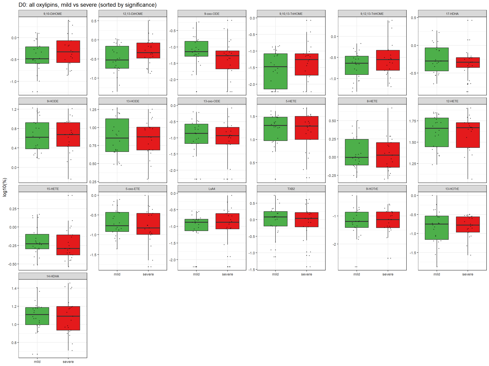
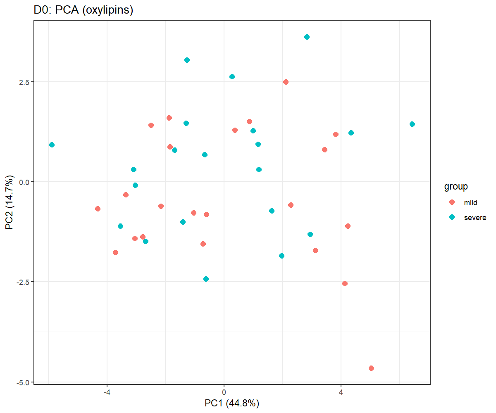
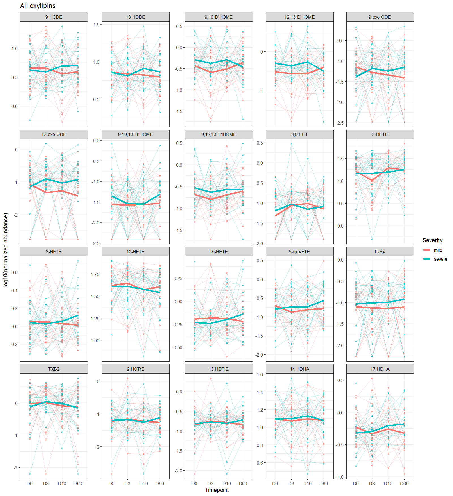
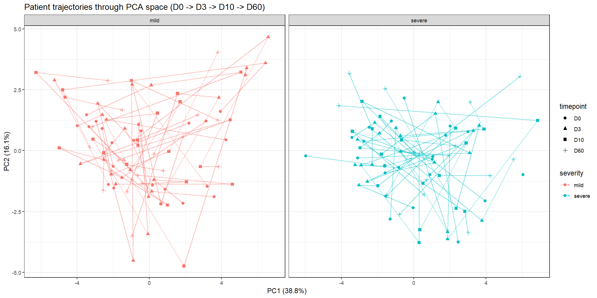
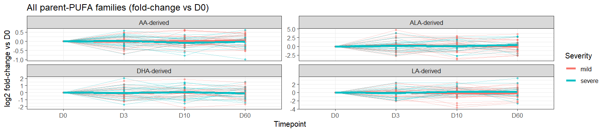

**Design:** 47-oxylipin panel (HETEs, HODEs, prostaglandins, leukotrienes, lipoxins, resolvins, protectins, maresin) tracked at D0, D3, D10, D60 in the same patients (mild/severe dengue, no healthy arm)
**Scripts:** [code/Oxylipid_lipidomics_pretreatment.R](../../code/Oxylipid_lipidomics_pretreatment.R) · [code/Oxylipid_class_annotation.R](../../code/Oxylipid_class_annotation.R) · [code/Oxylipid_01_posthoc_mild_vs_severe.R](../../code/Oxylipid_01_posthoc_mild_vs_severe.R) · [code/Oxylipid_02_longitudinal_analysis.R](../../code/Oxylipid_02_longitudinal_analysis.R)
**Output directory:** `analysis/Oxylipids/`

---

## Objective

Test whether individual oxylipins — fatty-acid oxidation products that mark inflammation activity (HETEs, prostaglandins, leukotrienes, thromboxane) and its active resolution (resolvins, protectins, maresin) — differ between mild and severe dengue, both **cross-sectionally** at each timepoint and **longitudinally** across the full D0→D3→D10→D60 course.

## Data

| | |
|---|---|
| Source | `data/raw_data/241008GMI_oxylipins_results.xlsx`, sheet `Results` — the platform's own deduplicated, pre-normalized (pg/µL of fluid) results table |
| Patients | 43 (mild + severe only — no longitudinal healthy-control data exists for oxylipins: healthy donors are single-draw controls with no D60 sample) |
| Timepoints | D0, D3, D10, D60 (uneven spacing: 0, 3, 10, 60 days) |
| Panel | 47 named oxylipins, with an authoritative parent-PUFA "Precursor" label per compound taken directly from the platform's own metadata |
| Patients per timepoint | D0: 43 (22 mild, 21 severe) · D3: 42 (22 mild, 20 severe) · D10: 41 (22 mild, 19 severe) · D60: 40 (22 mild, 18 severe) |

**This pipeline was rebuilt mid-analysis after a data-provenance check.** An earlier version read `data/raw_data/oxylipines.xlsx`, a pre-existing, undocumented 24-compound extract. Comparing it against the two raw batch files named in `README.md` (`241008GMI_oxylipins_results.xlsx` / `241009DMI_oxylipins_results.xlsx`) surfaced two things:

1. **The panel was less than half of what was actually measured.** The platform's own `Results` sheet reports 47 named compounds, not 24 — the missing ~half included essentially the entire specialized pro-resolving mediator (SPM) class (resolvins, protectins, maresin), several more prostaglandins/leukotrienes/lipoxins, and 3 of 4 EET regioisomers.
2. **The reduced extract also silently dropped 3 severe patients** (`JV-048`, `JV-071`, `KT-565`) who are part of the documented 43-patient mild/severe cohort used elsewhere in this project (see `Longitudinal_Analysis_Report.md`'s limitations section — these 3 are known to have only 3/4 plasma timepoints). Reading from the platform's own Results sheet recovers them, improving severity balance at D0 from 22 mild/18 severe to 22 mild/21 severe.

The two "batch" files themselves turned out **not** to represent two different sample batches, despite the naming: their `Raw Datas` sheets are byte-identical (16,830/16,830 cells match), and their `Results` sheets differ only by 2 blank trailing columns in the DMI file. Only one file was needed; `241008GMI_oxylipins_results.xlsx` was used as the cleaner of the two. Full detail in the `Oxylipid_lipidomics_pretreatment.R` header comment.

## Processing & normalization

**Why not the standard LipidSigR pipeline used elsewhere in this project?** Oxylipins are fatty-acid oxidation products, not glycerophospholipids/sphingolipids, so `rgoslin::parseLipidNames()` cannot annotate them. A hand-built substitute annotation table was tried and does not work: `as_summarized_experiment()` unconditionally runs LipidSigR's internal `lipid_annotation()`, which performs real LION/ChEBI/LIPID MAPS ontology lookups and nomenclature parsing that crash on non-rgoslin names (confirmed empirically — a row-count mismatch when building the `SummarizedExperiment`). Both scripts therefore reimplement the *same statistical design* directly in plain R rather than going through a `SummarizedExperiment`:

- **Missing-value filtering**: features detected (non-zero) in fewer than 70% of samples are dropped — matching `data_process(exclude_missing=TRUE, exclude_missing_pct=70)` elsewhere in this project. This step turned out to matter a lot for the expanded panel (see below).
- **Normalization**: percentage of each sample's total oxylipin signal, remaining zero/NA replaced with half the smallest non-zero value per lipid, then `log10` — numerically the same operation as `data_process(normalization='Percentage', replace_na_method='min', replace_na_method_ref=0.5, transform='log10')` elsewhere in this project.
- **Class annotation**: `family` (parent PUFA — LA/DGLA/AA/ALA/EPA/DHA-derived) comes directly from the platform's own `Precursor` column, not a guess. `class` (HETE, HODE, PG, LT, LX, RvD, RvE, PD, MaR, ...) is hand-assigned from standard oxylipin/eicosanoid nomenclature, since the platform doesn't provide this finer grouping. Built by `Oxylipid_class_annotation.R`.

**How this compares to the previous oxylipin analysis (Loic's scripts):** the pretreatment notebooks that built the old ratio dataset (`code/Oxylipins_pretreatment.ipynb` / `_v2.ipynb`) applied **no normalization step at all** — only a `+1` offset (to avoid division by zero) and a per-patient ratio of `Dx / D60`. The one downstream script that actually ran that ratio data through LipidSigR (`LipidSigR/Profiling.R`, and `Lipidsig_Tool_function.R` following the same pattern) applied `data_process(..., normalization='PQN', transform='log10')` — **PQN** (Probabilistic Quotient Normalization), not the `Percentage` normalization used here. This pipeline uses `Percentage`, matching the convention used by the plasma cross-sectional and longitudinal scripts elsewhere in this project, rather than reproducing Loic's PQN choice.

### Most of the expanded panel is below reliable detection in this cohort

Applying the 70%-detection filter removes **27 of the 47 compounds** pooled across all 4 timepoints (slightly fewer, 26–28, at any single timepoint). What's lost is almost entirely the newly recovered part of the panel: **all** resolvins (RvE1, RVD1, RvD2, RvD3, RvD5), **all** protectins (PD1, PDx) and maresin (7(S)-MaR1), **all** extra prostaglandins beyond PGE2/PGF2a (PGA1, PGD2, PGE3, 8isoPGA2, 11B-PGF2a, PGFM, 15dPGJ2, 6kPGF1a), both leukotrienes (LTB4, LTB5), one of two lipoxins (LXB4), 3 of 4 EET regioisomers, and 10-HODE. **This is a genuine, reportable analytical finding, not a processing artifact**: specialized pro-resolving mediators circulate at very low (often sub-pg/mL) concentrations and are frequently near or below quantification limits on a general HPLC-QqQ panel without dedicated SPM sample enrichment — their absence from reliable detection here is itself informative about what this particular assay can and cannot resolve in plasma at this cohort's sample volumes.

The **20 compounds retained** after filtering are dominated by the "classical" oxylipin panel: complete LA-derived coverage (HODE, DiHOME, OxoODE, TriHOME), most AA-derived HETEs plus TXB2 and one EET/one lipoxin, complete ALA-derived HOTrE coverage, and 2 of 9 DHA-derived compounds (14-HDHA, 17-HDHA — the two most abundant, non-SPM DHA metabolites). This is coincidentally close to the original 24-compound extract's selection, suggesting whoever built that earlier file had — without documenting it — already hand-curated toward the reliably-detected subset, just without a stated threshold or method.

## Cross-sectional analysis (mild vs severe, each timepoint independently)

**Script:** `Oxylipid_01_posthoc_mild_vs_severe.R` — the oxylipid analogue of `02/03/04_posthoc_*.R`, looped over the 4 timepoints instead of 3 group pairs (there is only one comparison here: mild vs severe).

**Method:** per lipid, per timepoint, Welch t-test and Wilcoxon rank-sum test on the normalized log10 values (mild vs severe), BH-FDR correction across the lipids tested at that timepoint. `log2FC` is severe relative to mild.

### Results

| Timepoint | Patients | Lipids tested (post-filter) | Significant (t-test, FDR<0.05) | Closest to significance (nominal p, uncorrected) |
|---|---|---|---|---|
| D0 | 43 (22 mild, 21 severe) | 19 | **0** | 12,13-DiHOME (p=0.065, FDR=0.92) |
| D3 | 42 (22 mild, 20 severe) | 21 | **0** | 13-oxo-ODE (p=0.079, FDR=0.92) |
| D10 | 41 (22 mild, 19 severe) | 20 | **0** | 12,13-DiHOME (p=0.032, FDR=0.55) |
| D60 | 40 (22 mild, 18 severe) | 20 | **0** | 13-oxo-ODE (p=0.082, FDR=0.60) |

No oxylipin reaches FDR<0.05 for mild vs severe at any single timepoint. Nominal (uncorrected) p-values are well-distributed across the 0–1 range at every timepoint, so this reads as a genuine null result for this panel/sample size rather than a processing artifact.

**`12,13-DiHOME` and its isomer `9,10-DiHOME` are consistently among the top nominal hits** at D0, D3, and D10 (always higher in severe: log2FC +0.5 to +1.0), and reappear below as the closest-to-significance class in the longitudinal severity-effect test — the one recurring pattern across otherwise independent tests, though it does not clear multiple-testing correction at any single timepoint.

Full results per timepoint: [`D0/02.DiffExp/DE_results_mild_vs_severe.tsv`](PostHoc_Mild_vs_Severe/D0/02.DiffExp/DE_results_mild_vs_severe.tsv) · [`D3`](PostHoc_Mild_vs_Severe/D3/02.DiffExp/DE_results_mild_vs_severe.tsv) · [`D10`](PostHoc_Mild_vs_Severe/D10/02.DiffExp/DE_results_mild_vs_severe.tsv) · [`D60`](PostHoc_Mild_vs_Severe/D60/02.DiffExp/DE_results_mild_vs_severe.tsv)

All reliably-detected oxylipins at D0, mild vs severe:



PCA at D0 shows no visual separation by severity, consistent with the absence of any significant univariate hit:



Class/family enrichment (Fisher's exact test) was not run at any timepoint since there were no significant lipids to test for over-representation.

## Longitudinal analysis (D0 → D3 → D10 → D60, paired)

**Script:** `Oxylipid_02_longitudinal_analysis.R` — same design as `code/05_longitudinal_analysis.R` for the plasma dataset: a per-lipid linear mixed model with patient as a random intercept, rather than treating each patient's repeated measurements as independent (which LipidSigR's `deSp_multiGroup` ANOVA would assume).

**Statistical model** (identical in form to the plasma longitudinal analysis):

```
value ~ timepoint * severity + day_of_fever + (1 | patient_id)
```

`timepoint` is a 4-level factor (uneven day spacing). `day_of_fever` (days of fever before hospitalization, `data/sick_patients_day_of_fever.tsv`) is included as a covariate in every model so severity/time effects aren't confounded with how far into their illness course each patient already was at enrollment. Models fit by ML (`REML=FALSE`) for LRT-based nested-model comparison (`p_time`, `p_severity`, `p_interaction`), each BH-FDR-corrected across the tested lipids. The 70%-detection filter is applied once across all 166 pooled sample-timepoints, retaining 20 of 47 compounds (see "Processing & normalization" above for which).

### Species level

| Metric | Value |
|---|---|
| Lipids tested | 20 |
| Significant **time** effect (FDR<0.05) | **0 / 20** |
| Significant **timepoint × severity** interaction (FDR<0.05) | **0 / 20** |
| Significant **severity** main effect (FDR<0.05) | **0 / 20** |
| Models with singular fit (near-zero patient variance — interpret with extra caution) | 14 / 20 |

Full results: [`LMM_all_results.tsv`](Longitudinal/02.Mixed_models/LMM_all_results.tsv)

Closest to significance (uncorrected p; all FDR≥0.27 after correction across 20 lipids):

| Lipid | p_time | p_severity | p_interaction |
|---|---|---|---|
| 12,13-DiHOME | 0.938 | **0.029** | 0.203 |
| 9,12,13-TriHOME | 0.447 | **0.026** | 0.882 |
| 9,10-DiHOME | 0.551 | 0.069 | 0.242 |
| 5-HETE | 0.174 | 0.924 | 0.432 |
| 8,9-EET | 0.289 | 0.766 | 0.656 |

No post-hoc `emmeans` contrasts were run, since no species reached the significance threshold that would trigger them.

All 20 retained oxylipin trajectories, D0→D3→D10→D60:



Patient trajectories through PCA space:



### Family & class level aggregation

Species were aggregated to parent-PUFA families and compound classes using the platform-derived annotation, and the same paired LMM refit on the aggregated series (linear-scale percentage sum, re-log10-transformed — same method as the plasma report's class/category aggregation). Only families/classes with at least one detected species survive to this stage: **4 of the original 6 families** (LA/AA/ALA/DHA-derived — DGLA-derived and EPA-derived have zero surviving species, see below) and **11 of ~21 classes**.

| Level | Tested | Significant time effect (FDR<0.05) | Significant severity effect (FDR<0.05) | Significant interaction (FDR<0.05) |
|---|---|---|---|---|
| Family | 4 | 0 | 0 | 0 |
| Class | 11 | 0 | 0 | 0 |

The lowest nominal p-values at the class level belong to the two LA-derived classes that also stood out at the species level: **DiHOME** (p_severity=0.049, FDR=0.27) and **TriHOME** (p_severity=0.026, FDR=0.27) — consistent with `12,13-DiHOME`/`9,10-DiHOME` and `9,12,13-TriHOME` independently showing the same pattern above. Still exploratory only (FDR>0.25), but this is a materially more consistent signal — recurring across 3 cross-sectional timepoints, the longitudinal severity test, and the class-level aggregation — than any single-test nominal hit would be on its own.

**A previous version of this report (built on the reduced 24-compound extract) flagged an "EPA-derived family" lead** (driven by `18-HEPE` and `FA 20:5;O2`/`RvE1`). That lead **does not survive** in this rebuilt analysis: every EPA-derived compound in the full 47-panel (`18-HEPE`, `RvE1`, `LTB5`, `PGE3`, `5,6-DiHETE`) falls below the 70%-detection threshold once a proper prevalence filter is applied, meaning the entire EPA-derived family has zero species reliably measured in this cohort — the earlier signal was very likely noise from mostly-undetected data that had never been filtered for prevalence. This is flagged here explicitly as a correction, not silently dropped.

Full results: [`LMM_family_results.tsv`](Longitudinal/03.Aggregated/Family/LMM_family_results.tsv) · [`LMM_class_results.tsv`](Longitudinal/03.Aggregated/Class/LMM_class_results.tsv)



Class/family over-representation (Fisher's exact test) was not run, since no species reached significance at either the time or interaction LRT to form a test set.

## Why null, and what would change that

Two structural reasons this panel may be underpowered relative to the plasma lipidome analysis, rather than oxylipins being biologically uninformative in dengue:

1. **Effective panel size after detection filtering.** 20 reliably-detected oxylipins vs. 119+ species in the plasma lipidome analysis — an order of magnitude fewer independent tests, and BH-FDR correction is accordingly less forgiving per lipid.
2. **Sample size per group.** 18–21 per group at each timepoint is modest for detecting anything short of a large effect by t-test; the plasma longitudinal analysis had a comparable n (43 patients) but 119 tested species and (per that report) generally larger effect sizes (log2FC up to ~5.5 among its interaction hits) than seen here.

A third, newly surfaced reason is specific to the SPM half of this panel: **resolvins, protectins, and maresin are simply not reliably detected by this assay in this cohort**, so no amount of additional statistical power on the current data would recover a signal there — that would require a more sensitive/targeted SPM-specific method, not a larger sample of the same measurements.

Nothing in this pipeline (normalization, missing-value handling, test choice) looks like a processing artifact — p-values are well-behaved and QC plots (boxplots, PCA, correlation heatmaps under `PostHoc_Mild_vs_Severe/<Timepoint>/01.Profiling/`) show no obvious batch or outlier problem.

## Limitations & caveats

- **No healthy control, at any timepoint.** Healthy donors are single-draw controls with no D60 sample, so oxylipin analysis is mild-vs-severe only, unlike the 3-group plasma cross-sectional analysis.
- **Roughly half the measured panel (27/47) is below reliable detection** in this cohort at the 70%-presence threshold — entirely so for resolvins, protectins, and maresin. Absence of a signal from those compounds reflects assay sensitivity in this cohort, not evidence they're biologically uninvolved.
- **Manual class/family annotation for the `class` column** (not the `family` column, which is platform-reported) — curated by hand from standard eicosanoid/oxylipin nomenclature, not independently verified against a lipid ontology database.
- **14/20 species-level models had singular fits** (near-zero between-patient variance) — expected for a small, low-abundance panel with 40-43 patients, but LMM p-values for singular-fit lipids should be read with extra caution.
- **1 patient (`KT-926`) contributes only a single D0 timepoint**, and a few others (`JV-048`, `JV-071`, `KT-565`) have 3/4 timepoints — retained (mixed models tolerate unbalanced data) but less informative for the within-patient trajectory question than fully-paired patients.
- **No multiple-testing correction across levels.** BH-FDR is applied within each effect (time/severity/interaction) and within each aggregation level (species/family/class) separately, not jointly.
- **Class/family aggregation is a simple percentage sum**, not a weighted or abundance-corrected composite — a class with one high-abundance species and several trace ones will be dominated by that one species.

## Possible next steps

- If oxylipins remain a priority biomarker candidate, the clearest lever is **more patients** rather than reprocessing — 20 reliably-detected compounds at n≈20/group is a difficult regime for BH-FDR regardless of true effect size.
- The recurring **DiHOME/TriHOME (LA-derived) signal** (higher in severe, consistent across D0/D3/D10 and the longitudinal severity test) is the most consistent lead in this dataset and the best candidate for a targeted, single-hypothesis follow-up test (no multiple-testing burden from the other classes) if there's a biological reason to prioritize it a priori.
- If specialized pro-resolving mediators remain of interest given the "resolution of inflammation" framing of this study, they would need a dedicated, more sensitive SPM-targeted LC-MS/MS method (e.g. with solid-phase extraction enrichment) rather than reanalysis of this panel — the compounds are present in the raw data but not quantifiable here.
- Cross-reference against the plasma lipidome's D3-divergent DG/TG/PI/LPC species (see [`Longitudinal_Analysis_Report.md`](../Longitudinal/Longitudinal_Analysis_Report.md)) — same patients, same D3 timepoint — to check whether patients with an early plasma lipid shift also show any (even sub-significant) oxylipin co-movement.
- Merge in the clinical covariates available in the raw patient-list spreadsheet but not yet used here (`1997 Classification` DF/DHF/DSS granularity beyond mild/severe, DENV serotype, primary/secondary infection status, age, sex) as additional covariates or stratification.
