```{r setup, include=FALSE}
knitr::opts_chunk$set(
  echo = FALSE,
  warning = FALSE,
  message = FALSE,
  fig.align = "center"
)

# Load required libraries
library(knitr)
library(kableExtra)
library(dplyr)
```

# Executive Summary

**A note on normalization:** this dataset passes through two independent, non-redundant normalizations before analysis. First, an ISTD- and cell-count-based normalization (internal-standard-corrected signal divided by each sample's input cell number, from the raw platform data) is a technical/analytical correction applied during data pretreatment, correcting for extraction/ionization efficiency and cell input differences. Second, LipidSigR's `Percentage` normalization (applied in `data_process()`, see Methodology below) is a separate, whole-sample compositional correction applied during analysis, expressing each lipid as a fraction of that sample's total detected lipid signal. The two remove different sources of variation and neither substitutes for the other.

This lipidomics analysis investigates lipid profile alterations associated with dengue disease severity in PBMC samples. Using targeted lipidomics, we analyzed plasma samples from healthy controls and dengue patients classified as mild or severe cases at day 0 (D0) of hospitalization.

**Key Findings:**

- **Three-group ANOVA** (Healthy vs Mild vs Severe) found **no lipid species significant after FDR correction** (padj < 0.05); only 11 of 110 tested lipids reached nominal significance (p < 0.05), dominated by triglyceride (TG) species
- **Healthy vs Mild**: 17 lipids nominally significant, but **none survive FDR correction**; nominal trends point to elevated TG species and reduced FA 14:0, with TG the only class reaching significance by over-representation analysis (ORA)
- **Healthy vs Severe**: only 1 lipid (FA 18:1) nominally significant, and it does not survive FDR correction — the weakest signal of the three pairwise comparisons
- **Mild vs Severe**: 9 lipids nominally significant, and **one, SM 34:1;O2, survives FDR correction** (padj = 0.047, lower in severe than mild) — the only robust, FDR-significant finding in the entire dataset
- Unsupervised ordination (PCA, t-SNE, UMAP) shows only partial, overlapping separation between groups; the clearest group separation is seen with supervised PLS-DA in the Mild vs Severe comparison
- Lipid set enrichment (LSEA) and over-representation (ORA) analyses are largely non-significant across comparisons, with two exceptions: TG class over-representation in Healthy vs Mild, and FA class enrichment in Mild vs Severe

Overall, this dataset shows modest, mostly sub-threshold lipid differences between groups rather than large-scale dysregulation. The single robust finding — reduced SM 34:1;O2 in severe versus mild disease — is a candidate severity marker, but the broader picture is one of limited statistical power (n=9 for severe patients) and considerable inter-sample heterogeneity rather than a clear, dominant biological signature.

---

# Introduction

## Study Objectives

The primary objectives of this lipidomics study are:

1. **Characterize lipid profile alterations** in dengue patients compared to healthy controls at the time of hospitalization (D0)

2. **Identify lipid biomarkers** that distinguish between disease severity levels (mild vs severe)

3. **Determine lipid classes and pathways** most affected by dengue virus infection

4. **Establish lipid signatures** that correlate with disease progression from mild to severe dengue

5. **Evaluate the potential** of plasma lipid profiles as prognostic markers for disease severity

6. **Contribute to understanding** the metabolic dysregulation associated with dengue pathophysiology

These objectives aim to advance our knowledge of the metabolic consequences of dengue infection and potentially identify novel therapeutic targets or biomarkers for clinical management.

## Sample Description

This study included plasma samples from 40 participants, stratified into three groups based on dengue severity status:

### Cohort Composition

- **Healthy controls (n=20)**: Individuals with no dengue infection, serving as the reference group for baseline lipid profiles  
- **Mild dengue patients (n=11)**: Patients with confirmed dengue virus infection presenting with mild symptoms not requiring intensive care  
- **Severe dengue patients (n=9)**: Critically ill patients with confirmed dengue virus infection requiring intensive care management  

### Sample Collection

- **Timepoint**: Day 0 (D0) - samples collected at the time of hospitalization/diagnosis  
- **Sample type**: Plasma  
- **Biospecimen**: Peripheral blood  

### Analytical Coverage

- **Total lipid species measured**: 143 lipid species
- **Lipid recognition rate**: >97% (139/143 species successfully annotated using rgoslin nomenclature)
- **Lipids retained for statistical analysis**: 110 species passed the 50% detection-frequency filter and were consistently detected (~110 lipids/sample) across all 40 samples
- **Major lipid classes represented**:
  - Phosphatidylcholines (PC), Phosphatidylethanolamines (PE), and Lysophosphatidylcholines (LPC)
  - Sphingomyelins (SM) and ceramides (Cer, Hex2Cer)
  - Triglycerides (TG) and Diglycerides (DG)
  - Cholesteryl esters (CE) and Cholesterol
  - Fatty acids (FA)
  - Phosphatidylinositols (PI) and ether-linked PC (PC O-)

### Study Design

The analysis employed a comprehensive approach:

1. **Three-group comparison** (n=40): One-way ANOVA comparing all groups simultaneously
2. **Pairwise post-hoc comparisons**:
   - Healthy vs Mild (n=31)
   - Healthy vs Severe (n=29)
   - Mild vs Severe (n=20)

## Methodology

### Data Processing Pipeline

1. **Data Loading & Quality Control**
   - Lipid nomenclature parsing using rgoslin
   - Recognition rate: >97%

2. **Data Processing**
   - Filtering: 50% threshold (lipids present in at least 50% of samples)
   - Missing value imputation: Minimum value method
   - Normalization: Percentage normalization
   - Transformation: Log10 transformation

3. **Statistical Analysis**
   - Multi-group comparison: One-way ANOVA
   - Post-hoc pairwise comparisons: t-test
   - Multiple testing correction: Benjamini-Hochberg (FDR)
   - Significance threshold: padj < 0.05

4. **Enrichment Analysis**
   - Lipid Set Enrichment Analysis (LSEA)
   - Over Representation Analysis (ORA)

**Methodological Approach:**

This analysis employs a comprehensive strategy combining global assessment (three-group ANOVA) with targeted pairwise comparisons. The LipidSigR package provides specialized methods for lipidomics data, including:
- Lipid nomenclature standardization via rgoslin parsers  
- Missing value handling tailored to lipidomics datasets  
- Appropriate normalization methods (percentage-based)  
- Statistical tests accounting for lipid-specific distributions  
- Enrichment analyses considering lipid structural relationships  

The combination of univariate statistics, multivariate dimensionality reduction, and pathway enrichment provides robust, multi-faceted insights into lipid dysregulation patterns.

---

# Three-Group Analysis (Healthy vs Mild vs Severe)

## Overview

The three-group analysis employs one-way ANOVA to simultaneously compare lipid profiles across healthy controls (n=20), mild dengue patients (n=11), and severe dengue patients (n=9) at day 0 of hospitalization. This global analysis identifies lipid species whose abundance differs significantly across disease severity states, providing an initial overview of lipid dysregulation patterns in dengue infection before conducting detailed pairwise comparisons.

This section presents the results of the one-way ANOVA comparing lipid profiles across all three groups simultaneously.

## Data Quality Assessment

### Before and After Processing

```{r three-group-quality}
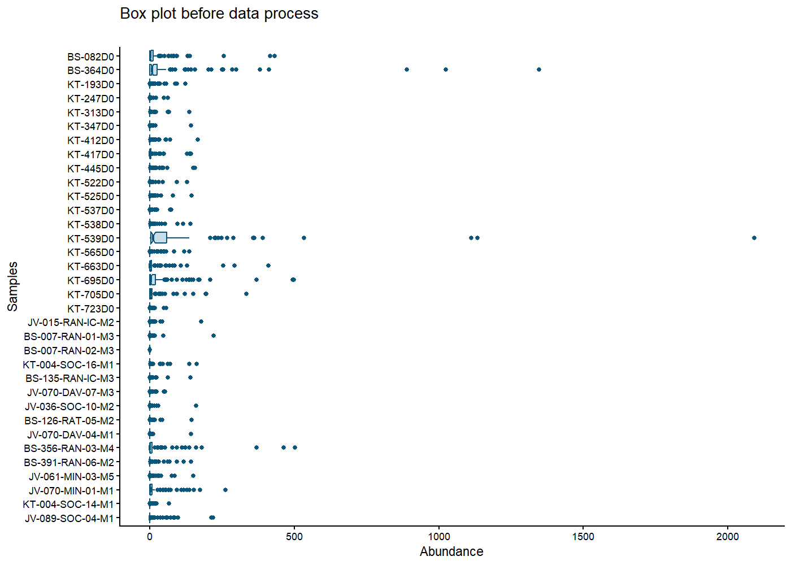
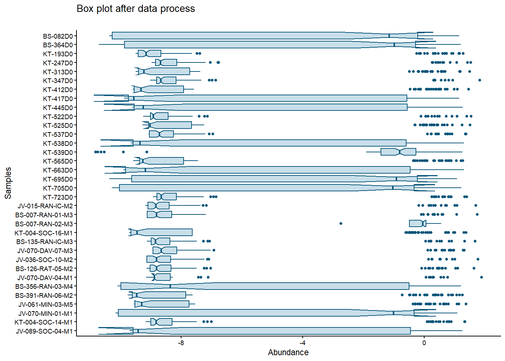
```

**Data Quality Assessment:**

Before processing, raw abundance values show:
- A wide dynamic range (0 to ~840 units), driven mainly by two samples (KT-539D0, KT-663D0-adjacent outliers) with large high-abundance tails
- Heterogeneous distributions across samples, with most values compressed near zero
- Presence of outliers and strongly right-skewed distributions

After percentage normalization and log10 transformation, most sample boxes tighten into a consistent interquartile range (roughly -9 to -7), but **several samples remain visibly more dispersed than the rest** — notably BS-082D0, BS-364D0, KT-663D0, KT-705D0, BS-356-RAN-03-M4, and JV-070-MIN-01-M1, whose boxes span nearly the full -10 to +2 range. This indicates that normalization removed most, but not all, of the technical/sample-level variability, and these samples should be treated as candidate outliers when interpreting downstream results.

### Density Plots

```{r three-group-density}
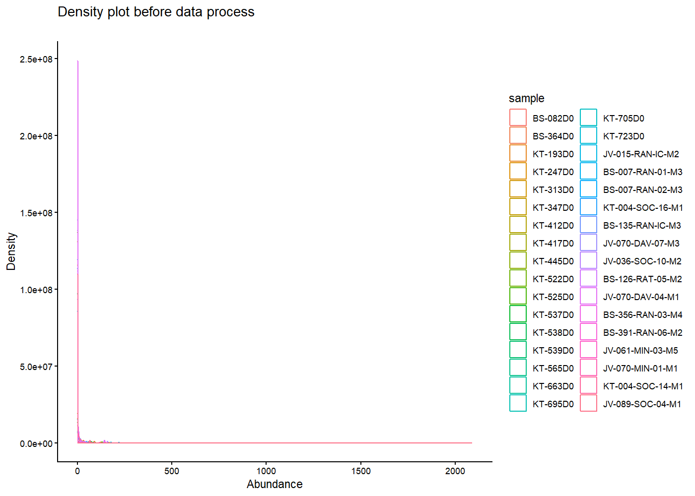
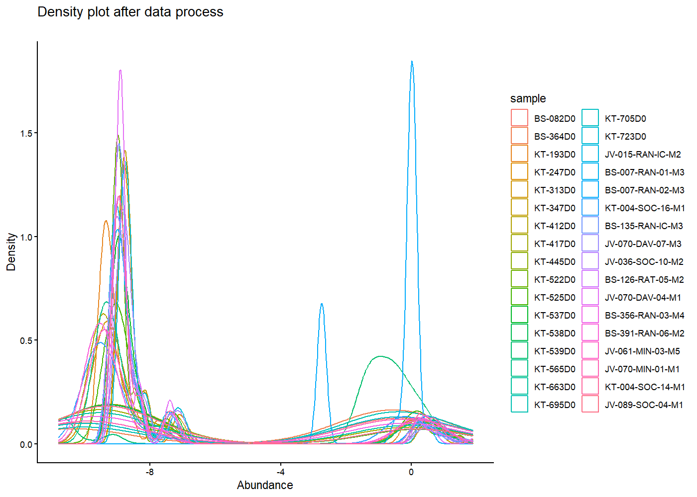
```

**Density Distribution Analysis:**

Before processing, the density plot shows a sharp, shared peak near zero abundance for almost all samples, with one sample (BS-007-RAN-02-M3) showing a distinct, unusually narrow and tall secondary peak, and a long flat tail extending out to ~800 driven by a few high-abundance lipids/samples.

After log10 transformation and normalization, the distributions are **not cleanly bimodal**: most samples share a dominant peak around -9 to -8, with a broader, lower secondary hump spread between roughly -3 and +1. A few samples depart from this common shape — one sample shows a distinct peak near 0, and another shows an intermediate peak near -2 — indicating that a handful of samples still behave differently from the bulk of the cohort after normalization, consistent with the outliers flagged in the boxplots above.

## Sample Profiling

### Cross-Sample Variability

```{r three-group-variability}
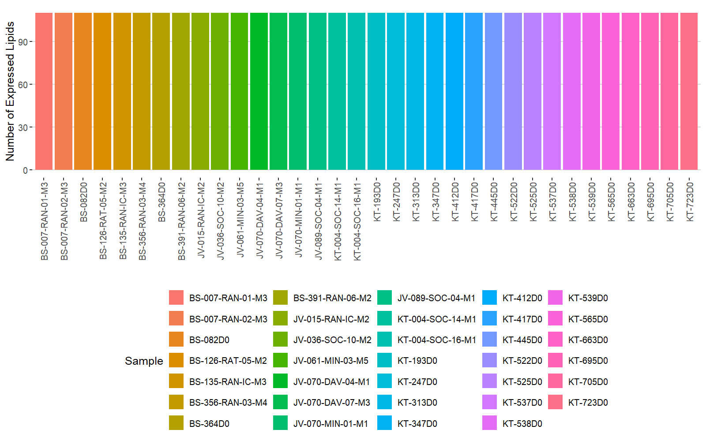
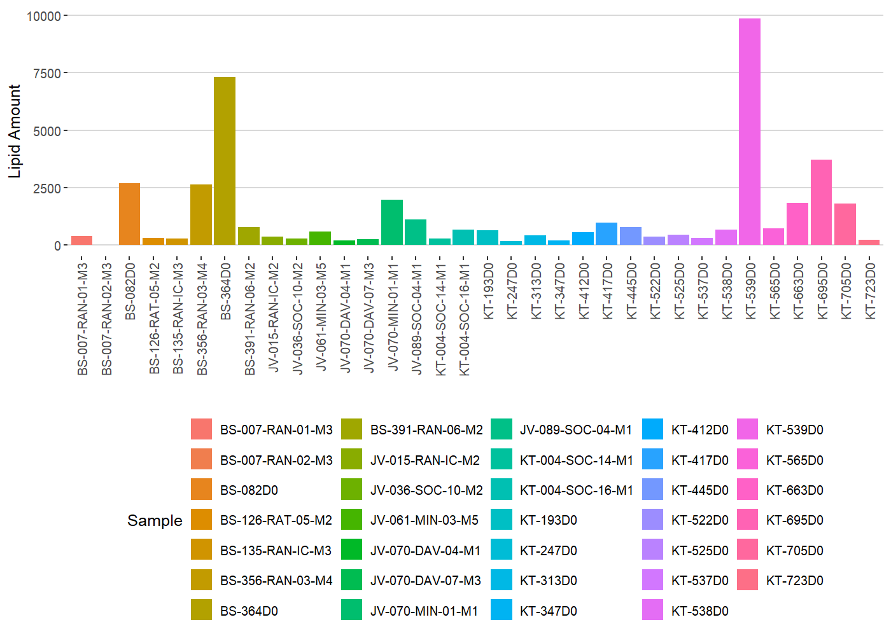
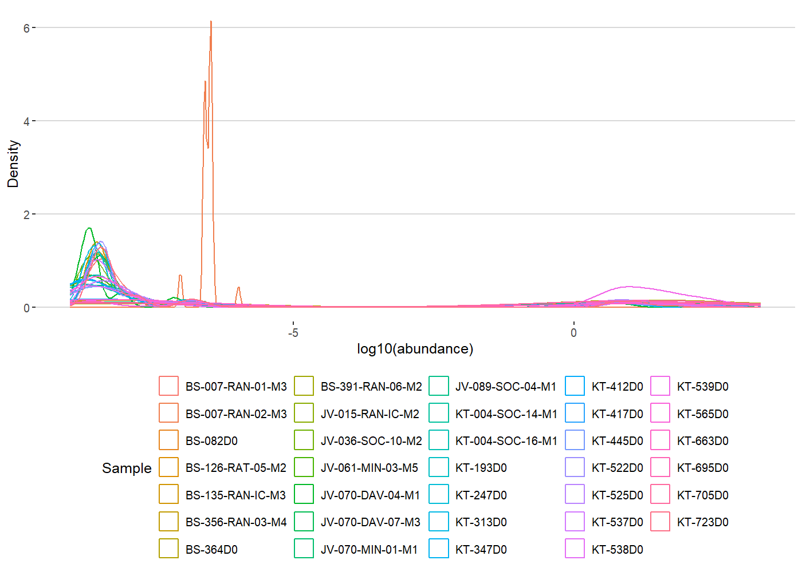
```

**Cross-Sample Variability Assessment:**

- **Number of expressed lipids** is highly consistent across all 40 samples: essentially all samples detect ~110 of the 110 filtered lipid species, with no group showing systematically lower coverage. This confirms that detection depth is not confounded with disease group.
- **Total lipid abundance per sample**, in contrast, is far from uniform: most samples sum to under 500 abundance units, but a handful of samples (KT-539D0 ~4000, BS-364D0 ~2900, KT-695D0 ~1500, BS-082D0 and BS-356-RAN-03-M4 ~1000-1100) are 2-8x higher than the rest. These same samples reappear as the outliers in the quality-control boxplots above.
- **Lipid abundance distribution** (log10 scale) is broadly overlapping across samples, aside from the same outlier samples showing distinct peak positions.

Because detection depth is uniform but total abundance is not, downstream comparisons are unlikely to be confounded by missingness, but the identified outlier samples add residual noise that likely reduces statistical power — consistent with the limited number of FDR-significant lipids reported below.

### Dimensionality Reduction

#### PCA (Principal Component Analysis)

```{r three-group-pca}
pca_plot <- readRDS("PBMC/Three_groups/D0/01.Profiling/02.Dimensionality_reduction/PCA/PCA_plot_interactive.rds")
pca_plot
```

```{r three-group-scree}
scree_plot <- readRDS("PBMC/Three_groups/D0/01.Profiling/02.Dimensionality_reduction/PCA/Scree_plot_interactive.rds")
scree_plot
```

```{r three-group-corr}
variable_correlation_plot <- readRDS("PBMC/Three_groups/D0/01.Profiling/02.Dimensionality_reduction/PCA/Variable_correlation_interactive.rds")
variable_correlation_plot
```

**What "Groups" 1/2/3 mean in this plot:** `dr_pca()` was called with `clustering = "kmeans", cluster_num = 3` — the "Groups" legend (1/2/3) is an **unsupervised k-means clustering fit on the PCA-reduced data**, not the healthy/mild/severe disease-severity labels. LipidSigR's PCA plot does not color by the sample metadata group unless `clustering = "group_info"` is requested instead; that option exists in `dr_pca()`/`dr_tsne()`/`dr_umap()` and was not used when this plot was generated.

```{r three-group-pca-cluster-check}
pca_table <- read.delim("PBMC/Three_groups/D0/01.Profiling/02.Dimensionality_reduction/PCA/table_pca_rotated_data.tsv")
group_info <- read.delim("../data/PBMC/group_information_table_healthy_vs_sick_patients_D0_all.tsv")

cluster_vs_severity <- pca_table %>%
  dplyr::select(sample_name, kmeans_cluster = group) %>%
  dplyr::left_join(group_info %>% dplyr::select(sample_name, severity = group), by = "sample_name") %>%
  dplyr::count(kmeans_cluster, severity) %>%
  tidyr::pivot_wider(names_from = severity, values_from = n, values_fill = 0)

kable(cluster_vs_severity,
  caption = "k-means cluster (from the PCA plot's \"Groups\" legend) vs. true severity group"
) %>%
  kable_styling(bootstrap_options = c("striped", "hover", "condensed"), full_width = FALSE, font_size = 12)
```

**Principal Component Analysis Interpretation:**

PC1 and PC2 explain 40.6% and 18.1% of total variance, respectively. Cross-tabulating the k-means clusters against the true severity groups (table above) shows **no meaningful correspondence**: cluster 1 (26 of 34 samples) contains a roughly proportional mix of all three groups (12 healthy / 7 mild / 7 severe — close to the ~44%/26%/29% split of the whole cohort), while clusters 2 and 3 are small (2 and 6 samples) and also mixed rather than severity-specific. The scree plot confirms PC1-PC2 capture the bulk of structured variance (~59% combined, steep drop-off after PC3, ~7%), but that structure is not organized by disease severity — it more likely reflects the handful of technical outlier samples already flagged in the quality-control section above (e.g. BS-082D0, BS-364D0, KT-663D0), which is consistent with clusters 2 and 3 together holding only 8 of 34 samples.

**Bottom line:** this PCA does not show evidence that PBMC lipid profiles separate by dengue severity — the visual clustering in the plot is unsupervised structure (likely outlier-driven), not a healthy/mild/severe signature. Note that `dr_pca(..., clustering = "group_info")` cannot be used to get a severity-colored plot directly: that option only works when called on a post-`deSp_multiGroup()`/`deSp_twoGroup()` object (its `group_info` extraction depends on DE metadata being present, not on the `se_type` used when the `SummarizedExperiment` was built), and even then it subsets to only DE-significant lipids. The plot below instead colors by the true severity label directly (joining `group_info` back onto the PCA scores by `sample_name`, with k-means cluster kept as the point shape for reference) — the more informative diagnostic for this question, and consistent with the weak/absent statistical signal in the ANOVA below.

```{r three-group-pca-severity-colored}
pca_plot_severity <- readRDS("PBMC/Three_groups/D0/01.Profiling/02.Dimensionality_reduction/PCA/PCA_plot_clinical_group_interactive.rds")
pca_plot_severity
```

Colored this way, the three severity groups visibly overlap across the whole PC1-PC2 space rather than occupying separate regions — the same conclusion as the cross-tabulation table above, now visible directly rather than inferred from cluster composition.

#### t-SNE

```{r three-group-tsne}
tsne_plot <- readRDS("PBMC/Three_groups/D0/01.Profiling/02.Dimensionality_reduction/t-SNE/t-SNE_plot_interactive.rds")
tsne_plot
```

**t-SNE Analysis:**

t-distributed Stochastic Neighbor Embedding (t-SNE) emphasizes local structure and can reveal non-linear relationships not apparent in PCA. **As with the PCA plot above, "Groups" 1/2/3 here are k-means clusters fit on the t-SNE embedding (`clustering = "kmeans"`), not the healthy/mild/severe labels.**

```{r three-group-tsne-cluster-check}
tsne_table <- read.delim("PBMC/Three_groups/D0/01.Profiling/02.Dimensionality_reduction/t-SNE/table_tsne_results.tsv")

tsne_cluster_vs_severity <- tsne_table %>%
  dplyr::select(sample_name, kmeans_cluster = group) %>%
  dplyr::left_join(group_info %>% dplyr::select(sample_name, severity = group), by = "sample_name") %>%
  dplyr::count(kmeans_cluster, severity) %>%
  tidyr::pivot_wider(names_from = severity, values_from = n, values_fill = 0)

kable(tsne_cluster_vs_severity,
  caption = "k-means cluster (t-SNE \"Groups\" legend) vs. true severity group"
) %>%
  kable_styling(bootstrap_options = c("striped", "hover", "condensed"), full_width = FALSE, font_size = 12)
```

Every cluster contains a similar mix of all three severity groups (cluster 1: 9 healthy/3 mild/4 severe; cluster 2: 3/3/2; cluster 3: 3/5/2) — there is no discriminating pattern. Like PCA, t-SNE shows no evidence of a severity-driven separation in this dataset; the overlapping ellipses reflect that absence rather than a partial signal.

#### UMAP

```{r three-group-umap}
umap_plot <- readRDS("PBMC/Three_groups/D0/01.Profiling/02.Dimensionality_reduction/UMAP/UMAP_plot_interactive.rds")
umap_plot
```

**UMAP Analysis:**

UMAP balances preservation of local and global structure. **Again, "Groups" 1/2/3 are k-means clusters fit on the UMAP embedding, not severity labels.**

```{r three-group-umap-cluster-check}
umap_table <- read.delim("PBMC/Three_groups/D0/01.Profiling/02.Dimensionality_reduction/UMAP/UMAP_results.tsv")

umap_cluster_vs_severity <- umap_table %>%
  dplyr::select(sample_name, kmeans_cluster = group) %>%
  dplyr::left_join(group_info %>% dplyr::select(sample_name, severity = group), by = "sample_name") %>%
  dplyr::count(kmeans_cluster, severity) %>%
  tidyr::pivot_wider(names_from = severity, values_from = n, values_fill = 0)

kable(umap_cluster_vs_severity,
  caption = "k-means cluster (UMAP \"Groups\" legend) vs. true severity group"
) %>%
  kable_styling(bootstrap_options = c("striped", "hover", "condensed"), full_width = FALSE, font_size = 12)
```

The pattern is the same as PCA and t-SNE: cluster 1 (4H/6M/2S), cluster 2 (6H/5M/2S), and cluster 3 (5H/0M/4S) each mix multiple severity groups, with the one near-empty cell (0 mild in a 6-sample cluster) reflecting small-cluster noise rather than a real distinction.

**No method (PCA, t-SNE, or UMAP) shows evidence that the PBMC lipidome separates by disease severity** once the unsupervised clusters are checked against the true healthy/mild/severe labels rather than assumed to match them. This is consistent with the weak-to-absent statistical signal in the pairwise and three-group comparisons below. A more direct diagnostic — re-running these three functions with `clustering = "group_info"` to color by the true labels — is recommended as a follow-up.

### Correlation Analysis

#### Correlation by Samples

```{r three-group-correlation-samples}
heatmap_samples <- readRDS("PBMC/Three_groups/D0/01.Profiling/03.Correlation_Heatmap/by_samples/Heatmap_by_samples_interactive.rds")
heatmap_samples
```

#### Correlation by Category

```{r three-group-correlation-category}
heatmap_category <- readRDS("PBMC/Three_groups/D0/01.Profiling/03.Correlation_Heatmap/by_category/Heatmap_by_category_interactive.rds")
heatmap_category
```

#### Correlation by Class

```{r three-group-correlation-class}
heatmap_class <- readRDS("PBMC/Three_groups/D0/01.Profiling/03.Correlation_Heatmap/by_class/Heatmap_by_class_interactive.rds")
heatmap_class
```

**Correlation Heatmap Interpretation:**

**By Samples:** Most samples correlate strongly with one another (r mostly > 0.5, dark red), and the dendrogram does not cleanly separate healthy from mild/severe branches. A small number of samples stand out as poorly correlated with the rest — notably BS-007-RAN-02-M3, and to a lesser extent JV-070-DAV-04-M1, KT-004-SOC-16-M1, KT-705D0 — the same samples flagged as outliers in the quality-control plots above.

**By Category:** Sphingolipids [SP] and Sterol lipids [ST] are strongly positively co-regulated with each other; Fatty acyls [FA] is negatively correlated with both Sterol lipids [ST] and Glycerophospholipids [GP]; Glycerolipids [GL] correlate weakly with the other categories. This points to at least two loosely coupled co-regulation modules (SP/ST vs. FA/GP) rather than one dominant axis.

**By Class:** Two main class clusters emerge: (1) PC, Cholesterol, SM, and PC O- correlate strongly with one another, while (2) LPC groups instead with TG, Hex2Cer, PI, CE, and Cer. PE and DG cluster together and anti-correlate with the PC/Cholesterol/SM group. FA is largely independent of the other classes. Notably, **LPC does not correlate with PC** in this dataset — the two classes fall into different co-regulation clusters, which argues against a simple, dominant PC→LPC conversion process driving the overall correlation structure.

### Lipid Characteristics

```{r three-group-characteristics}
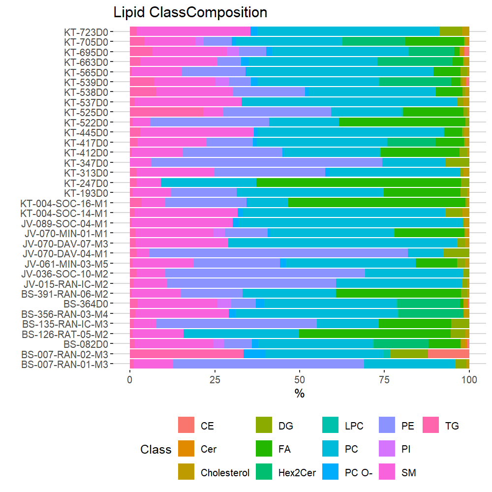
```

**Lipid Class Composition Analysis:**

The stacked bar chart displays the relative proportions of 13 lipid classes across all 40 samples. In this dataset:

- **PE, PC, SM, and FA** are the dominant classes, together typically accounting for the majority of each sample's composition
- **LPC** is a minor component in every sample (a thin band), with no visually obvious, uniform elevation pattern distinguishing any one group from another
- **SM proportion is the most variable class across samples** (ranging from near 0% to over 30%), but this variability does not track cleanly with the KT-/BS-/JV- sample-name groupings and appears to reflect general inter-individual heterogeneity rather than a clean group effect
- Minor classes (CE, Cer, Cholesterol, DG, Hex2Cer, PC O-, PI, TG) each contribute small, fairly consistent proportions

Unlike a scenario with a dominant reciprocal PC/LPC shift, the overall class-composition pattern here is one of considerable sample-to-sample heterogeneity without an obvious, uniform group-level signature — consistent with the limited number of FDR-significant lipids found in the differential expression analysis below.

## Differential Expression Analysis (ANOVA)

### Summary Statistics

```{r three-group-anova-stats}
# Read ANOVA  results (nothing is significant)
anova <- read.delim("PBMC/Three_groups/D0/02.DiffExp/01.ANOVA/ANOVA_all_results.tsv")

# Display summary
#cat("Number of significant lipids (padj < 0.05):", nrow(anova), "\n\n")

# Display table of significant results
kable(anova %>% 
        arrange(padj),
      caption = " Lipids ANOVA ( no lipids significant at padj < 0.05)",
      digits = 4) %>%
  kable_styling(bootstrap_options = c("striped", "hover", "condensed"),
                full_width = FALSE,
                font_size = 12) %>%
  scroll_box(width = "100%", height = "400px")
```

**ANOVA Results Interpretation:**

The one-way ANOVA tested 110 lipid species and found **0 significant after FDR correction** (padj < 0.05). Only **11 of 110 lipids (10%)** reached nominal significance (uncorrected p < 0.05), and even the most significant of these has p ≈ 0.014 (-log10(pval) ≈ 1.85) — several orders of magnitude weaker than would be needed to survive multiple-testing correction across 110 tests.

**Nominal (uncorrected) trends by class**, ranked by significance:
- **Triglycerides (TG)** dominate the top of the ranked list: TG 56:7, 56:6, 54:3, 54:4, 56:5, 54:5 all appear among the most nominally significant lipids
- **Phosphatidylcholines (PC)**: PC 36:1, PC O-32:0, PC 38:4, PC 32:1 appear with moderate nominal significance
- **Sphingomyelins (SM)**: SM 42:2;O2 and SM 40:1;O2 appear among the top nominal hits
- **Fatty acids (FA)**: FA 18:1, FA 18:0, FA 14:0 show nominal signal
- **Cholesteryl esters (CE)**: CE 18:2 appears with modest nominal significance

Because none of these survive FDR correction, they should be read as exploratory trends rather than confirmed findings. The pattern is also different from a simple PC-depletion/LPC-elevation story: LPC species (LPC 18:0 among them) appear only near the bottom of the nominally-significant list, and TG — not LPC — is the class most represented among the top hits.

### Visualization

```{r three-group-anova-viz}
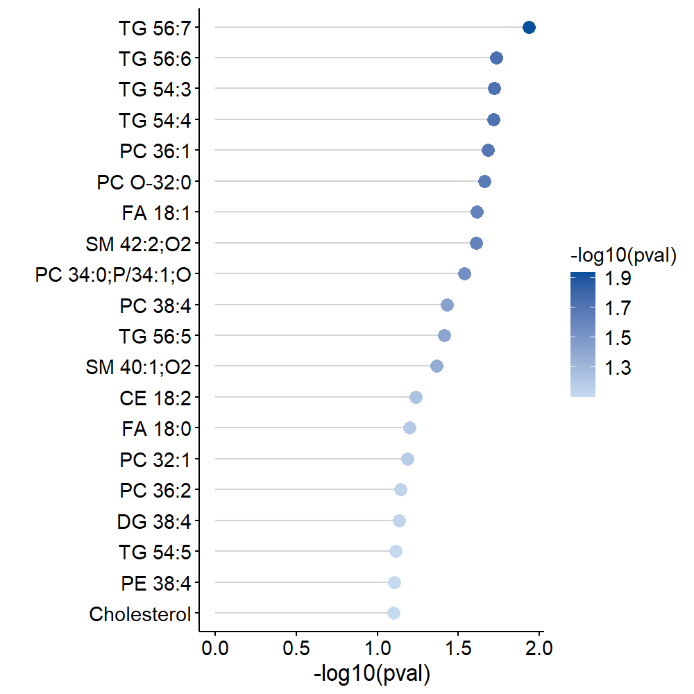
```

**Lollipop Chart Analysis:**

The lollipop chart ranks the top 20 lipids by nominal -log10(pval); the darkest points reach only -log10(pval) ≈ 1.85 (p ≈ 0.014), confirming that even the "top" hits from this three-group ANOVA are modest, uncorrected signals rather than strong biomarkers.

**Top of the ranked list:**
- **TG 56:7** — most nominally significant
- **PC 36:1**, **TG 56:6**, **TG 54:3**, **TG 54:4** — next most significant
- **PC O-32:0**, **SM 42:2;O2**, **FA 18:1** — also near the top

**Observations:**
- Triglyceride species dominate the top of the list, not LPC — a different pattern from a PLA2/LPC-driven signature
- LPC only appears once (LPC 18:0) and near the bottom of the top-20 list, with the weakest nominal significance shown
- Since none of these lipids survive FDR correction (see ANOVA summary above), this ranking should be treated as hypothesis-generating rather than as validated biomarkers.

### Individual Lipid Boxplots

```{r three-group-boxplots, results='asis', fig.show='hold', out.width='50%'}
boxplot_files <- list.files("PBMC/Three_groups/D0/02.DiffExp/03.Individual_lipid_boxplots",
  pattern = "*.png", full.names = TRUE
)
if (length(boxplot_files) > 0) {
  n_plots <- min(10, length(boxplot_files))
  for (i in seq_len(n_plots)) {
    knitr::include_graphics(boxplot_files[i])
  }
}
```

**Individual Lipid Profile Patterns:**

No individual lipid boxplots were generated for the three-group ANOVA in the current pipeline run — consistent with 0 lipids reaching FDR significance (padj < 0.05) across all three groups. The nominal (uncorrected) trends discussed above (TG species, PC O-32:0, SM 42:2;O2, FA 18:1) did not meet the threshold used to trigger per-lipid boxplot generation.

## Enrichment Analysis

### Lipid Set Enrichment Analysis (LSEA)

```{r three-group-lsea}
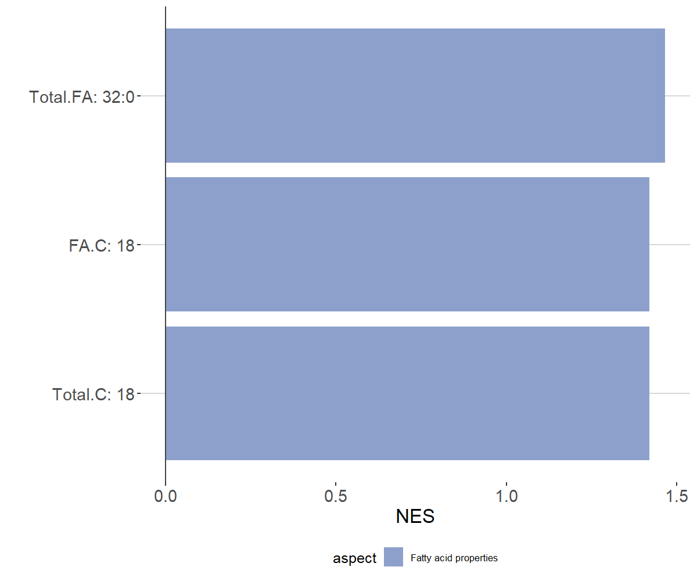
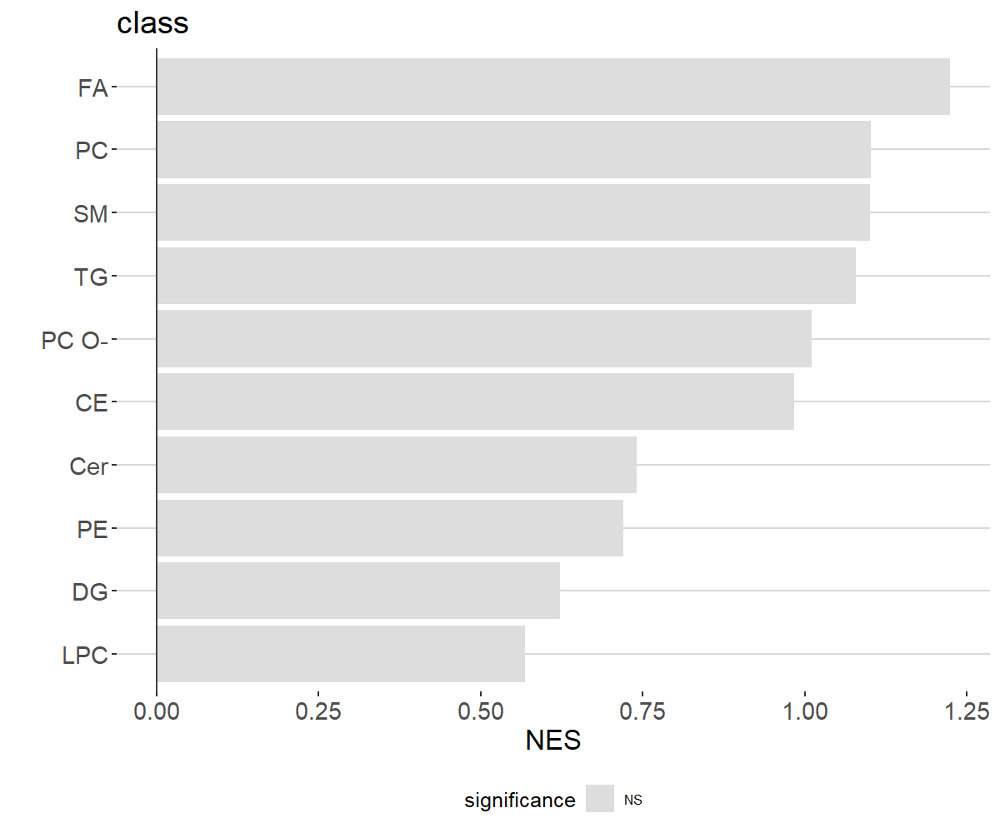
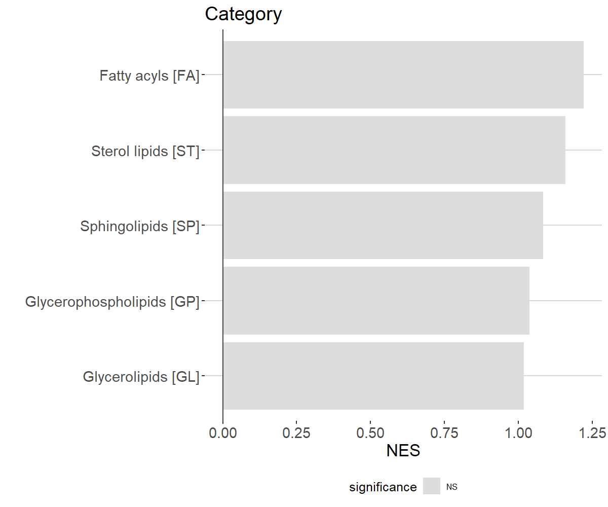
```

**LSEA evaluates whether predefined lipid sets are enriched at the top or bottom of a ranked lipid list, without applying a strict significance cutoff. This method is useful for detecting subtle but coordinated changes in lipid characteristics.**

**LSEA Results Interpretation:**

**By Class:** None of the 8 classes tested reach significance (all bars are gray/NS). FA shows the strongest positive trend (NES ≈ 1.3), followed by TG, CE, and SM; DG shows the strongest negative trend (NES ≈ -1.2); PC and LPC show weak positive and negative trends, respectively, both far from significance.

**By Category:** None of the 5 categories reach significance. Fatty acyls [FA] shows the highest (non-significant) NES (~1.3), followed by Sterol lipids [ST], Sphingolipids [SP], and Glycerolipids [GL]; **Glycerophospholipids [GP] has the lowest NES of all five categories (~0.85)** — the opposite of what would be expected if PC/LPC dysregulation were the dominant signal in this comparison.

**Interpretation:** LSEA finds no significant class- or category-level enrichment in the three-group comparison. The (non-significant) trend toward fatty-acyl and triglyceride enrichment, rather than glycerophospholipid enrichment, is consistent with the TG-dominated nominal ANOVA hits described above and argues against a dominant PLA2/glycerophospholipid-remodeling signature in this dataset.

### Over Representation Analysis (ORA)

```{r three-group-ora}
include_graphics("PBMC/Three_groups/D0/03.Enrichment/ORA/ORA_all_characteristics_barplot.png")
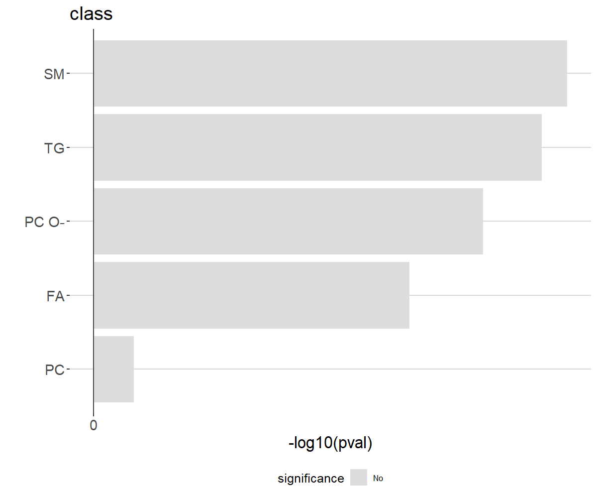
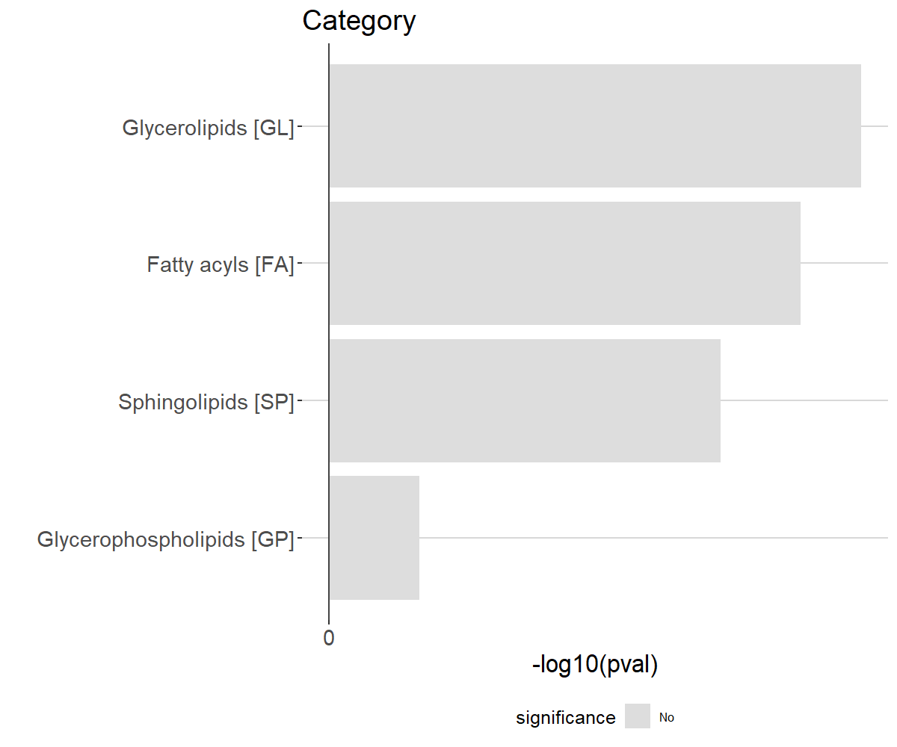
```

**ORA identifies lipid categories (e.g., classes or subclasses) that are overrepresented among significantly changed lipid species. It is suitable when you have a defined list of differentially expressed lipids.**

**ORA Results Interpretation:**

**By Class:** None of the 5 classes tested (PC O-, TG, FA, SM, PC) reach significance (all gray/"No"). PC O- and TG show the highest (non-significant) -log10(pval), while PC has essentially no enrichment signal.

**By Category:** None of the 4 categories tested (Glycerolipids [GL], Fatty acyls [FA], Sphingolipids [SP], Glycerophospholipids [GP]) reach significance. Glycerolipids [GL] shows the highest (non-significant) score; **Glycerophospholipids [GP] shows the lowest** of the four.

**Interpretation:** Both ORA and LSEA agree that no lipid class or category is significantly over-represented among the 11 nominally significant lipids from the three-group ANOVA. This is expected given the very small number of nominal hits (11 of 110 lipids) — there simply are not enough differentially-changed lipids for any single class to reach statistical over-representation. The consistent (non-significant) lean toward glycerolipids/TG and fatty acyls, rather than glycerophospholipids, is nonetheless in agreement with the ANOVA and LSEA results above.

## Complementary Check: Total Lipid Abundance by Severity

**Rationale:** `data_process(normalization = "Percentage")` rescales every sample to its own total lipid signal before any of the ANOVA/t-test results above are computed, which by construction removes between-sample differences in *total* lipid abundance from all species-level results. Since dengue severity is clinically associated with shifts in circulating/cellular lipid content, that removed axis could itself carry a severity signal. This check is run directly on the pre-normalization (raw) PBMC abundance table — total abundance per sample, summed across all 110 filtered lipid species — independent of the LipidSigR pipeline above (see `code/PBMC_05_total_abundance_check.R`).

```{r total-abundance-note, results='asis'}
summary_tbl <- read.delim("PBMC/Three_groups/D0/04.Total_abundance_check/total_abundance_summary_by_group.tsv")
cat(sprintf(
  "**Note on cohort size:** this check uses %d samples (%d healthy / %d mild / %d severe) — the full current PBMC D0 cohort — which is larger than the 40 (20/11/9) used in the rest of this report. The PBMC data files were updated after the three-group and post-hoc analyses above were generated; `PBMC_01`-`04` have not yet been rerun on the updated cohort, so sample counts here are not directly comparable to the sections above.\n",
  sum(summary_tbl$n), summary_tbl$n[summary_tbl$group == "healthy"],
  summary_tbl$n[summary_tbl$group == "mild"], summary_tbl$n[summary_tbl$group == "severe"]
))
```

```{r total-abundance-boxplot}
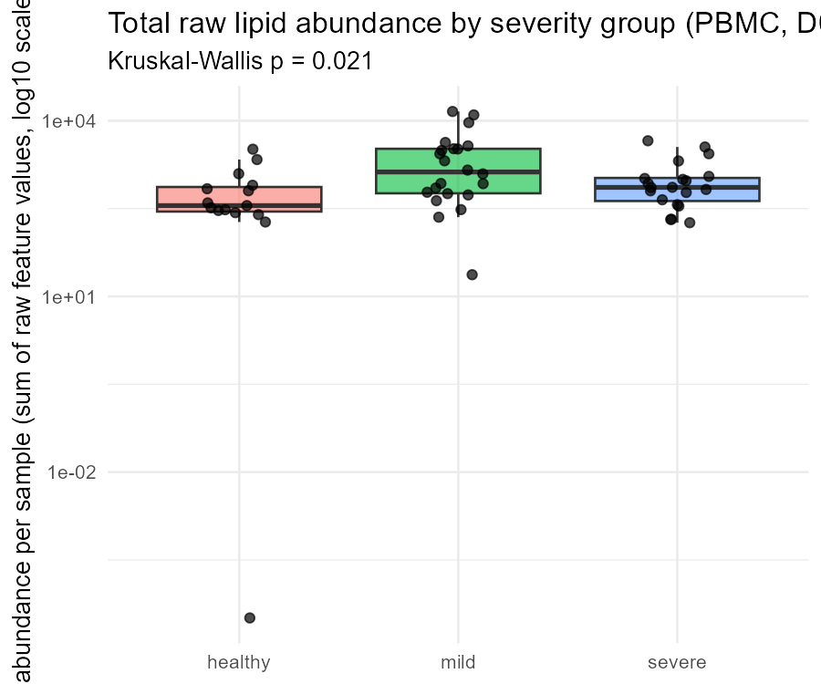
```

```{r total-abundance-summary-table}
kable(summary_tbl,
  caption = "Total raw lipid abundance per sample, by severity group",
  digits = 1
) %>%
  kable_styling(bootstrap_options = c("striped", "hover", "condensed"), full_width = FALSE, font_size = 12)
```

```{r total-abundance-tests}
kw <- read.delim("PBMC/Three_groups/D0/04.Total_abundance_check/kruskal_wallis_result.tsv")
pw <- read.delim("PBMC/Three_groups/D0/04.Total_abundance_check/pairwise_wilcoxon_results.tsv")

kable(kw, caption = "Kruskal-Wallis test, total abundance across healthy/mild/severe", digits = 4) %>%
  kable_styling(bootstrap_options = c("striped", "hover", "condensed"), full_width = FALSE, font_size = 12)

kable(pw, caption = "Pairwise Wilcoxon tests (BH-adjusted), total abundance", digits = 4) %>%
  kable_styling(bootstrap_options = c("striped", "hover", "condensed"), full_width = FALSE, font_size = 12)
```

**Results Interpretation:**

Total raw lipid abundance differs significantly across the three severity groups (Kruskal-Wallis p = 0.021). The pattern is **not a simple monotonic decline with severity**: median total abundance is highest in **mild** patients (535), roughly double **severe** (291) and nearly 4x **healthy** (142); severe sits between healthy and mild rather than below both. Pairwise (BH-adjusted) tests localize this to **mild vs healthy** (padj = 0.021, significant), while **severe vs healthy** and **severe vs mild** are both non-significant (padj = 0.135).

This means the species-level Percentage-normalized results above are indeed discarding a real, statistically significant total-abundance signal — but it takes the shape of a mild-specific elevation in total PBMC lipid content rather than the hypolipidemia gradient that plasma-based dengue severity studies typically report. Given this is cellular (PBMC) rather than plasma lipid content, and the cohort mismatch noted above, this result should be treated as a hypothesis-generating flag for a rerun on the full, consistent cohort rather than a confirmed biomarker.

---

# Post-Hoc Analysis 1: Healthy vs Mild

## Overview

This pairwise comparison focuses on lipid changes occurring in the early stages of dengue disease by comparing healthy controls (n=20) with mild dengue patients (n=11) at D0. Of 110 lipids tested, 17 are nominally significant (p<0.05), but **none survive FDR correction** — so any conclusions from this comparison should be treated as exploratory trends rather than confirmed biomarkers.

## Data Quality and Profiling

### Quality Assessment

```{r healthy-mild-quality}
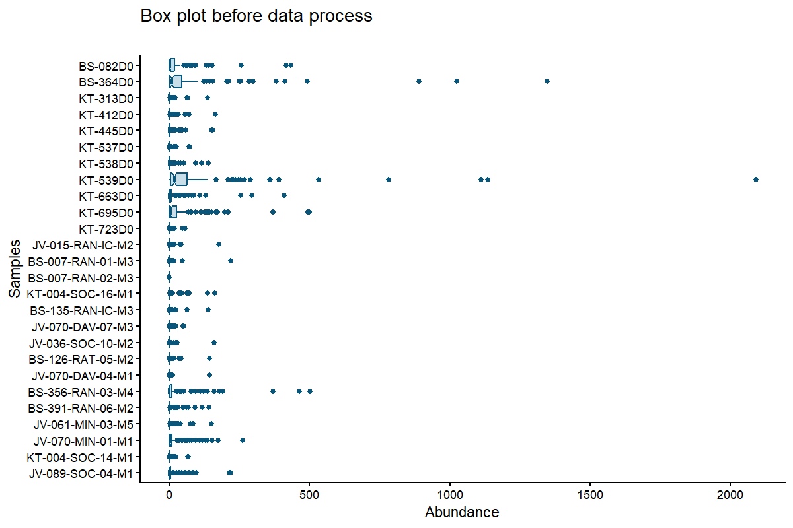
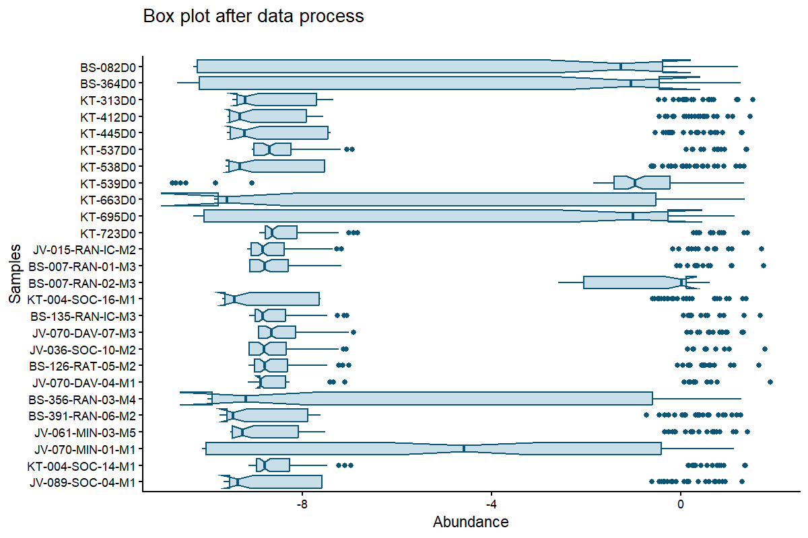
```

**Data Quality Assessment:**

As in the three-group analysis, normalization tightens most sample distributions into a consistent interquartile range (roughly -9 to -7 on the log10 scale) across the 31 samples (20 healthy + 11 mild). However, the same outlier samples reappear here: **BS-082D0, BS-364D0, KT-663D0, KT-695D0, BS-356-RAN-03-M4, BS-007-RAN-02-M3, and JV-070-MIN-01-M1** show much wider post-processing spread than the rest of the cohort, indicating residual sample-level heterogeneity that normalization did not fully remove.

### Dimensionality Reduction

#### PCA

```{r healthy-mild-pca}
pca_plot <- readRDS("PBMC/PostHoc_Healthy_vs_Mild/D0/01.Profiling/02.Dimensionality_reduction/PCA/PCA_plot_interactive.rds")
pca_plot
```

**PCA Results:** PC1 and PC2 explain 43.5% and 18.1% of variance, respectively. The mild-patient ellipse is small and compact, centered just right of the origin, while the healthy-control ellipse is much more elongated along the PC1-PC2 diagonal — driven by a few outlier healthy samples rather than a uniform group shift. The two ellipses overlap substantially near the origin, indicating that most mild and healthy samples are not well separated on the first two components.

```{r healthy-mild-scree}
scree_plot <- readRDS("PBMC/PostHoc_Healthy_vs_Mild/D0/01.Profiling/02.Dimensionality_reduction/PCA/Scree_plot_interactive.rds")
scree_plot
```

**Scree Plot:** Shows the proportion of variance explained by each principal component. The first few PCs typically capture the majority of disease-related variation, with later PCs representing technical or individual variation.

```{r healthy-mild-corr-circle}
variable_correlation_plot <- readRDS("PBMC/PostHoc_Healthy_vs_Mild/D0/01.Profiling/02.Dimensionality_reduction/PCA/Variable_correlation_interactive.rds")
variable_correlation_plot
```

**PCA Interpretation for Healthy vs Mild:**

The elongated healthy ellipse, rather than a tight one, suggests that PC1/PC2 in this comparison are picking up **within-healthy-group heterogeneity** as much as any healthy-vs-mild difference. This is consistent with the lack of any FDR-significant lipid between these two groups.

#### t-SNE

```{r healthy-mild-tsne}
tsne_plot <- readRDS("PBMC/PostHoc_Healthy_vs_Mild/D0/01.Profiling/02.Dimensionality_reduction/t-SNE/t-SNE_plot_interactive.rds")
tsne_plot
```

**t-SNE Interpretation:**

Healthy controls form a small, tight cluster in the upper-left of the plot, while mild patients spread broadly across the remaining space with a moderate overlap with the healthy ellipse. Mild samples show more spread than healthy samples in this projection — the opposite pattern from PCA — which is more indicative of general heterogeneity in the mild group than of a clean, separable disease signature.

#### UMAP

```{r healthy-mild-umap}
umap_plot <- readRDS("PBMC/PostHoc_Healthy_vs_Mild/D0/01.Profiling/02.Dimensionality_reduction/UMAP/UMAP_plot_interactive.rds")
umap_plot
```

**UMAP Interpretation:**

Healthy and mild ellipses partially overlap, with healthy samples concentrated in the lower half and mild samples in the upper half, but a clear band of overlap in the middle where both groups intermix. This partial, non-absolute separation is consistent across all three ordination methods (PCA, t-SNE, UMAP) and agrees with the absence of FDR-significant lipids between these two groups.

### Correlation Analysis

```{r healthy-mild-correlation}
heatmap_corr <- readRDS("PBMC/PostHoc_Healthy_vs_Mild/D0/01.Profiling/03.Correlation_Heatmap/by_samples/Correlation_heatmap_samples_interactive.rds")
heatmap_corr
```

**Correlation Heatmap:**

As in the three-group analysis, most samples correlate strongly with one another regardless of group, and the small set of samples flagged earlier as quality-control outliers (e.g. BS-007-RAN-02-M3) again stand out as poorly correlated with the rest. There is no clear block structure separating healthy from mild samples.

### Lipid Characteristics

```{r healthy-mild-characteristics}
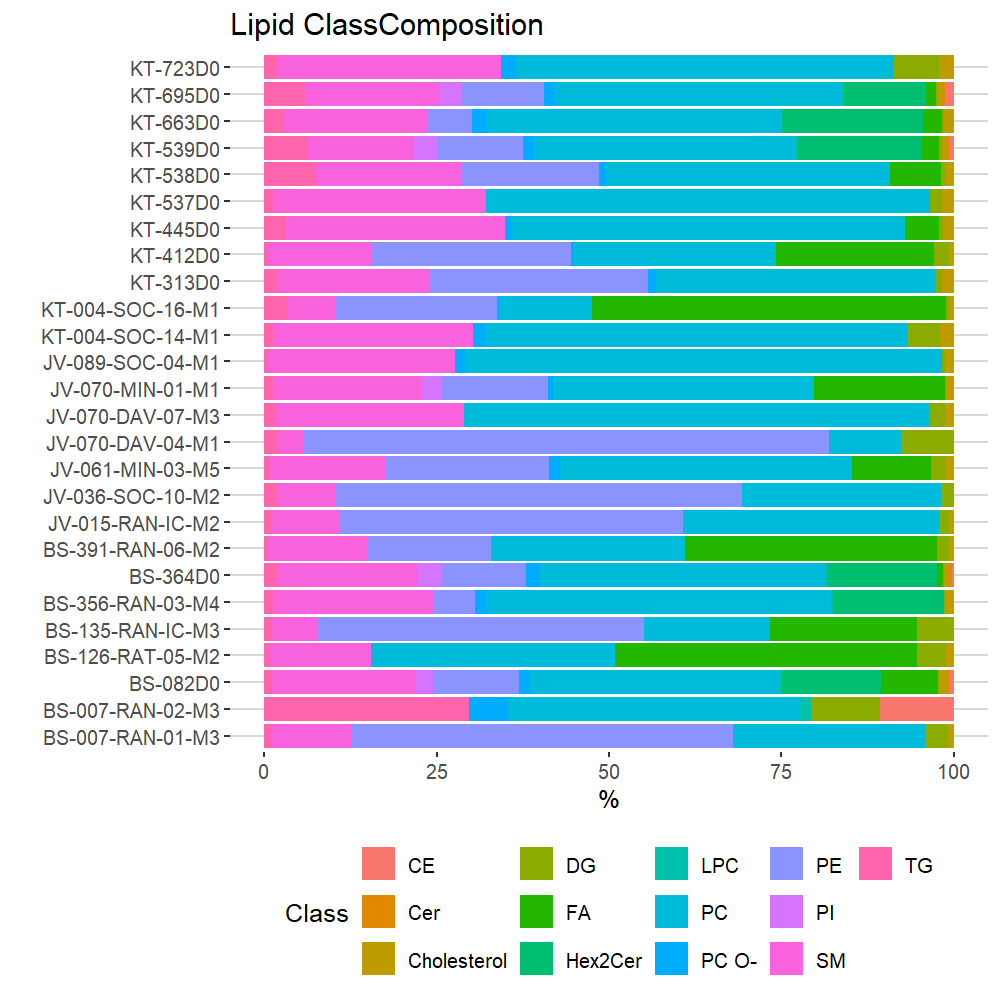
```

**Lipid Class Composition:**

As in the three-group chart, PE, PC, SM, and FA dominate the class composition for most samples, with LPC present only as a minor, thin band throughout. SM proportion varies considerably across individual samples (from very low to >30%), but this variability does not align cleanly with healthy-vs-mild status. No obvious, group-consistent shift in the LPC/PC ratio is visible in this chart.

## Differential Expression Analysis

### Summary Statistics

```{r healthy-mild-stats}
# Read t-test results
ttest_results <- read.delim("PBMC/PostHoc_Healthy_vs_Mild/D0/02.DiffExp/01.t-test_results/t-test_results.tsv")

# Filter significant results (FDR-corrected)
ttest_sig <- ttest_results[ttest_results$padj < 0.05 & !is.na(ttest_results$padj), ]

# Summary
# Note: ttest_results.tsv already contains only the lipids nominally significant
# at p < 0.05 (pre-filtered by the pipeline), not the full tested panel (~110 lipids).
cat("Lipids nominally significant (p < 0.05):", nrow(ttest_results), "\n")
cat("Of these, significant after FDR correction (padj < 0.05):", nrow(ttest_sig), "\n")
cat("Up-regulated in Mild (of nominal hits):", sum(ttest_results$log2FC > 0, na.rm = TRUE), "\n")
cat("Down-regulated in Mild (of nominal hits):", sum(ttest_results$log2FC < 0, na.rm = TRUE), "\n\n")

# Display table
kable(ttest_results,
      caption = "Nominally Significant Lipids: Healthy vs Mild (p < 0.05); none survive FDR correction",
      digits = 4) %>%
  kable_styling(bootstrap_options = c("striped", "hover", "condensed"),
                full_width = FALSE,
                font_size = 11) %>%
  scroll_box(width = "100%", height = "400px")
```

**Differential Expression Results - Healthy vs Mild:**

Of 110 lipids tested, 17 were nominally significant (p < 0.05); **none survive FDR correction**, so these should be read as exploratory trends. Ranked by nominal p-value, the strongest trends are:

**Triglycerides (TG), up in mild:**
- TG 54:3, 54:4, 56:5, 56:6, 56:7, 52:4 all nominally elevated with modest, comparable log2FC values (roughly +1 to +3)

**Other nominal hits:**
- SM 40:1;O2, SM 42:2;O2 — modestly elevated
- PC 32:1, PC O-32:0, PC 36:2, PC 38:4 — modestly elevated
- DG 38:4 — modestly elevated
- **FA 14:0** — the single largest fold-change in the dataset (log2FC ≈ -27), but this extreme value most likely reflects near-zero abundance in one or more samples rather than a biologically meaningful 27-fold change, and should be interpreted with caution

**Summary:** Unlike a scenario dominated by LPC elevation and PC depletion, the nominal trends here point to a broad, low-amplitude shift toward higher TG (and some PC/SM) species in mild dengue relative to healthy controls, none of which are statistically robust after multiple-testing correction. The volcano plot below shows 13 lipids trending up and 2 trending down among the nominal hits, against a background of ~93 lipids showing no meaningful difference.

### Visualization

#### Volcano Plot

```{r healthy-mild-volcano-interactive}
volcano_plot <- readRDS("PBMC/PostHoc_Healthy_vs_Mild/D0/02.DiffExp/02.Visualizations/Volcano/Volcano_plot_interactive.rds")
volcano_plot
```

#### MA Plot

```{r healthy-mild-ma-interactive}
ma_plot <- readRDS("PBMC/PostHoc_Healthy_vs_Mild/D0/02.DiffExp/02.Visualizations/MA_plot/MA_plot_interactive.rds")
ma_plot
```

#### PLS-DA Analysis

```{r healthy-mild-plsda, eval=FALSE}
# Not generated in the current pipeline run for this comparison (no PLS-DA output exists
# under PBMC/PostHoc_Healthy_vs_Mild/D0/02.DiffExp/02.Visualizations/PLS-DA/).
plsda_plot <- readRDS("PBMC/PostHoc_Healthy_vs_Mild/D0/02.DiffExp/02.Visualizations/PLS-DA/PLSDA_plot_interactive.rds")
plsda_plot
```

**PLS-DA (Partial Least Squares Discriminant Analysis) was not generated for the Healthy vs Mild comparison in the current pipeline run.**

```{r healthy-mild-plsda-loading, eval=FALSE}
loading_plot <- readRDS("PBMC/PostHoc_Healthy_vs_Mild/D0/02.DiffExp/02.Visualizations/PLS-DA/Loading_plot_interactive.rds")
loading_plot
```

#### Lollipop Chart

```{r healthy-mild-lollipop}
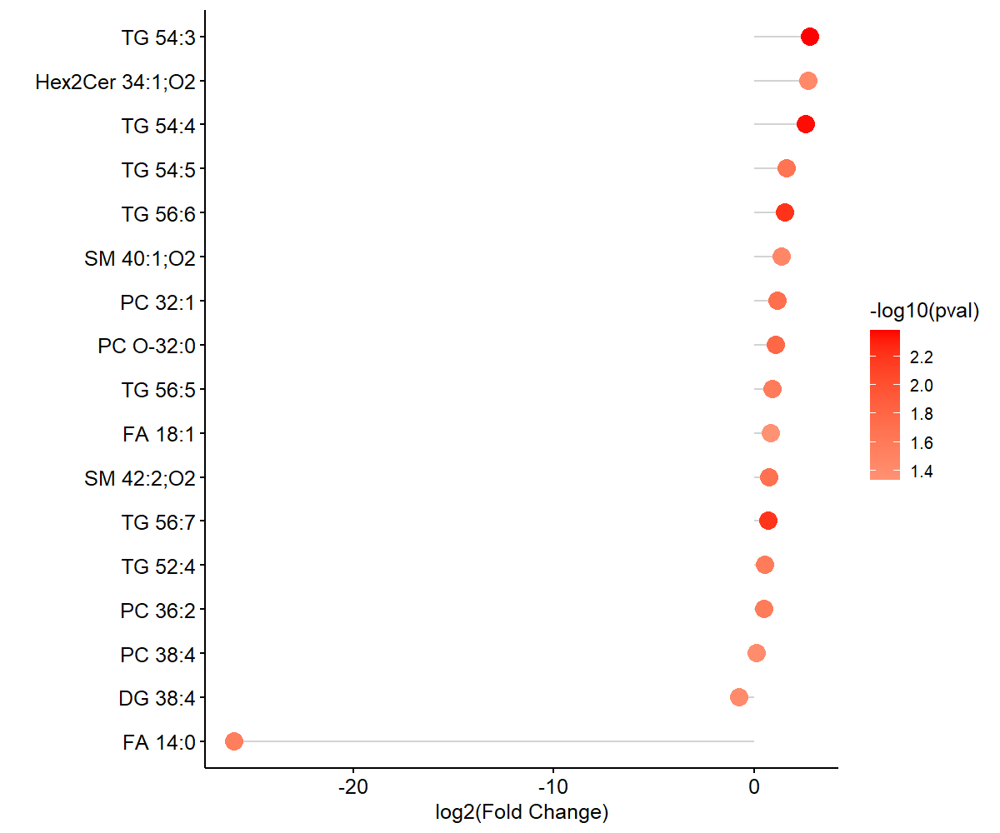
```

**Visualization Interpretation:**

**Volcano Plot:** The maximum -log10(pval) reached is only ~2.4 (p ≈ 0.004), well short of what would survive FDR correction across 110 tests. 13 lipids trend up (mostly TG species) and 2 trend down (including the extreme FA 14:0 outlier), against a large background of lipids (gray) showing no meaningful change.

**MA Plot:** Shows the relationship between mean abundance and fold-change; consistent with the volcano plot, no lipid stands out with both high abundance and large, robust fold-change.

**PLS-DA and Loading Plot:** The current pipeline run **did not generate PLS-DA output for this comparison** (no PLS-DA files exist for Healthy vs Mild) — see note below.

**Lollipop Chart:** Reiterates the ranked nominal hits from the summary table above (TG species at the top); none reach FDR significance.

### Differential Expression by Lipid Characteristics

```{r healthy-mild-dechar}
include_graphics("PBMC/PostHoc_Healthy_vs_Mild/D0/02.DiffExp/02.Visualizations/deChar_TotalC_barplot.png")
include_graphics("PBMC/PostHoc_Healthy_vs_Mild/D0/02.DiffExp/02.Visualizations/deChar_Category_barplot.png")
include_graphics("PBMC/PostHoc_Healthy_vs_Mild/D0/02.DiffExp/02.Visualizations/deChar_Class_barplot.png")
```

**All three deChar barplots (by total carbon number, by category, and by class) are blank in the current pipeline output** — there is no significant differential-characteristic signal to display, consistent with the absence of any FDR-significant lipid in this comparison.

### Individual Lipid Boxplots

```{r healthy-mild-boxplots, results='asis', fig.show='hold', out.width='50%'}
boxplot_files <- list.files("PBMC/PostHoc_Healthy_vs_Mild/D0/02.DiffExp/03.Individual_lipid_boxplots",
  pattern = "*.png", full.names = TRUE
)
if (length(boxplot_files) > 0) {
  n_plots <- min(10, length(boxplot_files))
  for (i in seq_len(n_plots)) {
    knitr::include_graphics(boxplot_files[i])
  }
}
```

**Individual Lipid Boxplot Patterns:**

No individual lipid boxplots were generated for the Healthy vs Mild comparison in the current pipeline run, consistent with 0 lipids reaching FDR significance (padj < 0.05).

## Enrichment Analysis

### LSEA

```{r healthy-mild-lsea}
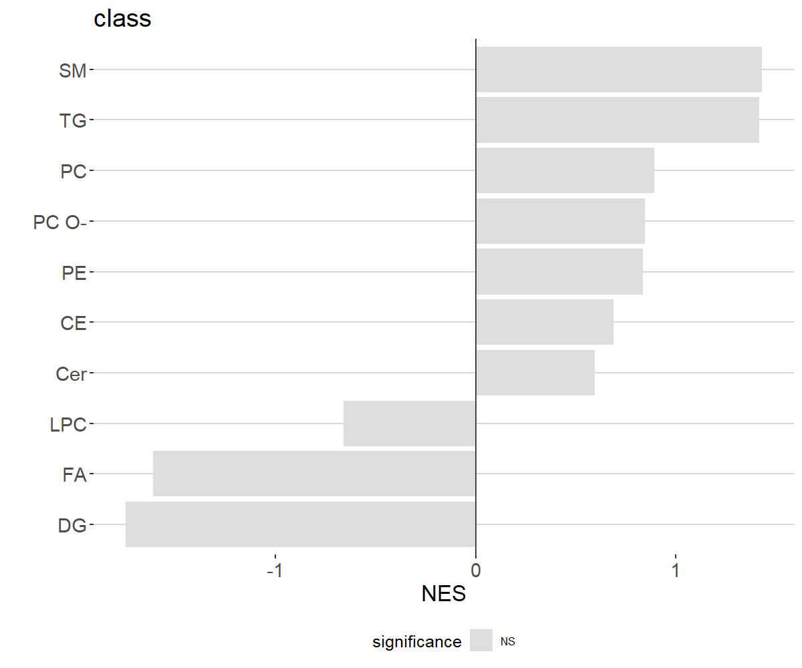
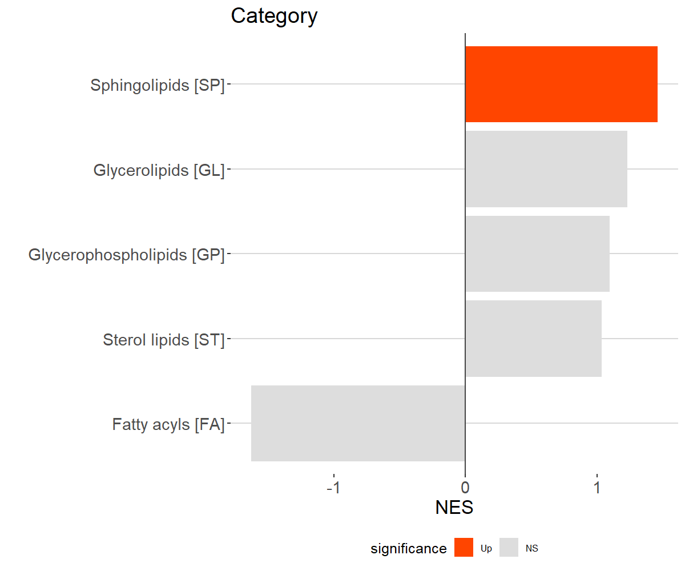
```

**LSEA evaluates whether predefined lipid sets are enriched at the top or bottom of a ranked lipid list, without applying a strict significance cutoff. This method is useful for detecting subtle but coordinated changes in lipid characteristics.**

**LSEA Results - Healthy vs Mild:**

**By Class:** None of the 10 classes tested reach significance. SM and TG show the strongest (non-significant) positive trend; PC, PC O-, PE, CE, and Cer show weaker positive trends; **LPC shows a negative trend** (opposite of what a PLA2-driven signature would predict), and FA/DG show the strongest negative trends.

**Interpretation:** LSEA finds no significant class-level enrichment for Healthy vs Mild. The direction of the (non-significant) trends — SM and TG up, LPC down — again argues against an LPC/PLA2-centered signature and instead points toward the same TG/SM-leaning pattern seen in the three-group ANOVA.

### ORA

```{r healthy-mild-ora}
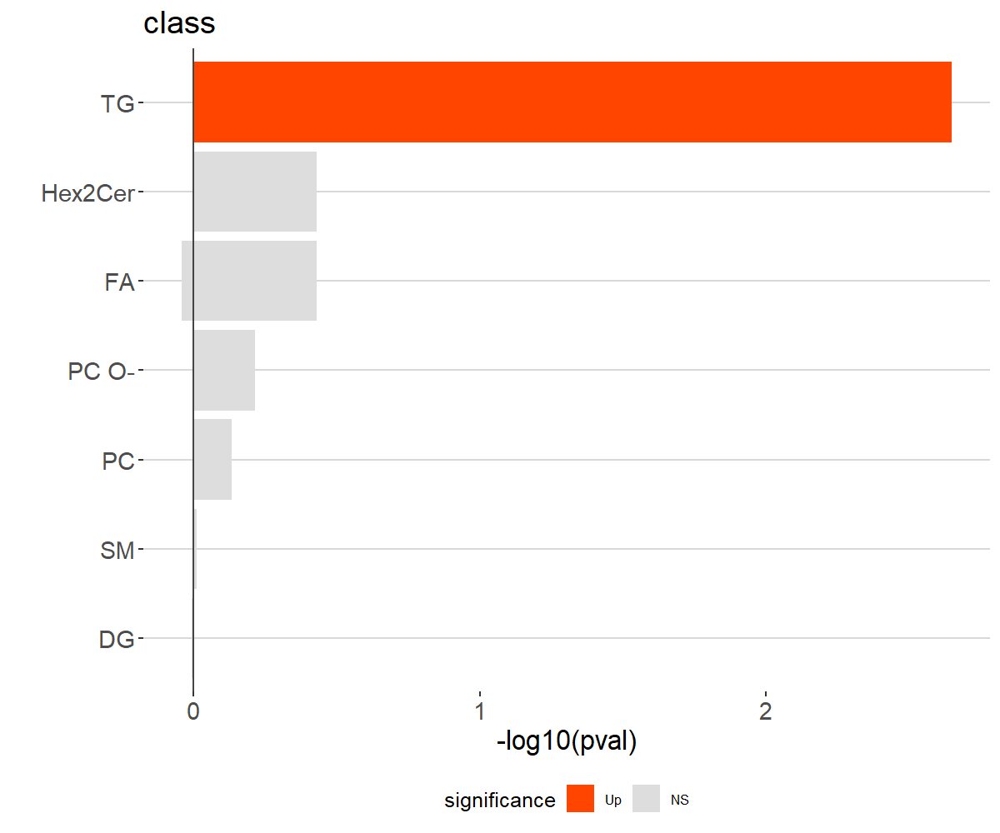
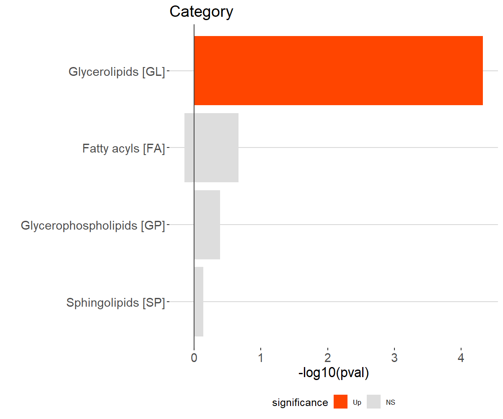
```

**ORA identifies lipid categories (e.g., classes or subclasses) that are overrepresented among significantly changed lipid species. It is suitable when you have a defined list of differentially expressed lipids.**

**ORA Results - Healthy vs Mild:**

**TG is the only class that reaches significance** in the ORA barplot (colored "Up", -log10(pval) well above the rest). Hex2Cer, FA, PC O-, PC, and SM show elevated but non-significant scores. This means that among the 17 nominally significant lipids, TG species are disproportionately represented relative to how many TG lipids exist in the full 110-lipid panel — the one class-level result in this comparison that clears a significance threshold, and it points toward triglyceride metabolism rather than LPC/PC remodeling.

---

# Post-Hoc Analysis 2: Healthy vs Severe

## Overview

This comparison examines lipid alterations in severe dengue patients (n=9) relative to healthy controls (n=20) at D0. Of the three pairwise comparisons in this report, this one shows the **weakest signal**: only 1 of 110 tested lipids (FA 18:1) is even nominally significant, and it does not survive FDR correction. This likely reflects, at least in part, the small severe-patient sample size (n=9), which limits statistical power.

## Data Quality and Profiling

### Quality Assessment

```{r healthy-severe-quality}
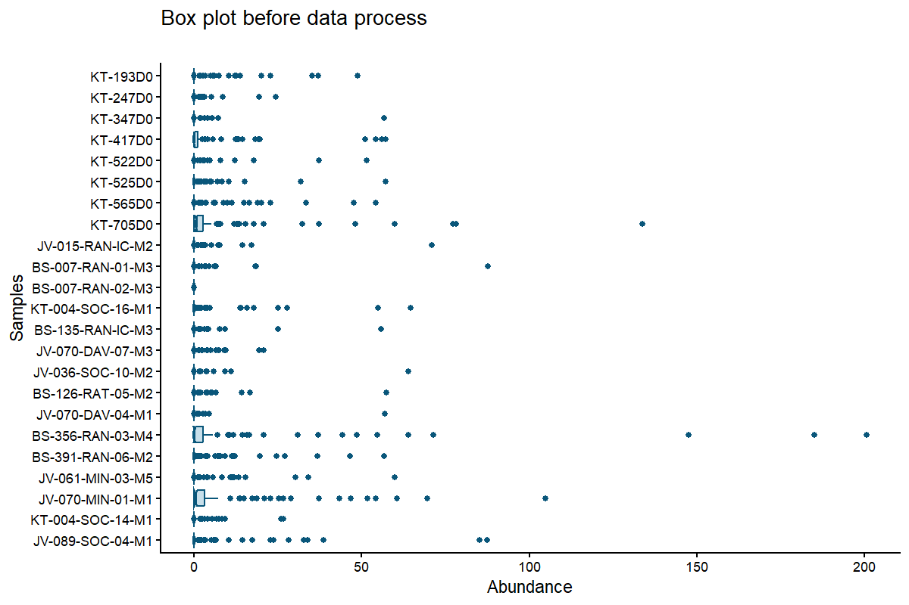
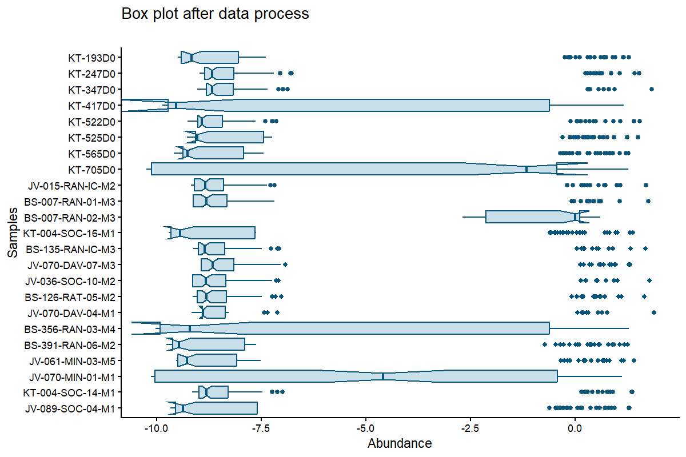
```

**Data Quality:** Normalization of the 29 samples (20 healthy + 9 severe) tightens most distributions to a consistent range, but the same outlier samples seen in the other comparisons — **KT-417D0, KT-705D0, BS-007-RAN-02-M3, BS-356-RAN-03-M4, and JV-070-MIN-01-M1** — again show much wider post-processing spread than the rest of the cohort.

### Dimensionality Reduction

#### PCA

```{r healthy-severe-pca}
pca_plot <- readRDS("PBMC/PostHoc_Healthy_vs_Severe/D0/01.Profiling/02.Dimensionality_reduction/PCA/PCA_plot_interactive.rds")
pca_plot
```

**PCA Analysis:** PC1 and PC2 explain 50% and 19.6% of variance, respectively. The healthy-control ellipse is a narrow vertical band near Dim1 = 0, while the severe-patient ellipse is a wide horizontal band that **almost entirely overlaps** the healthy ellipse — except for one severe sample that is a clear outlier at high Dim1 (~+33). This is the least-separated PCA of the three pairwise comparisons, consistent with Healthy vs Severe showing the weakest statistical signal.

```{r healthy-severe-scree}
scree_plot <- readRDS("PBMC/PostHoc_Healthy_vs_Severe/D0/01.Profiling/02.Dimensionality_reduction/PCA/Scree_plot_interactive.rds")
scree_plot
```

**Scree Plot:** Indicates variance explained by each principal component, with early PCs capturing disease-related variation.

```{r healthy-severe-corr-circle}
variable_correlation_plot <- readRDS("PBMC/PostHoc_Healthy_vs_Severe/D0/01.Profiling/02.Dimensionality_reduction/PCA/Variable_correlation_interactive.rds")
variable_correlation_plot
```

**Variable Correlation:** Shows which lipid species load most strongly on PC1/PC2 in this comparison; given the near-total overlap of the two groups in PCA space, these loadings should not be over-interpreted as severity biomarkers on their own.

#### t-SNE

```{r healthy-severe-tsne}
tsne_plot <- readRDS("PBMC/PostHoc_Healthy_vs_Severe/D0/01.Profiling/02.Dimensionality_reduction/t-SNE/t-SNE_plot_interactive.rds")
tsne_plot
```

**t-SNE:** As with PCA, expect substantial overlap between healthy and severe samples rather than clean separation, consistent with only 1 lipid reaching even nominal significance in this comparison.

#### UMAP

```{r healthy-severe-umap}
umap_plot <- readRDS("PBMC/PostHoc_Healthy_vs_Severe/D0/01.Profiling/02.Dimensionality_reduction/UMAP/UMAP_plot_interactive.rds")
umap_plot
```

**UMAP:** Healthy samples occupy mostly the lower half of the plot and severe samples the upper half, but with a wide overlap band in the middle where several samples from both groups intermix — partial, not clean, separation.

### Correlation Analysis

```{r healthy-severe-correlation}
heatmap_corr <- readRDS("PBMC/PostHoc_Healthy_vs_Severe/D0/01.Profiling/03.Correlation_Heatmap/by_samples/Correlation_heatmap_samples_interactive.rds")
heatmap_corr
```

**Correlation:** Most samples correlate strongly with each other regardless of group, with no clean healthy-vs-severe block structure. BS-007-RAN-02-M3 again stands out as the most poorly correlated sample, and JV-070-DAV-04-M1 shows a weak negative correlation with a subset of other samples.

### Lipid Characteristics

```{r healthy-severe-characteristics}
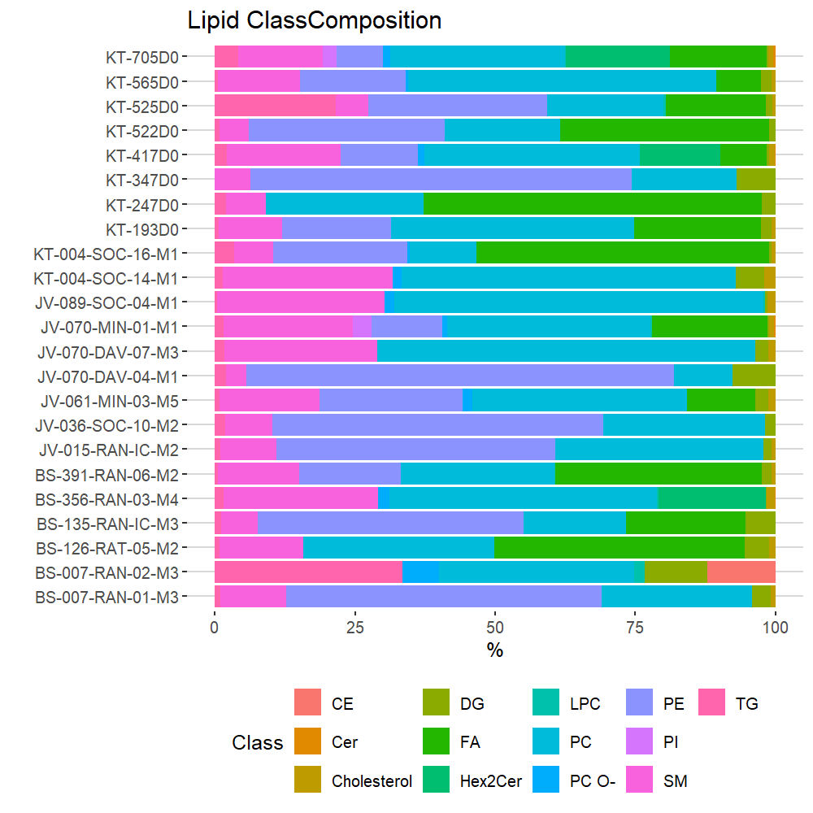
```

**Lipid Composition:** As in the other comparisons, PE, PC, SM, and FA dominate composition for most samples, LPC remains a minor component throughout, and SM proportion is the most variable class across individual samples without a clear healthy-vs-severe pattern.

## Differential Expression Analysis

### Summary Statistics

```{r healthy-severe-stats}
# Read t-test results
ttest_results <- read.delim("PBMC/PostHoc_Healthy_vs_Severe/D0/02.DiffExp/01.t-test_results/t-test_results.tsv")

# Filter significant results (FDR-corrected)
ttest_sig <- ttest_results[ttest_results$padj < 0.05 & !is.na(ttest_results$padj), ]

# Summary
# Note: ttest_results.tsv already contains only the lipid(s) nominally significant
# at p < 0.05 (pre-filtered by the pipeline), not the full tested panel (~110 lipids).
cat("Lipids nominally significant (p < 0.05):", nrow(ttest_results), "\n")
cat("Of these, significant after FDR correction (padj < 0.05):", nrow(ttest_sig), "\n")

# Display table
kable(ttest_results,
      caption = "Nominally Significant Lipid: Healthy vs Severe (p < 0.05); does not survive FDR correction",
      digits = 4) %>%
  kable_styling(bootstrap_options = c("striped", "hover", "condensed"),
                full_width = FALSE,
                font_size = 11) %>%
  scroll_box(width = "100%", height = "400px")
```

**Differential Expression Results - Healthy vs Severe:**

Of 110 lipids tested, only **one** — **FA 18:1** — is even nominally significant (p ≈ 0.012), showing a large apparent fold-change (log2FC ≈ 3.1, roughly 9-fold higher in severe patients) but a high FDR-adjusted p-value (padj ≈ 0.74) that does not survive correction.

**Interpretation:** This is the weakest result of the three pairwise comparisons — with a severe-patient group of only n=9, statistical power is limited, and this analysis simply does not detect a reproducible, group-wide lipid signature distinguishing severe dengue from healthy controls in this dataset. A single nominal hit (FA 18:1) is not sufficient to support claims about specific pathways (e.g., PLA2 activation, arachidonic acid metabolism) being altered in severe disease; larger severe-patient cohorts would be needed to test that possibility.

### Visualization

#### Volcano Plot

```{r healthy-severe-volcano-interactive}
volcano_plot <- readRDS("PBMC/PostHoc_Healthy_vs_Severe/D0/02.DiffExp/02.Visualizations/Volcano/Volcano_plot_interactive.rds")
volcano_plot
```

#### MA Plot

```{r healthy-severe-ma-interactive}
ma_plot <- readRDS("PBMC/PostHoc_Healthy_vs_Severe/D0/02.DiffExp/02.Visualizations/MA_plot/MA_plot_interactive.rds")
ma_plot
```

#### PLS-DA Analysis

```{r healthy-severe-plsda, eval=FALSE}
# Not generated in the current pipeline run for this comparison (no PLS-DA output exists
# under PBMC/PostHoc_Healthy_vs_Severe/D0/02.DiffExp/02.Visualizations/PLS-DA/).
plsda_plot <- readRDS("PBMC/PostHoc_Healthy_vs_Severe/D0/02.DiffExp/02.Visualizations/PLS-DA/PLSDA_plot_interactive.rds")
plsda_plot
```

**PLS-DA (Partial Least Squares Discriminant Analysis) was not generated for the Healthy vs Severe comparison in the current pipeline run.**

```{r healthy-severe-plsda-loading, eval=FALSE}
loading_plot <- readRDS("PBMC/PostHoc_Healthy_vs_Severe/D0/02.DiffExp/02.Visualizations/PLS-DA/Loading_plot_interactive.rds")
loading_plot
```

#### Lollipop Chart

```{r healthy-severe-lollipop}
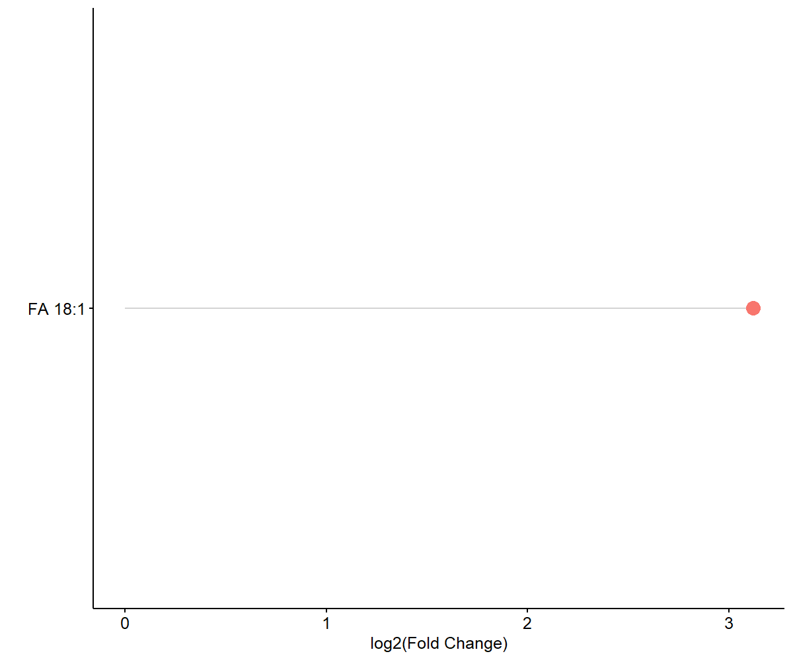
```

**Visualization Interpretation:**
- **Volcano & MA Plots:** With only 1 nominal hit, these plots show a single colored point (FA 18:1) against a background of ~109 non-significant lipids
- **PLS-DA:** Not generated for this comparison
- **Lollipop Chart:** Shows only the single nominal hit, FA 18:1 — there is no ranked list of biomarkers to report here

### Differential Expression by Lipid Characteristics

```{r healthy-severe-dechar}
include_graphics("PBMC/PostHoc_Healthy_vs_Severe/D0/02.DiffExp/02.Visualizations/deChar_TotalC_barplot.png")
include_graphics("PBMC/PostHoc_Healthy_vs_Severe/D0/02.DiffExp/02.Visualizations/deChar_Category_barplot.png")
include_graphics("PBMC/PostHoc_Healthy_vs_Severe/D0/02.DiffExp/02.Visualizations/deChar_Class_barplot.png")
```

**All three deChar barplots are blank in the current pipeline output** — with only a single nominally significant lipid, there is no meaningful characteristic-level signal to display.

### Individual Lipid Boxplots

```{r healthy-severe-boxplots, results='asis', fig.show='hold', out.width='50%'}
# List top 10 significant lipids
boxplot_files <- list.files("PBMC/PostHoc_Healthy_vs_Severe/D0/02.DiffExp/03.Individual_lipid_boxplots",
  pattern = "*.png", full.names = TRUE
)
# Display first 10 boxplots
if (length(boxplot_files) > 0) {
  n_plots <- min(10, length(boxplot_files))
  for (i in seq_len(n_plots)) {
    knitr::include_graphics(boxplot_files[i])
  }
}
```

**Individual Lipid Profiles:** No individual lipid boxplots were generated for the Healthy vs Severe comparison in the current pipeline run, consistent with 0 lipids reaching FDR significance.

## Enrichment Analysis

### LSEA

```{r healthy-severe-lsea}
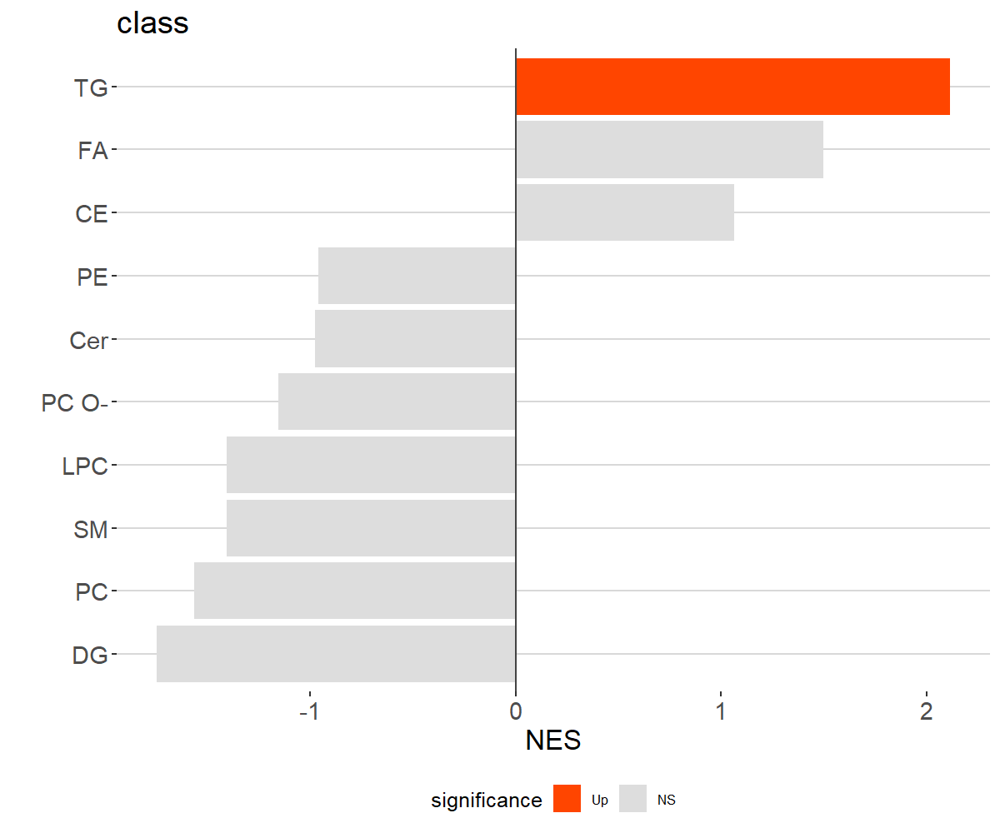
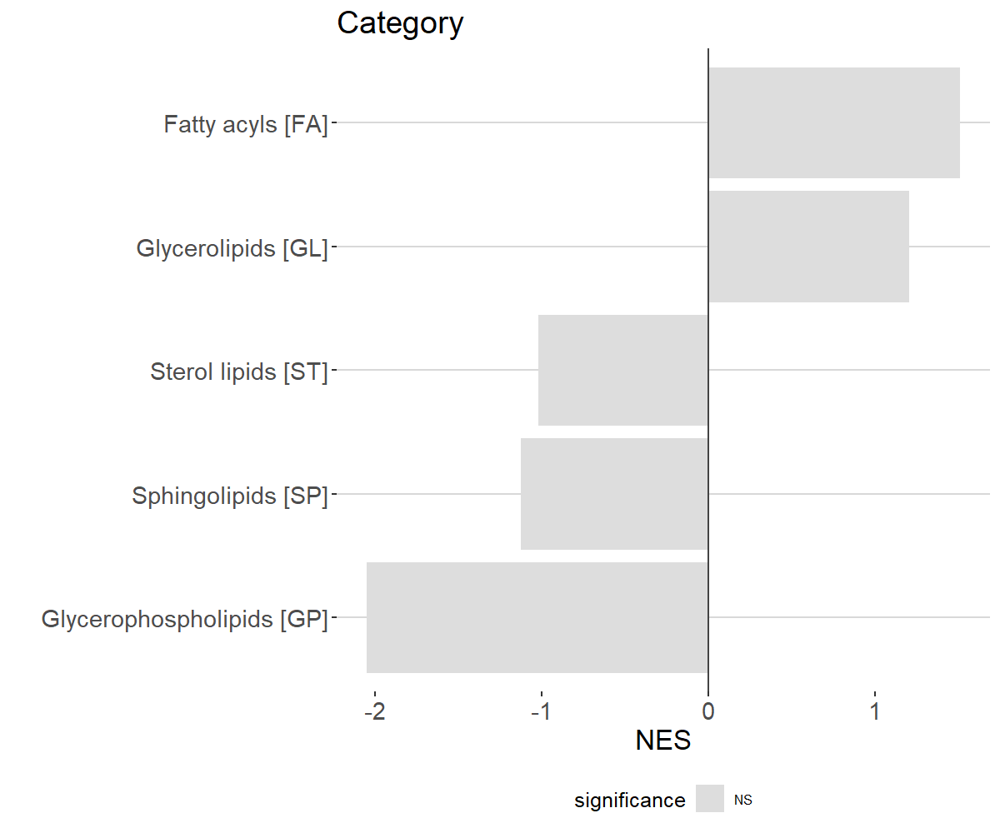
```

**LSEA evaluates whether predefined lipid sets are enriched at the top or bottom of a ranked lipid list, without applying a strict significance cutoff. This method is useful for detecting subtle but coordinated changes in lipid characteristics.**

**LSEA Results:** With only a single nominally significant lipid to rank against, LSEA finds no significant class- or category-level enrichment for Healthy vs Severe — consistent with the overall weak signal in this comparison.

### ORA

```{r healthy-severe-ora}

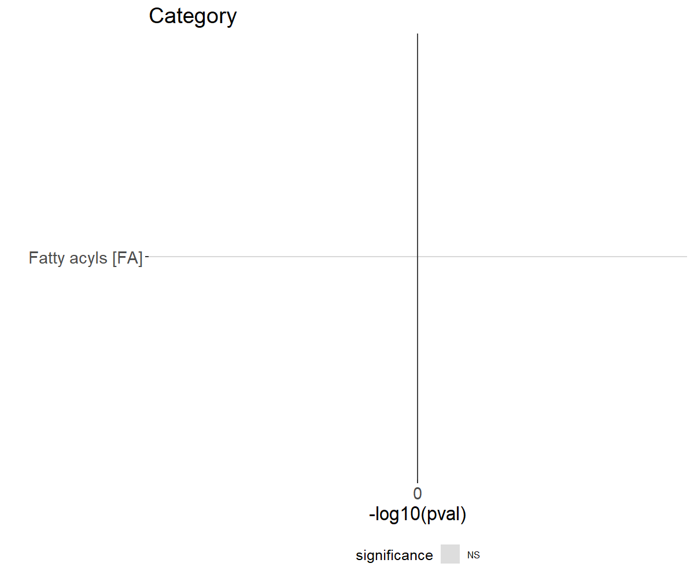
```

**ORA identifies lipid categories (e.g., classes or subclasses) that are overrepresented among significantly changed lipid species. It is suitable when you have a defined list of differentially expressed lipids.**

**ORA Results:** No class or category reaches significance — the ORA barplot for this comparison is blank, since a single differentially-expressed lipid (FA 18:1) is not enough to test for over-representation of any class.

---

# Post-Hoc Analysis 3: Mild vs Severe

## Overview

This comparison directly contrasts mild (n=11) and severe (n=9) dengue patients at D0, both groups being infected with dengue virus, and focuses on severity-related lipid changes rather than infection-vs-healthy differences. Of the three pairwise comparisons in this report, **this is the only one that yields an FDR-significant lipid**: SM 34:1;O2 is significantly lower in severe than in mild disease (padj = 0.047). 9 of 110 lipids are nominally significant overall, and this comparison also shows the clearest group separation by supervised PLS-DA of the three comparisons.

**Note:** the quality-control, correlation-heatmap, and lipid-composition plots under the Profiling subsection below list healthy-control sample IDs (KT-*) rather than mild/severe patient IDs — this appears to be a labeling artifact in the pipeline's profiling step for this comparison. The differential expression results (t-test, PLS-DA, volcano) described further down do use the correct mild-vs-severe sample groups.

## Data Quality and Profiling

### Quality Assessment

```{r mild-severe-quality}
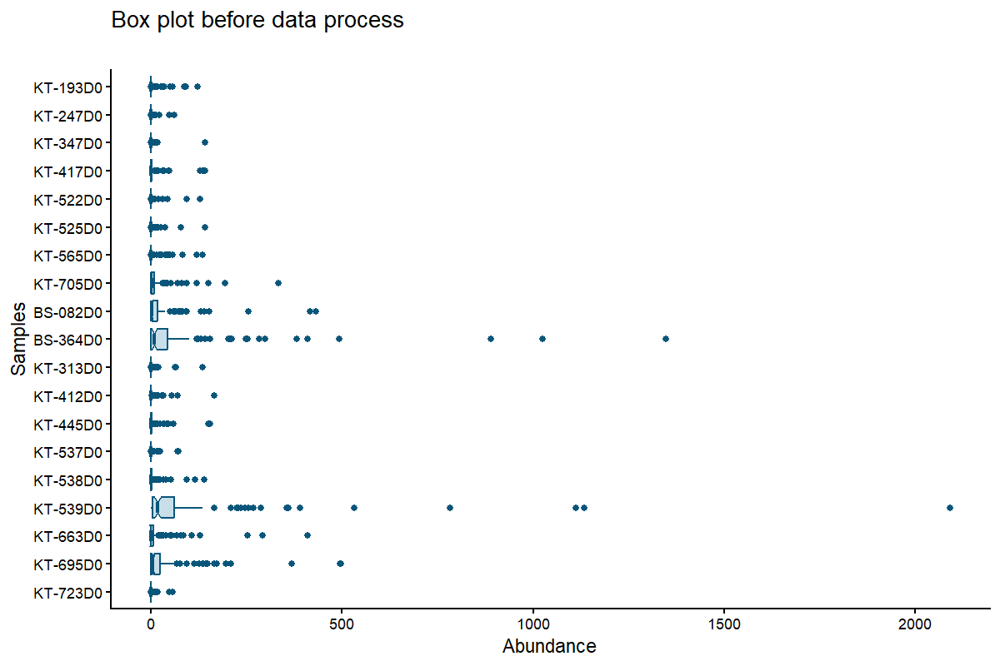
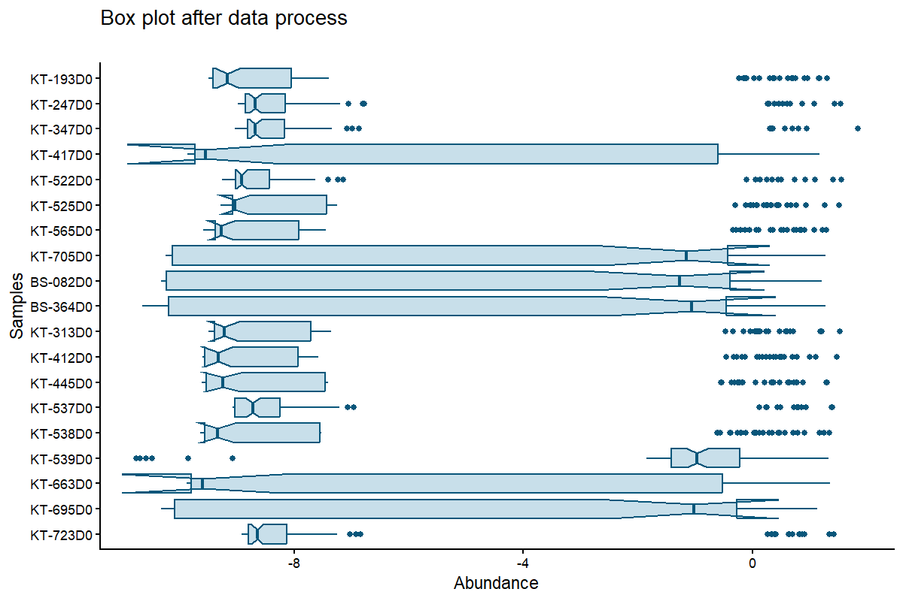
```

**Data Quality:** As noted above, the sample IDs shown in this plot are healthy-control IDs (KT-*), not the mild/severe patient IDs expected for this comparison — likely a pipeline labeling artifact for the Profiling step. The general pattern (most samples tightening to a consistent range after normalization, with a handful of wide-spread outliers) is consistent with what is seen throughout this report, but sample-level conclusions from this specific plot should not be drawn for the mild-vs-severe grouping.

### Dimensionality Reduction

#### PCA

```{r mild-severe-pca}
pca_plot <- readRDS("PBMC/PostHoc_Mild_vs_Severe/D0/01.Profiling/02.Dimensionality_reduction/PCA/PCA_plot_interactive.rds")
pca_plot
```

**PCA for Severity Discrimination:** PC1 and PC2 explain 40.1% and 18% of variance. The mild and severe ellipses overlap substantially along a shared diagonal axis, with one mild sample as a clear outlier at high PC1/PC2. As with the other comparisons, PCA alone does not cleanly separate the two groups — the clearer separation for this comparison comes from the supervised PLS-DA shown later in this section.

```{r mild-severe-scree}
scree_plot <- readRDS("PBMC/PostHoc_Mild_vs_Severe/D0/01.Profiling/02.Dimensionality_reduction/PCA/Scree_plot_interactive.rds")
scree_plot
```

**Scree Plot:** Variance explained by PCs capturing severity-related metabolic differences.

```{r mild-severe-corr-circle}
variable_correlation_plot <- readRDS("PBMC/PostHoc_Mild_vs_Severe/D0/01.Profiling/02.Dimensionality_reduction/PCA/Variable_correlation_interactive.rds")
variable_correlation_plot
```

**Variable Correlation:** Shows lipid loadings on PC1/PC2 for this comparison; given the overlapping PCA ellipses, these are best treated as descriptive rather than confirmed severity markers on their own.

#### t-SNE

```{r mild-severe-tsne}
tsne_plot <- readRDS("PBMC/PostHoc_Mild_vs_Severe/D0/01.Profiling/02.Dimensionality_reduction/t-SNE/t-SNE_plot_interactive.rds")
tsne_plot
```

**t-SNE:** As with PCA, expect partial overlap between mild and severe samples in this unsupervised, non-linear projection.

#### UMAP

```{r mild-severe-umap}
umap_plot <- readRDS("PBMC/PostHoc_Mild_vs_Severe/D0/01.Profiling/02.Dimensionality_reduction/UMAP/UMAP_plot_interactive.rds")
umap_plot
```

**UMAP:** Provides another unsupervised view; as with PCA and t-SNE, expect partial rather than absolute separation. The clean separation between mild and severe seen later in this section comes specifically from the supervised PLS-DA method, which is trained to maximize group separation — an important distinction from the unsupervised methods shown here.

### Correlation Analysis

```{r mild-severe-correlation}
heatmap_corr <- readRDS("PBMC/PostHoc_Mild_vs_Severe/D0/01.Profiling/03.Correlation_Heatmap/by_samples/Correlation_heatmap_samples_interactive.rds")
heatmap_corr
```

**Correlation:** As noted above, this plot's sample labels are healthy-control IDs rather than mild/severe patient IDs (likely the same Profiling-step labeling artifact), so group-specific conclusions should not be drawn from it for this comparison.

### Lipid Characteristics

```{r mild-severe-characteristics}
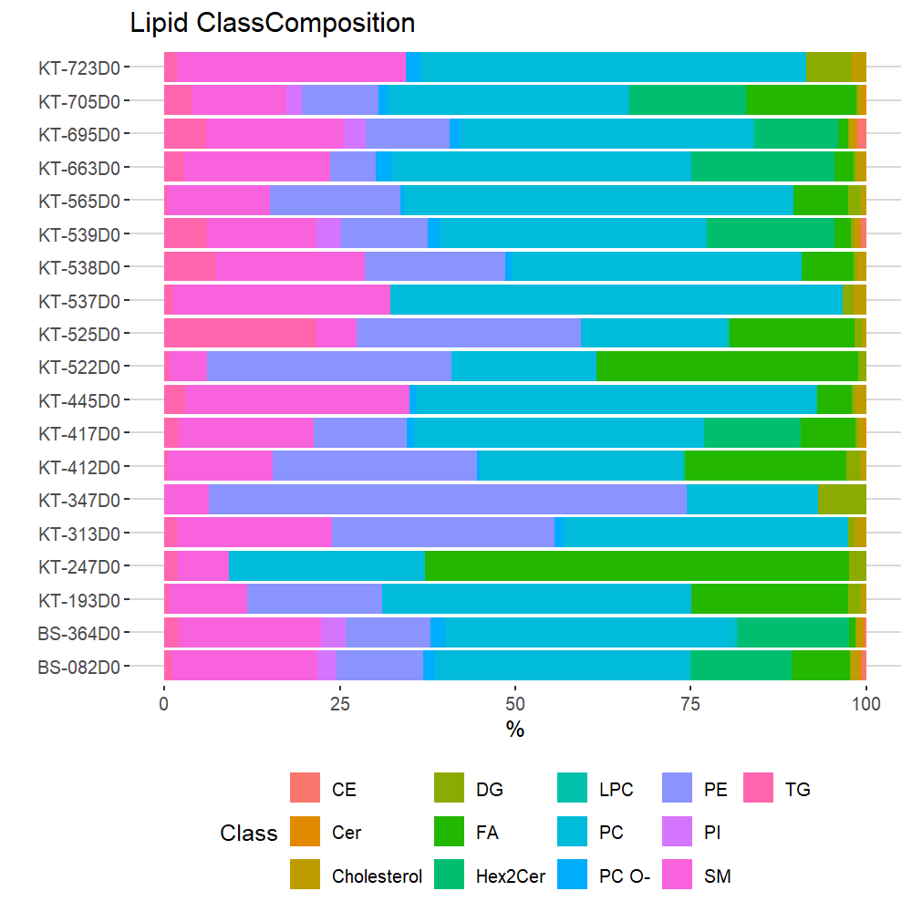
```

**Lipid Composition by Severity:** As above, this chart's sample labels are healthy-control IDs, so it cannot be used to compare mild vs severe composition directly; see the differential expression results below for the validated mild-vs-severe signal (SM 34:1;O2).

## Differential Expression Analysis

### Summary Statistics

```{r mild-severe-stats}
# Read t-test results
ttest_results <- read.delim("PBMC/PostHoc_Mild_vs_Severe/D0/02.DiffExp/01.t-test_results/t-test_results.tsv")

# Filter significant results (FDR-corrected)
ttest_sig <- ttest_results[ttest_results$padj < 0.05 & !is.na(ttest_results$padj), ]

# Summary
# Note: ttest_results.tsv already contains only the lipids nominally significant
# at p < 0.05 (pre-filtered by the pipeline), not the full tested panel (~110 lipids).
cat("Lipids nominally significant (p < 0.05):", nrow(ttest_results), "\n")
cat("Of these, significant after FDR correction (padj < 0.05):", nrow(ttest_sig), "\n")
cat("Up-regulated in Severe (of nominal hits):", sum(ttest_results$log2FC > 0, na.rm = TRUE), "\n")
cat("Down-regulated in Severe (of nominal hits):", sum(ttest_results$log2FC < 0, na.rm = TRUE), "\n\n")

# Display table (FDR-significant result highlighted by sig_padj column)
kable(ttest_results,
      caption = "Nominally Significant Lipids: Mild vs Severe (p < 0.05); SM 34:1;O2 is the only one to survive FDR correction",
      digits = 4) %>%
  kable_styling(bootstrap_options = c("striped", "hover", "condensed"),
                full_width = FALSE,
                font_size = 11) %>%
  scroll_box(width = "100%", height = "400px")
```

**Differential Expression Results - Mild vs Severe:**

Of 110 lipids tested, 9 are nominally significant (p < 0.05). **One, SM 34:1;O2, survives FDR correction** (padj = 0.047) — the only FDR-significant result in this entire report — and is **lower in severe than in mild disease** (mean ≈ 8.8 vs. 16.7 on the pipeline's abundance scale; individual boxplot below).

**Other nominal (non-FDR-significant) hits, ranked by p-value:**
- SM 42:2;O2, PC 38:4, PC O-32:0, PC 36:1, Cholesterol — all lower in severe than mild
- FA 18:0 — higher in severe than mild (largest positive fold-change)
- SM 40:1;O2 — lower in severe (largest negative fold-change)
- PC 36:2 — lower in severe (weakest of the nominal hits)

**Interpretation:** Three of the 9 nominal hits are sphingomyelin (SM) species, all decreasing with severity, and several PC species plus cholesterol also trend down in severe disease. This is a more coherent, single-direction pattern than seen in the other two comparisons, and — together with SM 34:1;O2 being the only lipid to survive FDR correction anywhere in this study — makes SM 34:1;O2 the most credible severity-associated candidate marker in this dataset, though it is based on a single comparison with modest sample sizes (n=11 mild, n=9 severe) and should be validated in an independent cohort before further interpretation.

### Visualization

#### Volcano Plot

```{r mild-severe-volcano-interactive}
volcano_plot <- readRDS("PBMC/PostHoc_Mild_vs_Severe/D0/02.DiffExp/02.Visualizations/Volcano/Volcano_plot_interactive.rds")
volcano_plot
```

#### MA Plot

```{r mild-severe-ma-interactive}
ma_plot <- readRDS("PBMC/PostHoc_Mild_vs_Severe/D0/02.DiffExp/02.Visualizations/MA_plot/MA_plot_interactive.rds")
ma_plot
```

#### PLS-DA Analysis

```{r mild-severe-plsda}
plsda_plot <- readRDS("PBMC/PostHoc_Mild_vs_Severe/D0/02.DiffExp/02.Visualizations/PLS-DA/PLSDA_plot_interactive.rds")
plsda_plot
```

**PLS-DA (Partial Least Squares Discriminant Analysis) is a supervised dimensionality reduction method that maximizes the separation between groups. It identifies the main sources of variation that distinguish between conditions.**

```{r mild-severe-plsda-loading}
loading_plot <- readRDS("PBMC/PostHoc_Mild_vs_Severe/D0/02.DiffExp/02.Visualizations/PLS-DA/Loading_plot_interactive.rds")
loading_plot
```

**The loading plot shows which lipid species contribute most to the separation between groups in the PLS-DA space.**

#### Lollipop Chart

```{r mild-severe-lollipop}
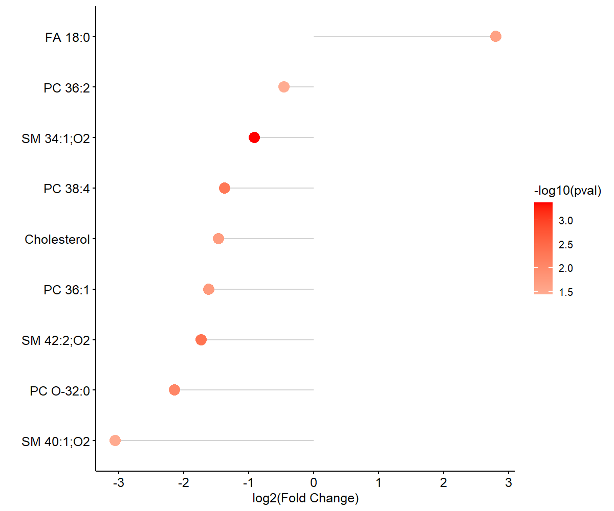
```

**Visualization Interpretation:**

**Volcano Plot:** Shows the 9 nominal hits (mostly down in severe) against the ~101 non-significant lipids; SM 34:1;O2 sits at the highest -log10(pval).

**PLS-DA:** This supervised method shows the **cleanest group separation of the three pairwise comparisons**: mild patients (ctrl) form a tight cluster, while severe patients (exp) are more spread out but mostly fall outside the mild cluster's core, with only one or two severe samples overlapping it. This is expected of a supervised method (which is trained to maximize group separation) and should be read as a description of how separable the groups are given the lipid panel, not as independent confirmation beyond the univariate SM 34:1;O2 result above.

**Loading Plot:** Identifies which lipids contribute most to the PLS-DA axis; SM 34:1;O2 and the other nominal t-test hits are expected to carry high loadings, consistent with the univariate results.

**Lollipop Chart:** Ranks the 9 nominal hits from the summary table above, with SM 34:1;O2 as the most significant.

### Differential Expression by Lipid Characteristics

```{r mild-severe-dechar}

include_graphics("PBMC/PostHoc_Mild_vs_Severe/D0/02.DiffExp/02.Visualizations/deChar_Category_barplot.png")
include_graphics("PBMC/PostHoc_Mild_vs_Severe/D0/02.DiffExp/02.Visualizations/deChar_Class_barplot.png")
```

**All three deChar barplots are blank in the current pipeline output** — even with 9 nominal hits and one FDR-significant lipid, there is not enough of a class/category/carbon-length signal to produce a plottable result.

### Individual Lipid Boxplots

```{r mild-severe-boxplots, results='asis', fig.show='hold', out.width='50%'}
# List top 10 significant lipids
boxplot_files <- list.files("PBMC/PostHoc_Mild_vs_Severe/D0/02.DiffExp/03.Individual_lipid_boxplots",
  pattern = "*.png", full.names = TRUE
)
# Display first 10 boxplots
if (length(boxplot_files) > 0) {
  n_plots <- min(10, length(boxplot_files))
  for (i in seq_len(n_plots)) {
    knitr::include_graphics(boxplot_files[i])
  }
}
```

**Individual Severity Biomarkers:** A single individual lipid boxplot was generated for this comparison — **SM 34:1;O2**, the sole FDR-significant lipid (padj = 0.047). The boxplot shows mild-patient values mostly between ~10-25 (log10 abundance scale) with a median around 16, versus severe-patient values mostly between ~5-15 with a median around 8 — a visually clear downward shift with severity, though with some overlap between the two groups (the lowest mild values and highest severe values are close). No other individual boxplots were generated, since no other lipid in this study reached FDR significance.

## Enrichment Analysis

### LSEA

```{r mild-severe-lsea}
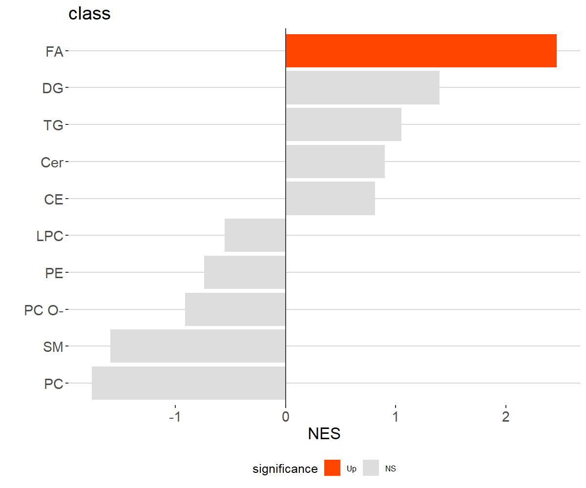
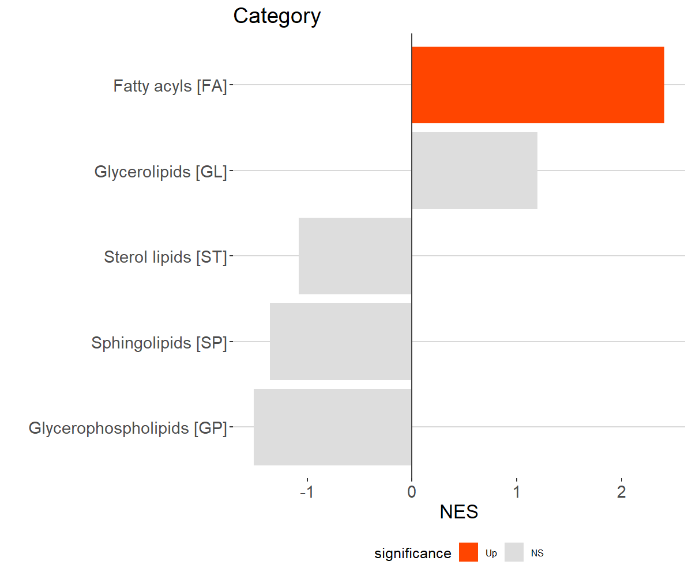
```

**LSEA evaluates whether predefined lipid sets are enriched at the top or bottom of a ranked lipid list, without applying a strict significance cutoff. This method is useful for detecting subtle but coordinated changes in lipid characteristics.**

**LSEA Results:** **FA is the only class that reaches significance** (NES ≈ 1.3, colored "Up"), indicating a coordinated, ranked-list-level shift in fatty acid species with severity. All other classes (DG, Cer, CE, LPC, PE, TG, PC O-, PC, SM) are non-significant; SM shows the strongest negative (non-significant) trend, consistent with the SM-species-down pattern seen in the individual t-test hits above.

### ORA

```{r mild-severe-ora}
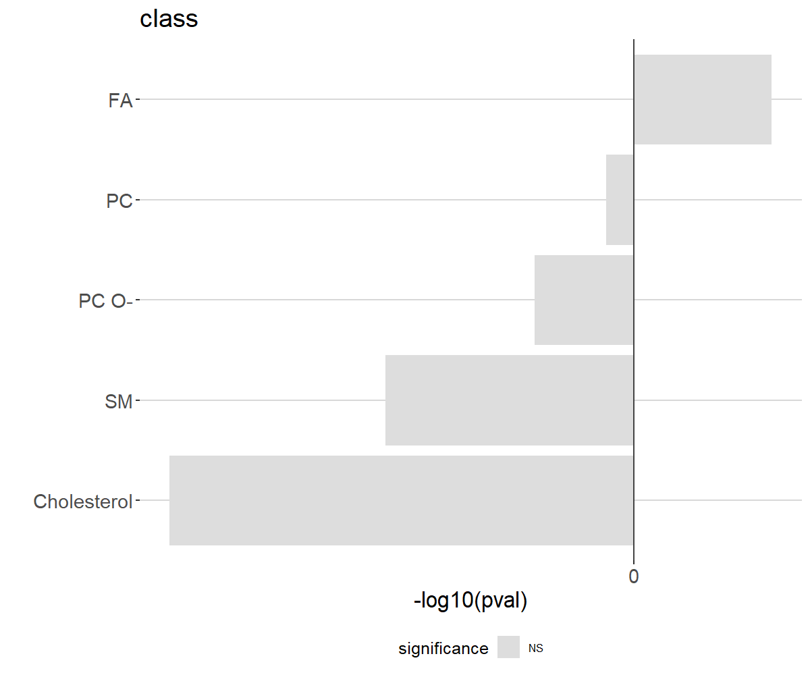
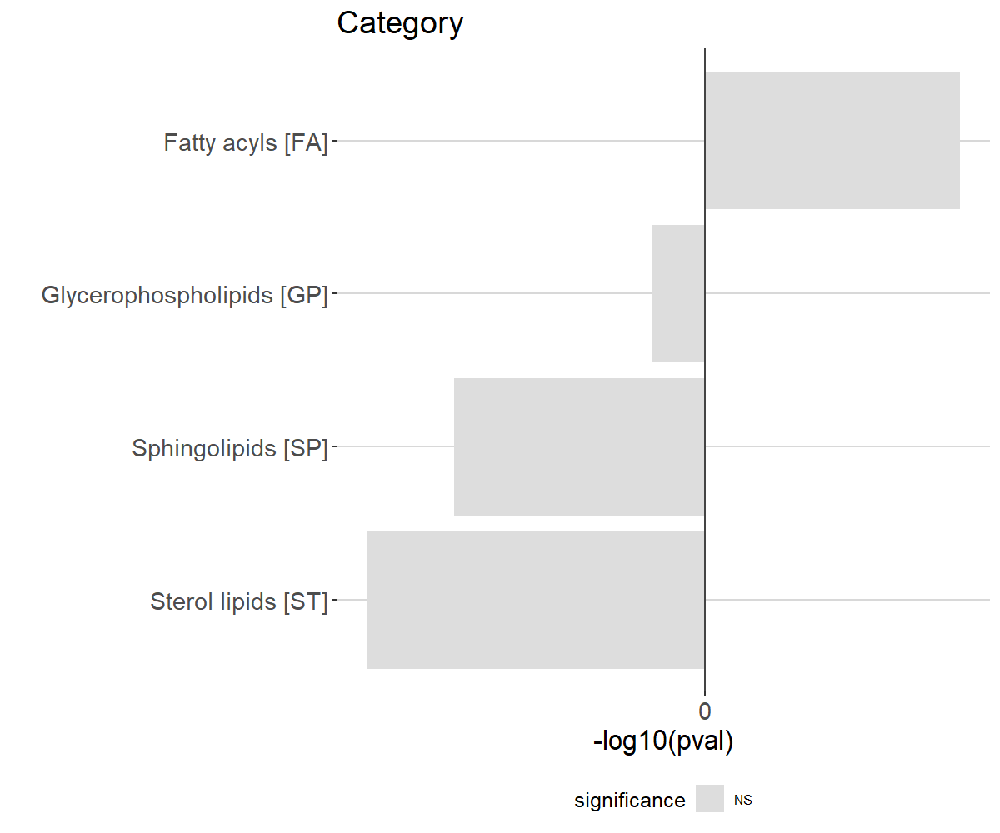
```

**ORA identifies lipid categories (e.g., classes or subclasses) that are overrepresented among significantly changed lipid species. It is suitable when you have a defined list of differentially expressed lipids.**

**ORA Results:** No class reaches significance in the ORA barplot (all gray/"NS"), despite 3 of the 9 nominal hits being SM species — with only 9 total hits, this is not enough to reach a formal over-representation threshold for any single class. FA shows the highest (non-significant) score, followed by PC, PC O-, SM, and Cholesterol.

---

# Cross-Comparison Summary

## Overview

This section integrates findings from all four analyses (three-group ANOVA and three pairwise comparisons). Across all of them, the consistent picture is one of **limited statistical power and modest effect sizes** rather than a dominant, universal lipid signature:

| Comparison | n | Lipids tested | Nominal hits (p<0.05) | FDR-significant (padj<0.05) |
|---|---|---|---|---|
| Healthy vs Mild vs Severe (ANOVA) | 40 | 110 | 11 | 0 |
| Healthy vs Mild | 31 | 110 | 17 | 0 |
| Healthy vs Severe | 29 | 110 | 1 | 0 |
| Mild vs Severe | 20 | 110 | 9 | **1 (SM 34:1;O2)** |

The only comparison to survive multiple-testing correction anywhere in this study is Mild vs Severe, with a single lipid (SM 34:1;O2, lower in severe disease). The Healthy vs Severe comparison — despite comparing the most clinically distinct groups — has the weakest signal, most likely reflecting its small sample size (n=9 severe patients).

## Venn Diagram of Significant Lipids

```{r venn-diagram, eval=FALSE}
# Code to create Venn diagram comparing significant lipids across comparisons
# library(VennDiagram)
#
# healthy_mild <- read.delim("PBMC/PostHoc_Healthy_vs_Mild/D0/02.DiffExp/01.t-test_results/t-test_results.tsv")
# healthy_severe <- read.delim("PBMC/PostHoc_Healthy_vs_Severe/D0/02.DiffExp/01.t-test_results/t-test_results.tsv")
# mild_severe <- read.delim("PBMC/PostHoc_Mild_vs_Severe/D0/02.DiffExp/01.t-test_results/t-test_results.tsv")
#
# sig_hm <- healthy_mild$feature[healthy_mild$padj < 0.05]
# sig_hs <- healthy_severe$feature[healthy_severe$padj < 0.05]
# sig_ms <- mild_severe$feature[mild_severe$padj < 0.05]
```

**Venn Diagram Interpretation:**

A formal Venn diagram was not generated, but given the counts above, there is essentially **no meaningful overlap to display**: with 0 FDR-significant lipids in the three-group ANOVA, Healthy vs Mild, and Healthy vs Severe comparisons, the only FDR-significant lipid in the whole study (SM 34:1;O2) comes from the Mild vs Severe comparison alone. Even at the nominal (uncorrected) level, the top hits differ substantially between comparisons — TG species dominate Healthy vs Mild and the three-group ANOVA, a single FA species appears in Healthy vs Severe, and SM/PC species dominate Mild vs Severe — so there is little consistent overlap in *which* lipids trend across comparisons.

## Common Patterns Across Comparisons

### Lipid Classes

Rather than one dominant, consistent class-level pattern, each comparison points in a somewhat different direction at the nominal level:

1. **Triglycerides (TG):** The most consistent nominal signal — TG species dominate the top hits in both the three-group ANOVA and Healthy vs Mild, and TG is the only class to reach ORA significance (Healthy vs Mild)
2. **Sphingomyelins (SM):** Appear among nominal hits in Healthy vs Mild and, most notably, dominate the Mild vs Severe hits (3 of 9), including the sole FDR-significant lipid, all trending down with severity
3. **Phosphatidylcholines (PC):** Appear as modest nominal hits in most comparisons, but **without a consistent direction of change** and without the dramatic magnitude that would indicate a dominant PC-depletion signature
4. **Lysophosphatidylcholines (LPC):** Notably **not** a prominent hit in any comparison — LPC appears only once among all nominal hits across the whole study (LPC 18:0, Healthy vs Mild, near the bottom of the ranked list) and trends in the *negative* direction in the LSEA class-enrichment analyses. This dataset does **not** support an LPC/PLA2-driven signature of dengue severity.
5. **Fatty acids (FA):** The single nominal hit in Healthy vs Severe (FA 18:1) and the only significant LSEA class in Mild vs Severe (FA), but not a class of dramatic magnitude in any comparison

### Fold Changes

Fold-changes among the nominal hits are generally modest (log2FC in the range of ±1 to ±3), with two notable exceptions that likely reflect near-zero-abundance artifacts rather than true biology: FA 14:0 in Healthy vs Mild (log2FC ≈ -27) and FA 18:1 in Healthy vs Severe (a large but statistically fragile fold-change, padj ≈ 0.74). No lipid shows a clean, monotonic "Healthy < Mild < Severe" (or reverse) progression backed by FDR-significant results in more than one comparison.

### Enrichment Pathways

Lipid set enrichment (LSEA) and over-representation (ORA) analyses are **largely non-significant across all four analyses**, with exactly two exceptions:
- **TG class** reaches ORA significance in Healthy vs Mild
- **FA class** reaches LSEA significance in Mild vs Severe

Notably, **Glycerophospholipids [GP]** — the category containing PC and LPC — is consistently among the *weakest*, not the strongest, category-level signals in every enrichment analysis performed (three-group LSEA and ORA). This is the opposite of what a PLA2-driven, glycerophospholipid-remodeling model of dengue pathophysiology would predict, and is not supported by this dataset.

---

# Discussion

## Key Findings

This lipidomics analysis of dengue disease severity found:

1. **No FDR-significant lipid differences** in the three-group ANOVA, Healthy vs Mild, or Healthy vs Severe comparisons
2. **One FDR-significant lipid** overall — SM 34:1;O2, lower in severe than mild disease (Mild vs Severe comparison, padj = 0.047)
3. **Modest nominal (uncorrected) trends** that differ in character between comparisons: TG-dominated in the three-group ANOVA and Healthy vs Mild, a single FA hit in Healthy vs Severe, and SM/PC-dominated in Mild vs Severe
4. **No evidence for a dominant LPC/PLA2-driven signature**: LPC appears in only one nominal hit across the entire study, and glycerophospholipids are consistently the *weakest*, not strongest, category in enrichment analyses
5. **Partial, overlapping separation** by unsupervised ordination (PCA, t-SNE, UMAP) in every comparison — no method fully separates any pair of groups, though supervised PLS-DA achieves cleaner separation for Mild vs Severe
6. **Persistent outlier samples** (e.g. BS-082D0, BS-364D0, KT-663D0, KT-705D0, BS-356-RAN-03-M4, BS-007-RAN-02-M3, JV-070-MIN-01-M1) remain more dispersed than the rest of the cohort even after normalization, adding noise that likely reduces statistical power throughout

## Biological Interpretation

**What the data supports:** A single, reasonably well-supported observation — SM 34:1;O2 is lower in severe than in mild dengue patients in this cohort. Sphingomyelin metabolism has plausible links to apoptotic signaling and membrane microdomain organization, but with only one FDR-significant lipid from one comparison, this should be treated as a hypothesis for follow-up rather than an established mechanism.

**What the data does not support:** The classic "PLA2 activation" narrative — dramatic, coordinated LPC elevation paired with PC depletion — is not evident in this dataset. LPC does not stand out as a top hit in any comparison, does not correlate with PC in the class-level correlation heatmaps, and trends in the *negative* (not positive) direction in LSEA class enrichment. Any interpretation involving arachidonic acid/eicosanoid mobilization, carnitine/mitochondrial dysfunction, or a dose-response ("healthy < mild < severe") gradient would need to rely on nominal, non-FDR-significant trends and should be presented as exploratory hypotheses, not established findings, given the current results.

### Potential Follow-Up

- **SM 34:1;O2** as a candidate severity marker, worth targeted validation in an independent mild-vs-severe cohort
- The consistent (but non-significant) TG-related trend across the three-group ANOVA and Healthy vs Mild comparisons could be worth testing with more statistical power or a larger panel of TG species
- No lipid or lipid class in this dataset currently meets the bar needed to be proposed as a diagnostic or prognostic biomarker on its own

## Comparison with Literature

Other dengue lipidomics studies have reported phospholipid remodeling and PLA2 activation as prominent features of infection. **This dataset does not reproduce that pattern** — whether because of differences in sample type (PBMC-associated plasma vs. other biospecimens), cohort characteristics, disease timepoint, or simply limited statistical power in the severe-patient group (n=9), cannot be determined from this analysis alone. This discrepancy with prior literature is itself a notable result and should be discussed transparently rather than reconciled by over-interpreting the current data.

## Limitations

1. **Statistical power:** With group sizes as small as n=9 (severe) and only 110 lipids tested, the study is underpowered to detect anything but large, consistent effects after multiple-testing correction
2. **Cross-sectional design:** D0 timepoint only; longitudinal sampling would reveal temporal dynamics
3. **Sample heterogeneity:** Several samples show substantially wider abundance spread than the rest of the cohort even after normalization, which likely adds noise and further reduces power
4. **Correlative nature:** Even the one FDR-significant finding (SM 34:1;O2) cannot establish causality between lipid changes and disease mechanisms
5. **Population specificity:** Findings may be specific to this patient cohort and geographic region
6. **Technical considerations:**
   - Of 143 measured lipid species, only 110 passed the 50% detection filter and were tested
   - Some low-abundance lipids may be below detection limits
   - Missing data for some lipid species required imputation
   - A labeling inconsistency was identified in the Mild vs Severe Profiling-stage plots (quality, correlation, composition), which display healthy-control sample IDs rather than mild/severe patient IDs — this should be corrected in the underlying pipeline before those specific plots are relied upon

## Future Directions

1. **Increase statistical power:**
   - Recruit larger cohorts, particularly for the severe-disease group (currently n=9)
   - Consider pooling with additional cohorts to re-test the TG- and SM-related nominal trends found here

2. **Investigate the SM 34:1;O2 finding:**
   - Targeted validation in an independent mild-vs-severe cohort
   - Explore whether the SM decrease reflects altered sphingomyelinase activity or another mechanism

3. **Longitudinal studies:**
   - Sample multiple timepoints (D0, D3, D7, D14, recovery) to see whether the modest nominal trends found at D0 strengthen, weaken, or reverse over the course of disease

4. **Data quality follow-up:**
   - Investigate the recurring outlier samples (BS-082D0, BS-364D0, KT-663D0, KT-705D0, BS-356-RAN-03-M4, BS-007-RAN-02-M3, JV-070-MIN-01-M1) to determine whether they reflect technical issues or genuine biological subgroups
   - Correct the sample-labeling inconsistency identified in the Mild vs Severe Profiling-stage plots

5. **Reconcile with prior literature:**
   - Directly compare methodology (sample type, processing, statistical approach) against studies reporting strong LPC/PLA2 signatures in dengue, to understand why this cohort's results differ

---

# Conclusions

This lipidomics analysis of dengue disease severity found **limited evidence of robust lipid dysregulation** in this cohort. Key conclusions:

1. **Only one lipid, SM 34:1;O2, is significant after FDR correction** — lower in severe than mild dengue patients — and it is the sole statistically robust finding across all four analyses performed (three-group ANOVA and three pairwise comparisons)

2. **No FDR-significant differences** were found between healthy controls and either mild or severe dengue patients, nor in the three-group ANOVA

3. **The data do not support a dominant LPC/PLA2-driven glycerophospholipid signature**: LPC is not a prominent hit in any comparison, and glycerophospholipids are consistently the weakest category in enrichment analyses — a notable departure from patterns reported in some other dengue lipidomics studies

4. **Nominal (uncorrected) trends** — TG elevation in mild disease, SM/PC/cholesterol reduction with severity — are worth further investigation but should not be treated as validated findings given this study's limited statistical power (n=9-20 per group after pairing)

5. **Persistent sample-level heterogeneity**, even after normalization, likely contributes to the limited statistical power observed throughout

These results argue for **larger, adequately powered cohorts** — particularly for severe disease — before drawing conclusions about lipid-based diagnostic or prognostic biomarkers for dengue severity. The SM 34:1;O2 finding is the most concrete lead from this analysis and merits targeted follow-up.

---

# Methods Details

## Software and Packages

- **R version**: `r R.version.string`  
- **LipidSigR**: Comprehensive lipidomics analysis  
- **rgoslin**: Lipid nomenclature parsing  
- **SummarizedExperiment**: Data structure for omics data  
- **ggplot2**: Data visualization  
- **ggsignif**: Statistical annotations on plots  

## Data Processing Parameters

- **Filtering threshold**: 50% (lipids present in ≥50% of samples)  
- **Missing value imputation**: Minimum value method  
- **Normalization**: Percentage normalization  
- **Transformation**: Log10  
- **Statistical test**:  
  - Multi-group: One-way ANOVA
  - Pairwise: t-test
- **Multiple testing correction**: Benjamini-Hochberg (FDR)
- **Significance threshold**: padj < 0.05 (nominal p < 0.05 also reported, since no comparison in this dataset yields FDR-significant hits beyond a single lipid)
- **Note**: the significant-lipid tables shown in this report are filtered by p-value alone; several nominally significant lipids have |log2FC| well below 1, indicating a fold-change threshold is not being applied as an additional filter in the current pipeline output

## Enrichment Analysis Parameters

- **LSEA**:  
  - Ranking method: test statistic
  - Significance: pval < 0.05
- **ORA**:  
  - Significance: pval < 0.05

---

# Appendix

## Session Information

```{r session-info}
sessionInfo()
```

## File Paths

- **Analysis directory**: `analysis/PBMC/`
- **Three-group analysis**: `PBMC/Three_groups/D0/`
- **Post-hoc Healthy vs Mild**: `PBMC/PostHoc_Healthy_vs_Mild/D0/`
- **Post-hoc Healthy vs Severe**: `PBMC/PostHoc_Healthy_vs_Severe/D0/`
- **Post-hoc Mild vs Severe**: `PBMC/PostHoc_Mild_vs_Severe/D0/`

---

# References

Key references supporting this analysis:

1. **LipidSigR methodology:** Wei et al. (2023) - LipidSigR: Comprehensive R package for lipidomic data analysis and visualization

2. **Lipid nomenclature:** Kopczynski et al. (2020) - A practical guide to LIPID MAPS nomenclature and shorthand notation for MS-derived lipidomics data

3. **Dengue lipidomics:** Previous studies demonstrating lipid alterations in flavivirus infections and dengue pathophysiology

4. **PLA2 in viral infection:** Research showing phospholipase A2 activation and its role in viral replication and host response

5. **Enrichment analysis methods:** Subramanian et al. (2005) - Gene set enrichment analysis principles adapted for lipidomics

6. **Clinical dengue classification:** WHO (2009) - Dengue: Guidelines for diagnosis, treatment, prevention and control

*Note: Complete bibliographic details would be added in final manuscript preparation*

1.
2.
3.

---

*Report generated on: `r Sys.Date()`*
